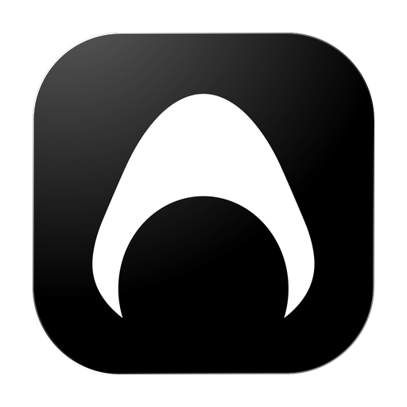
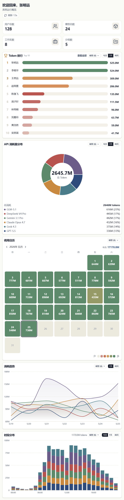
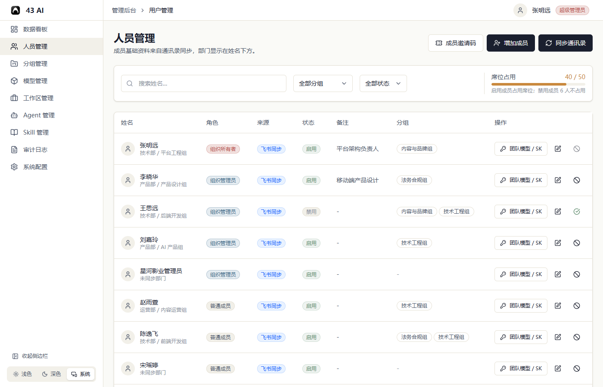
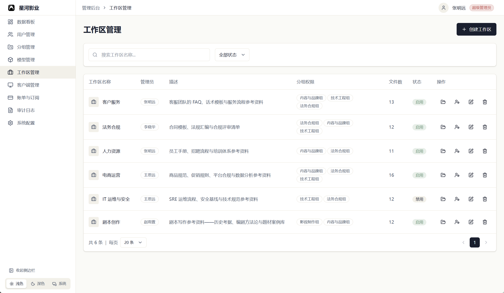
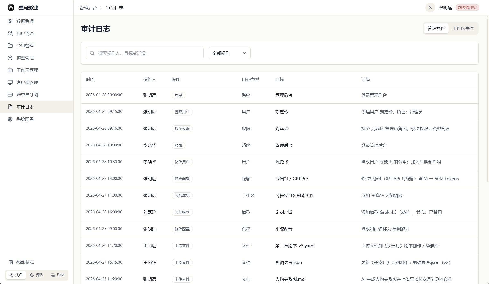
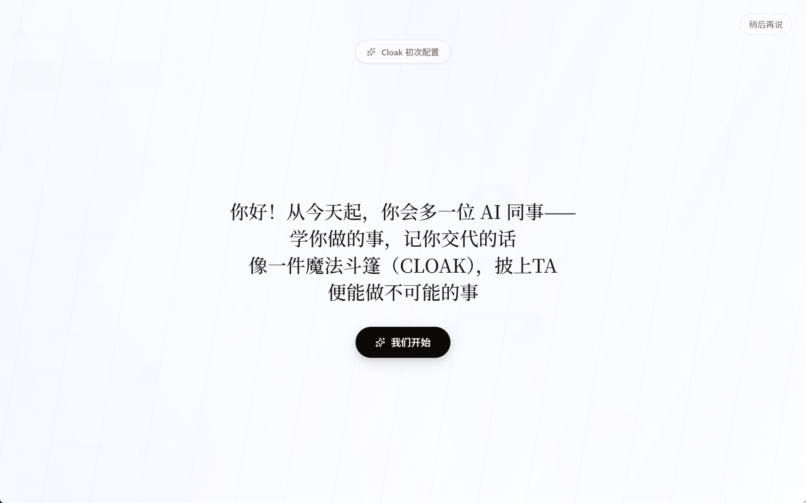
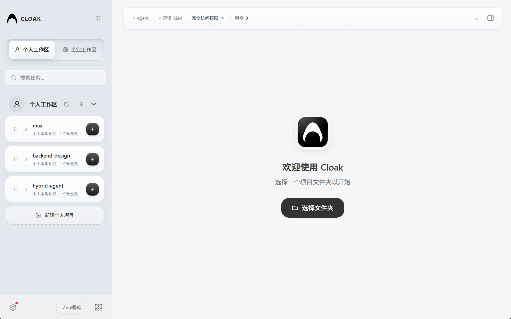
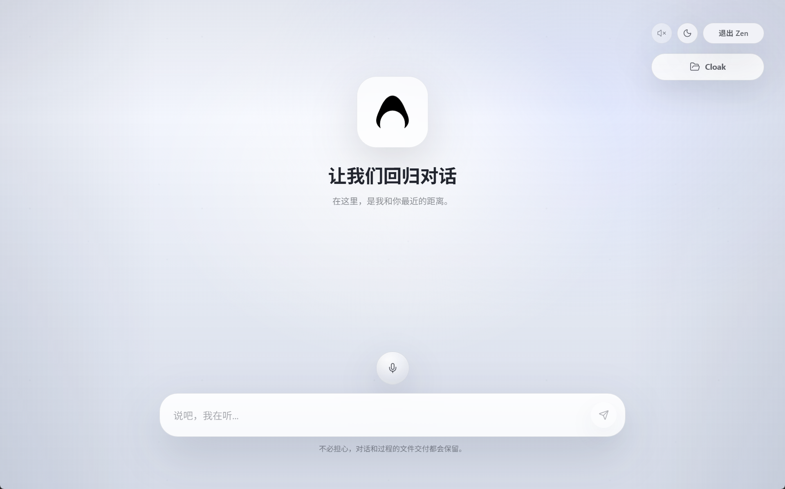
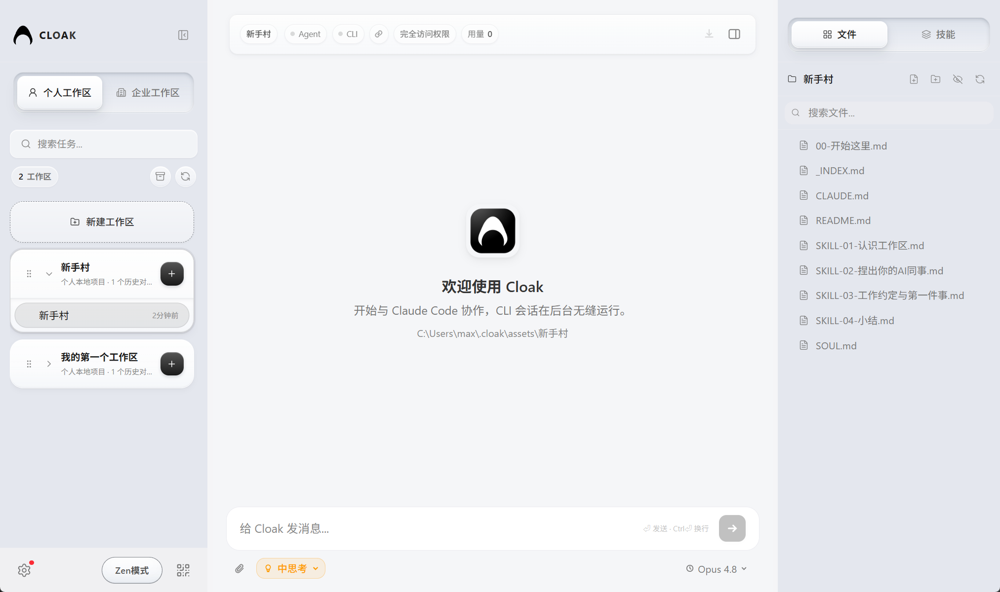
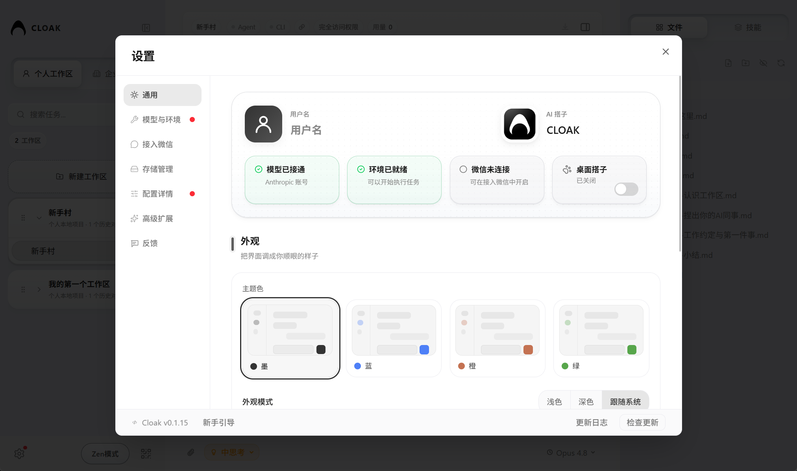

# 43 CLOAK

**面向个人与团队的 AI 工作台**

**团队版：统一管理成员、知识、模型、权限和资源使用。**

Cloak 把组织知识、团队文件、模型服务和日常任务接入同一个 AI 对话入口。团队可以在同一套工作区和管理后台里使用 AI；个人也可以用它处理本地项目和文件。

**想开通团队版、咨询部署配置或试用管理后台，可以扫码联系 CLOAK 团队。**

---

## 43 CLOAK 是什么

43 CLOAK 是一款**桌面端 AI 工作台**。你可以像和同事沟通一样发起任务，也可以把文件、项目资料和团队文档交给 AI 处理。

对团队和组织，Cloak 团队版重点解决三件事：

- **统一入口**：团队工作区、云端资料、账号登录、团队文件和团队群聊集中到客户端。
- **统一管理**：组织权限、成员分组、模型配置、资源使用情况和审计记录集中到后台。
- **统一交付**：成员直接使用组织配置好的 AI 能力，不需要各自维护 API Key。

对个人用户，Cloak 也可以作为本地项目和日常对话的 AI 助手，围绕文件夹资料持续完成阅读、总结、改写、分析和计划整理。你也可以在完整的设置页面里管理模型环境、Claude 登录、Zen 模式语音、扩展能力，或把当前工作区接入微信，在手机上继续跟进对话和文件。

当前桌面客户端已支持**个人工作区**与**团队工作区**。团队工作区、云端文件、组织权限和后台管理等能力，均由 **CLOAK 团队协助组织开通和配置**。

> 本项目早期工作参考借鉴了 [TOKENICODE](https://github.com/yiliqi78/TOKENICODE) 进行迭代开发，在此致谢原作者（@小七姐，@Tiny）。
>
> Cloak 为商业授权软件。商用、团队部署和授权开通请联系 CLOAK 团队；未经授权禁止反编译或二次分发。

---

## 下载

> 当前版本：**0.1.40**
>
> 发布页：[43-COLLEGE-TEAM/Cloak](https://github.com/43-COLLEGE-TEAM/Cloak/releases/tag/v0.1.40)

| 系统 | 下载 |
|------|------|
| Windows | [下载安装包](https://github.com/43-COLLEGE-TEAM/Cloak/releases/download/v0.1.40/Cloak_0.1.40_x64-setup.exe) |
| macOS（M 系列芯片）| [下载安装包](https://github.com/43-COLLEGE-TEAM/Cloak/releases/download/v0.1.40/Cloak_0.1.40_aarch64.dmg) |
| macOS（Intel 芯片）| [下载安装包](https://github.com/43-COLLEGE-TEAM/Cloak/releases/download/v0.1.40/Cloak_0.1.40_x64.dmg) |
| Linux 通用版 | [下载 AppImage](https://github.com/43-COLLEGE-TEAM/Cloak/releases/download/v0.1.40/Cloak_0.1.40_amd64.AppImage) |

不知道自己的 Mac 是哪种芯片？点击屏幕左上角的苹果图标，选择**关于本机**，查看“芯片”一栏。写着 M1 / M2 / M3 / M4 就选 M 系列，写着 Intel 就选 Intel。

Linux 用户请使用通用版。

> **Windows 用户：** 如果应用提示缺少基础组件，请按应用提示安装；也可以先安装 [Git for Windows](https://git-scm.com/download/win)，安装时保持默认选项即可。

  <strong>如需开通团队版或咨询部署，请扫码联系 CLOAK 团队。</strong>
   
  

---

## 3 分钟上手

### 1. 安装客户端

- **Windows**：双击下载好的安装文件，按提示完成安装。
- **macOS**：打开下载的文件，把 Cloak 图标拖到“应用程序”文件夹。
- **Linux**：优先使用通用版；如果是 AppImage，右键文件进入属性，允许作为程序执行后打开。

### 2. 选择使用路径

**组织成员**

团队版由组织开通后使用：

- **成员登录**：使用组织支持的账号方式进入团队工作区；个人用户也可以用手机号验证码登录或注册。
- **加入组织**：拿到组织邀请码后，可以在客户端组织菜单里直接输入邀请码加入。
- **资料与权限**：工作区资料、文件权限和资源使用规则由组织统一配置。
- **模型服务**：成员使用组织开放的模型，不需要自行维护复杂配置。

希望开通团队版，可以扫码联系 CLOAK 团队。我们会协助确认**成员范围、工作区、模型和后台配置方式**。

**个人用户**

打开左下角**设置**，进入**模型与环境**，选择服务商并填写 **API Key**。已有可用 API Key 时，直接粘贴保存即可；如果使用自建或兼容 OpenAI/Anthropic 的服务，也可以选择**自定义配置**并填写 API 端点。

如果你使用 Claude，也可以在**设置 → 配置详情**里查看 Claude 登录状态，并选择订阅账号登录或 Console/API 登录。

| 服务商 | 获取 API Key |
|--------|-------------|
| 小米 MiMo Token Plan | [前往获取](https://platform.xiaomimimo.com/#/console/plan-manage) |
| 小米 MiMo | [前往获取](https://platform.xiaomimimo.com/) |
| Anthropic（官方 Claude） | [前往获取](https://console.anthropic.com/account/keys) |
| 智谱 GLM | [前往获取](https://bigmodel.cn/usercenter/proj-mgmt/apikeys) |
| Kimi | [前往获取](https://platform.moonshot.cn/console/api-keys) |
| Kimi Code | [前往获取](https://www.kimi.com/code/console) |
| MiniMax | [前往获取](https://platform.minimaxi.com/user-center/basic-information/interface-key) |
| 通义千问 | [前往获取](https://bailian.console.aliyun.com/?apiKey=1) |

### 3. 开始对话

开始使用只需要三步：

1. 在欢迎界面点击**选择文件夹**，或进入团队工作区。
2. 点击左上角**新建任务**。
3. 在底部输入框写下你想完成的事，按回车发送。

需要 AI 看文件时，把文件拖进对话框再提问。组织成员可以基于**团队资料和云端文件**发起对话。

想在手机上跟进当前工作区，可以进入**设置 → 接入微信**生成二维码。扫码连接后，保持 Cloak 客户端运行，就可以在微信里继续对话、切换工作区或查找文件。

想使用语音输入或语音播报，可以进入**设置 → 高级扩展**里的 Zen 模式配置，填写语音服务 API Key，保存后回到 Zen 模式使用。

---

## 为什么团队需要 CLOAK 团队版

当团队开始真正使用 AI，问题通常不在“有没有模型”，而在 **AI 能不能被组织稳定管理**。

- **资料分散**：制度、流程、项目资料、客户问答和经验文档散在不同地方，成员很难基于同一套资料使用 AI。
- **配置分散**：每个人自己找模型、填 Key、切服务商，体验不一致，资源使用情况也不透明。
- **权限分散**：谁能访问哪个项目、谁能查看或使用文件、外部成员能看到多少资料，都需要有清晰边界。
- **用量不可见**：团队整体资源使用情况、模型配置和工作区使用情况，需要有基础看板支撑。
- **问题难追溯**：权限变更、模型调整、资源上限调整、工作区变化和客户端问题，需要可查记录。

**Cloak 团队版的目标：**

让合适的人，在合适的工作区里，用合适的模型处理合适的资料，并让管理员**看得见、管得住、追得回**。

  
   
  <strong>扫码咨询团队版开通、试用和部署配置</strong>

---

## 团队版能力

团队版由两部分组成：

- **客户端团队工作区**：给成员使用，连接团队资料、云端文件和组织配置的模型。
- **团队管理后台**：给管理员使用，统一管理成员、分组、工作区、模型、资源配置和审计记录。

| 模块 | 团队版能解决什么 |
|------|------------------|
| 团队工作区与云端资料 | 把项目资料、流程文档、共享文件放到组织工作区，成员在授权范围内查看、搜索、下载和上传本地文件，并基于资料发起 AI 对话；交付中心会集中呈现云端交付内容，更多文件操作按组织配置开放。 |
| 账号登录与成员同步 | 成员可使用飞书账号进入团队工作区；个人用户也可使用手机号验证码登录或注册，也可以在客户端里输入组织邀请码加入组织。组织成员、邮箱、部门等基础信息可从通讯录同步，减少重复维护。 |
| 用户、分组、角色与资源配置 | 按成员、分组、角色和项目范围分配权限；为不同团队设置可用模型、访问范围和资源使用规则。 |
| 模型统一管理 | 组织统一配置成员可用的模型范围；普通成员只看到自己被允许使用的模型；团队工作区会按组织配置加载模型。 |
| 工作区权限与文件管理 | 围绕工作区管理成员、分组、文件变更记录和访问权限，适合项目资料库、部门知识库和外部协作场景。 |
| 团队群聊协作 | 在团队工作区中围绕同一主题组织多方 AI 协作，支持团队群聊房间、成员邀请与移除、成员状态同步、消息状态和连接恢复，让多个智能体一起讨论、补充和审阅任务。 |
| 数据看板与用量概览 | 查看成员、模型、工作区等基础概览；用量图表会按实际接入情况展示，帮助团队了解资源使用。 |
| 客户端版本与审计追溯 | 查看客户端相关信息，追踪关键操作记录，排查权限、资源配置、模型和工作区变化。 |
| 系统配置 | 配置组织名称、Logo、显示偏好和后台基础信息，让团队内部使用入口更清晰。 |

团队版适合这些团队：

- 需要把团队知识库、项目资料和 AI 对话连接起来的团队或组织。
- 希望统一管理模型服务、成员权限和资源使用情况的组织。
- 需要为不同部门、项目组或外部合作方配置不同访问范围的团队。
- 需要后台看板、客户端信息和审计记录支撑管理的管理员。

---

## 团队管理后台预览

管理后台可按组织角色开放不同菜单。以下为团队管理能力示例，截图中数据为演示数据。

**数据看板：查看成员、模型、工作区等基础概览；用量图表按实际接入情况展示**

**用户管理：管理成员角色、模块权限、模型配额和客户端配置**

**工作区管理：按项目、部门或资料库管理成员、分组和文件权限**

**审计日志：追溯成员、权限、模型、工作区和文件相关操作**

---

## 通用基础能力

Cloak 的基础能力覆盖 **AI 对话、文件处理、项目资料协作、跨端跟进和个性化体验**。

个人工作区和团队工作区都可以使用这些通用能力；团队版会在此基础上增加**组织、权限、模型、资源使用和后台管理**。

- 💬 **多个任务同时进行**：不同话题分开处理，互不打扰，随时切换回来继续；支持任务进度的对话会显示当前步骤，长任务状态更容易跟进；代码内容默认换行显示，阅读长代码更轻松。
- 👥 **团队群聊协作**：团队工作区支持多人/多智能体协作场景，可以围绕同一主题进入群聊房间，发起讨论和审阅；成员、消息、在线状态和房间变更会更稳定地同步。
- 📁 **直接处理文件和图片**：把文件或图片拖进对话窗口，让 AI 阅读、总结、改写、提取重点或分析内容；图片、聊天中的本地文件路径和外部文件链接都可更直接地预览、定位和打开。
- 🗂️ **文件管理**：在**文件**面板搜索、预览、打开文件，也可以全屏查看预览内容，或把文件插入对话继续提问；团队云端工作区会展示本地新增、修改和冲突状态，并支持按权限上传本地文件。
- 🎙️ **Zen模式与语音**：用更安静的界面整理问题、查看文件和进行语音输入；配置语音服务后，也可以体验 AI 语音播报。
- 🤖 **模型选择与 Claude 登录**：根据任务需要选择模型和 Claude Code 努力程度；团队工作区会显示组织为当前工作区配置的可用模型，个人用户可以在**设置 → 模型与环境**里选择服务商、填写 API Key，或使用自定义 API 端点，也可以在配置详情中查看 Claude 登录状态并选择适合自己的登录方式。模型不可用时，Cloak 会提示重试或切换备用模型。
- 💬 **微信接入预览**：扫码接入后，可以在微信里继续当前工作区的对话，查看当前会话、切换工作区、切换最近会话、新建会话和查找文件。
- 🧠 **技能库**：在 Skills 面板中搜索、安装和更新可用 Skills，并查看技能作者信息；组织发放兑换码后，也可以按兑换码解锁可用技能。
- 📌 **任务中心**：集中查看和安排需要稍后处理的任务；未登录时会先引导登录，避免任务上下文分散。
- 📦 **产物与交付中心**：AI 生成或交付文件后，界面会提示新产物；团队工作区还可以集中查看云端交付内容，方便及时打开、定位和继续处理。
- 🎨 **个性化工作台**：支持亮色 / 暗色、主题颜色、字体大小、中英文界面、项目卡片皮肤、工作区背景和任务完成提示音；云端工作区封面也可以使用组织提供的皮肤资源。
- 🧩 **工作搭子**：支持桌面工作搭子、尺寸调节、资源缓存和显示管理；云端资源支持更多操作，让 AI 工作台更有陪伴感和品牌识别。
- ⬆️ **应用更新提醒**：客户端会检查当前版本是否仍可继续使用；需要更新时会提示下载并重启完成更新。
- 🪟 **窗口记忆**：Cloak 会记住主窗口大小，下次打开时更容易回到熟悉的工作界面。
- 💌 **问题反馈**：在**设置 → 反馈**提交问题描述、截图、文件和联系方式。

---

## 客户端界面预览

**欢迎界面**

**主界面**

**Zen模式**

**文件管理**

**设置**

---

## 更新记录

这里只展示最近 3 次更新，完整记录见 [CHANGELOG.md](CHANGELOG.md)。

**v0.1.40**

- 团队工作区新增清晰的欢迎与状态引导，登录、加入组织和进入工作区时更容易知道下一步怎么做。
- 使用 Claude 处理任务时会显示当前进度和完成情况，长任务状态更容易跟进。
- 聊天中的文件路径和外部文件链接预览更稳定，定位和打开文件更顺畅。

**v0.1.39**

- 优化 Skills 信息展示，查看较长的使用限制和说明更轻松。

**v0.1.38**

- 工作区会记住最近使用的会话，切换工作区后更容易继续原来的工作。
- 外部文件链接支持在聊天中预览和打开，处理共享资料更方便。
- 团队与个人工作区的模型选择更贴合当前可用范围，减少无关选项干扰。

---

## 常见问题 Q&A

### 团队版开通与管理

**Q：团队版开通后，成员还需要自己配置 API Key 吗？**

A：通常不需要。组织可以统一配置**模型服务和可用模型**，成员登录后使用自己被授权的模型和工作区。

**Q：团队版部署或开通应该联系谁？**

A：扫码联系 **CLOAK 团队**。我们会协助确认**团队规模、成员范围、工作区资料、模型使用方式和后台配置**。

**Q：管理员能看到哪些后台能力？**

A：后台菜单按组织角色开放。常见模块包括**数据看板、用户管理、分组管理、模型管理、工作区管理、客户端管理、审计日志和系统配置**；资源或订阅相关信息会按实际开通方案展示。

**Q：左侧看不到团队工作区，是不是应用坏了？**

A：通常不是。请先确认三件事：**飞书账号已登录、组织已开通团队版功能、账号已加入对应工作区**。

**Q：团队文件能看到但打不开、不能下载或不能带入对话，是为什么？**

A：这通常和**工作区权限**有关。部分账号只能浏览目录，不能读取内容、下载文件或把文件带入对话；需要联系组织管理员或 CLOAK 团队调整权限。

### 下载与安装

**Q：我不知道该下载哪个安装包。**

A：Windows 选 Windows。Mac 查看“关于本机”的芯片信息：

- **M1 / M2 / M3 / M4**：选 M 系列
- **Intel**：选 Intel
- **Linux**：不确定时先选通用版

**Q：Windows 打开后提示缺少基础组件怎么办？**

A：按应用里的提示安装基础组件即可。也可以先安装 Git for Windows，安装时保持默认选项。

**Q：macOS 提示没有权限访问文件怎么办？**

A：到“系统设置 → 隐私与安全性 → 完全磁盘访问权限”里给 Cloak 授权，然后重启应用再试。

### 模型、API Key 与网络

**Q：模型服务由谁配置？**

A：组织成员由组织统一配置**模型服务、成员权限和资源使用规则**。个人使用时，可以在设置里填写自己的服务商 API Key。

**Q：个人用户一定要填写 API Key 吗？**

A：不一定。使用 Claude 时，可以在**设置 → 配置详情**里查看登录状态，并按自己的账号类型选择订阅账号登录或 Console/API 登录。使用其他服务商时，通常需要填写对应的 API Key。

**Q：提示资源不足、模型不可用或请求失败怎么办？**

A：个人用户请检查**账户余额、可用模型、服务商状态和网络连接**。组织成员可以先按提示重试或切换备用模型；如果仍然不可用，请联系组织管理员查看**模型权限、组织资源上限和后台配置**。

**Q：公司网络、校园网或代理会影响使用吗？**

A：会。部分网络会限制访问**模型服务、GitHub、下载地址或二维码登录服务**。

可以换一个网络，或让网管放行相关访问。

### 微信与语音

**Q：微信接入后可以做什么？**

A：可以在微信里继续当前工作区的对话，也可以查看当前绑定的会话、切换工作区、切换最近会话、新建会话和查找文件。使用时需要保持 Cloak 客户端运行。

**Q：Zen 模式语音需要怎么配置？**

A：进入**设置 → 高级扩展**里的 Zen 模式配置，填写语音服务 API Key 后保存。配置完成后，可以在 Zen 模式里使用语音输入，也可以体验 AI 语音播报。

### 反馈与排查

**Q：遇到问题时，我应该怎么反馈才有用？**

A：写清楚三点最有用：**点了哪里、想做什么、出现了什么提示**。设置里的反馈页支持粘贴截图和选择文件。

**Q：反馈里要不要留下联系方式？**

A：建议留下**邮箱、微信或飞书手机号**，方便团队后续跟进；不留也可以提交。

---

## 反馈与建议

使用中遇到问题，或者有想要的新功能、改进建议，都可以在应用内直接反馈：

打开左下角的**设置**，进入**反馈**页面，填写你的问题或建议。你可以粘贴截图或选择文件，也可以留下邮箱、微信或飞书手机号，方便我们后续跟进。

如果是使用问题，尽量说清楚你在做什么、出现了什么情况、用的是哪个系统；如果是团队版开通、组织配置或部署咨询，请直接扫码联系 CLOAK 团队。

---

## 联系我们

如需开通团队版、咨询部署配置、安排团队试用或反馈使用建议，可以使用微信扫码联系 CLOAK 团队。

  

---

Made with ❤️ by [43 COLLEGE TEAM](https://github.com/43-COLLEGE-TEAM)

© 2026 43 COLLEGE TEAM. All rights reserved. Cloak 为商业授权软件，商用、团队部署和授权开通请联系 CLOAK 团队；未经授权禁止反编译或二次分发。

