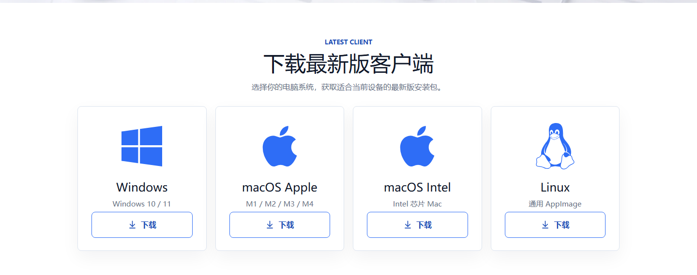

# 安装与启动

先到官网下载安装，再打开 Cloak。

## 1. 下载

打开 [www.43cloak.com](https://www.43cloak.com)，在首页的下载区直接下载与你系统匹配的安装包。

- Windows：点 Windows 卡片下方的下载按钮。
- macOS：点对应芯片卡片下方的下载按钮。
- Linux：点 Linux 卡片下方的下载按钮。

## 2. 安装

- Windows：双击安装包，按提示完成安装。
- macOS：打开 `.dmg`，把 Cloak 拖到“应用程序”文件夹。
- Linux：给 AppImage 加上可执行权限后打开。

## 3. 打开

- Windows：从桌面或开始菜单打开 Cloak。
- macOS：从“应用程序”打开 Cloak。
- Linux：从文件管理器或终端打开 Cloak。

## 4. 第一次打开

第一次打开后，会先进入初始引导页。

这一步的具体内容，继续看 [初始引导](02-初始引导.md)。
