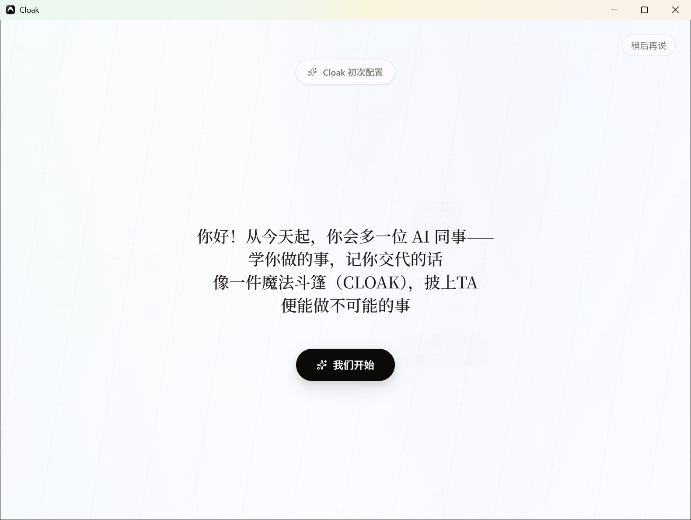
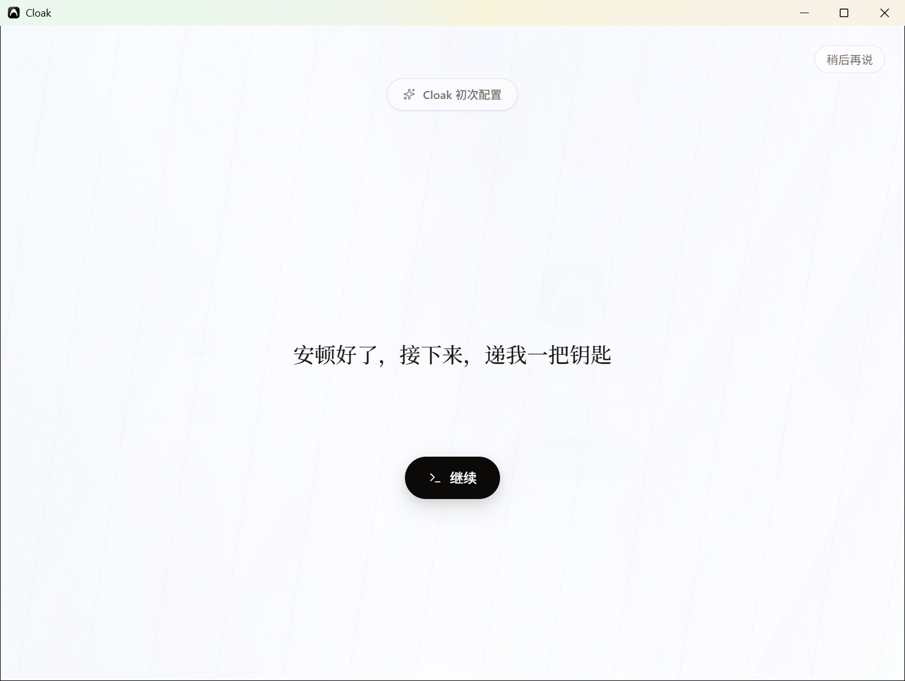
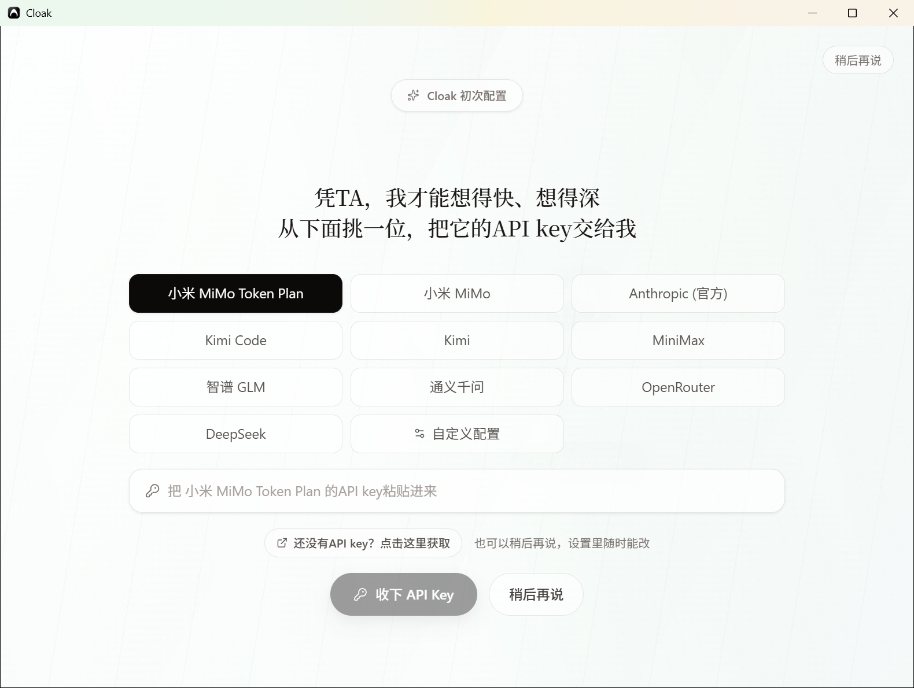
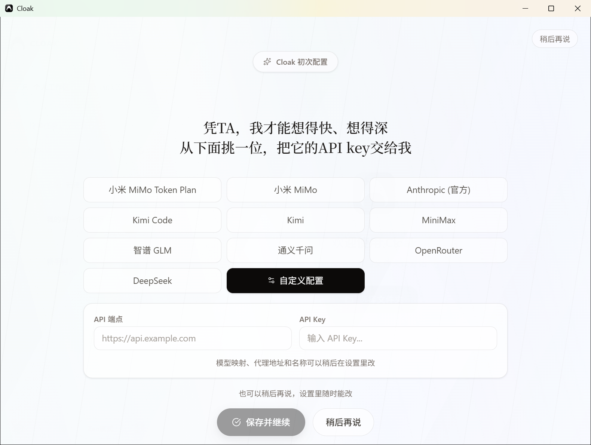
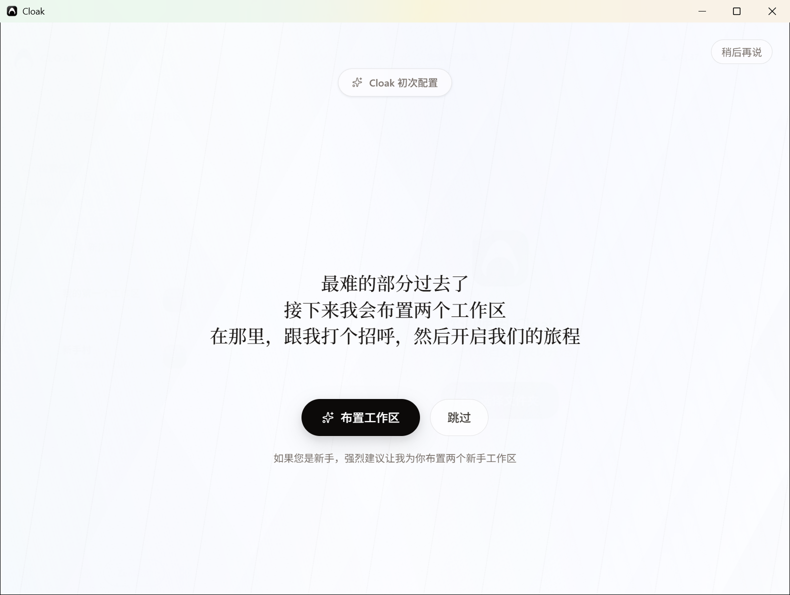
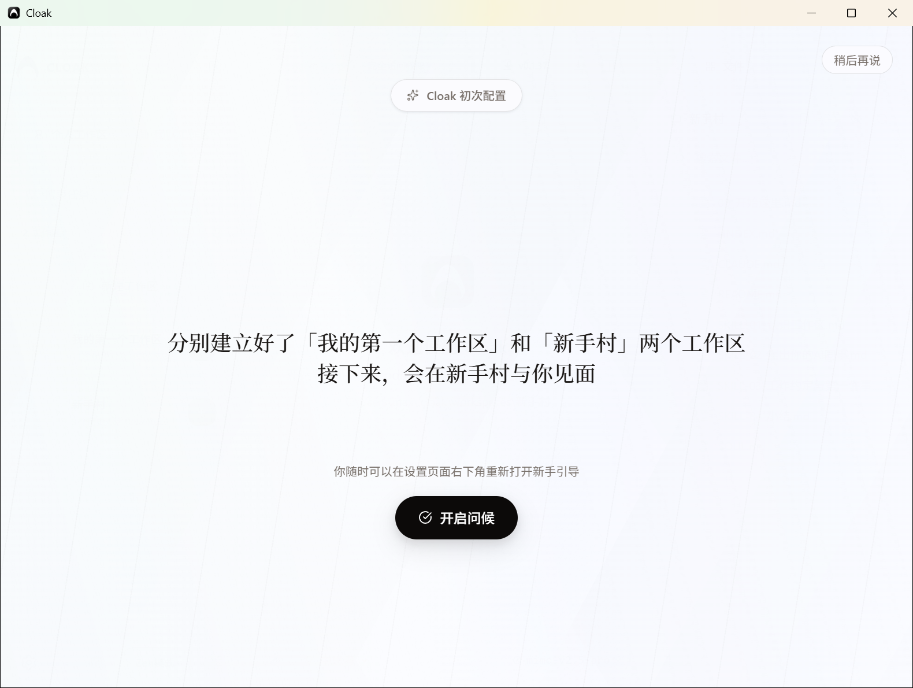
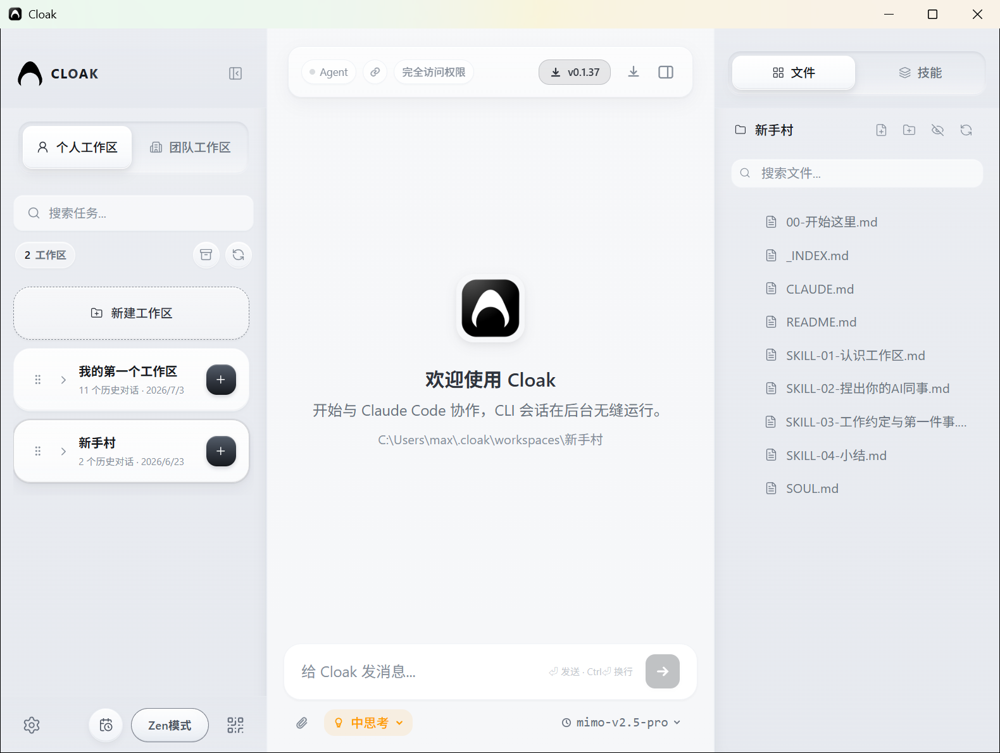

# 初始引导

第一次打开 Cloak 后，会自动进入“Cloak 初次配置”。按照页面顺序完成即可。

## 1. 开始引导

在欢迎页点击 `我们开始`。

如果暂时不配置，点击右上角 `稍后再说`。之后可以在设置页面重新打开初始引导。

## 2. 检查 Claude Code 环境

Cloak 会自动检查 Claude Code 环境。检查完成后，页面会显示“安顿好了，接下来，递我一把钥匙”，点击 `继续`。

如果检测到环境缺少组件，页面会提供以下选择：

- `立即加载环境`：由 Cloak 自动配置所需环境。
- `稍后再说`：跳过这一步，后续仍可在设置中配置。

如果配置失败，按钮会变成 `再试一次`。

初始引导会先准备 Claude Code。需要使用 Gemini CLI 或 Codex 时，完成引导后再到 [模型与环境配置](04-模型与环境配置.md) 中安装对应运行时。

## 3. 配置 API

选择一个 API 服务商，然后填写对应的 API key。

页面会列出当前可以直接配置的服务商。选择服务商后，在输入框粘贴 API key，再点击 `收下 API Key`。保存完成后，按钮会变为 `继续`，点击它进入下一步。

还没有 API key 时，点击 `还没有API key？点击这里获取`，打开当前服务商的申请页面。

### 使用自定义 API

如果列表中没有需要的服务商，点击 `自定义配置`，填写：

- `API 端点`：API 服务的访问地址。
- `API Key`：对应的密钥。

填写完成后，点击 `保存并继续`。

模型映射、代理地址和名称可以在设置中继续调整。

### 暂时跳过 API 配置

如果暂时没有 API key，点击页面下方 `稍后再说`，进入工作区准备步骤。API 配置可以之后在设置中补充。

## 4. 准备工作区

页面会提示准备两个工作区：`我的第一个工作区` 和 `新手村`。

点击 `布置工作区`，Cloak 会下载并建立这两个工作区，然后把 `新手村` 设置为当前工作区。

如果暂时不准备，点击 `跳过`，直接进入完成步骤。准备过程中如果网络较慢，也可以点击 `先跳过`。

## 5. 完成初始引导

工作区准备完成后，页面会显示已建立的两个工作区，并提供 `开启问候` 按钮。

点击 `开启问候`，进入 Cloak 主界面。如果跳过了工作区准备，这里的按钮会显示为 `开启旅程`。

完成后，当前工作区为 `新手村`，右侧文件区可以看到新手工作区中的文件。

下一步可以查看 [首次登录与工作区](03-首次登录与工作区.md)。
