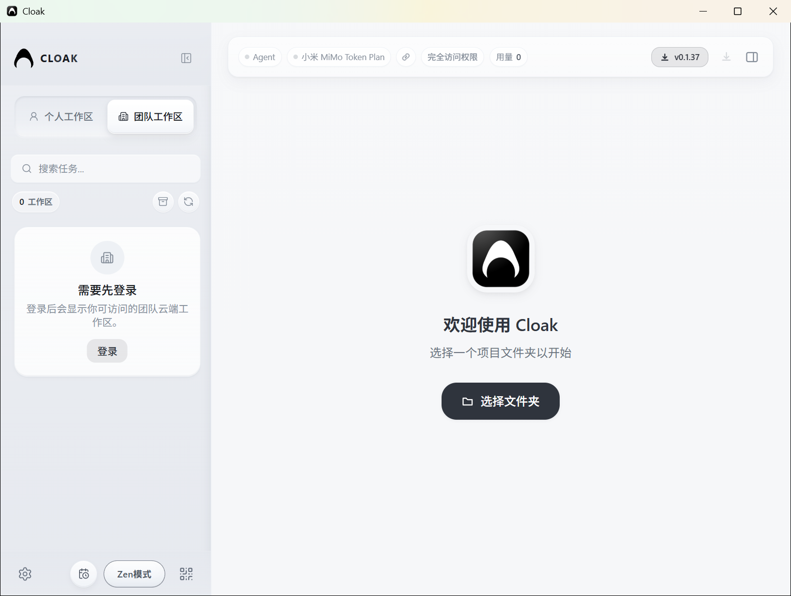
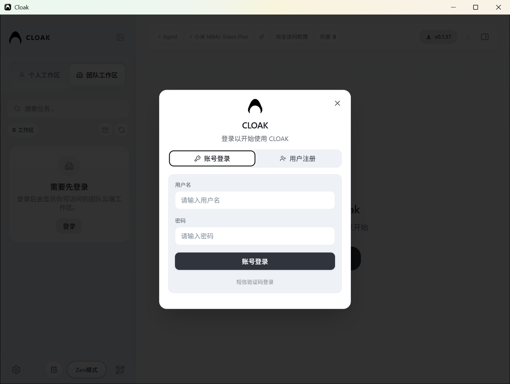
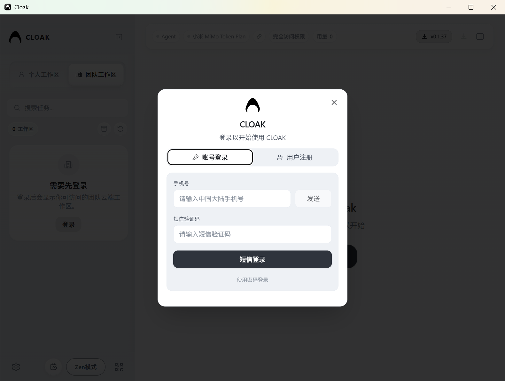
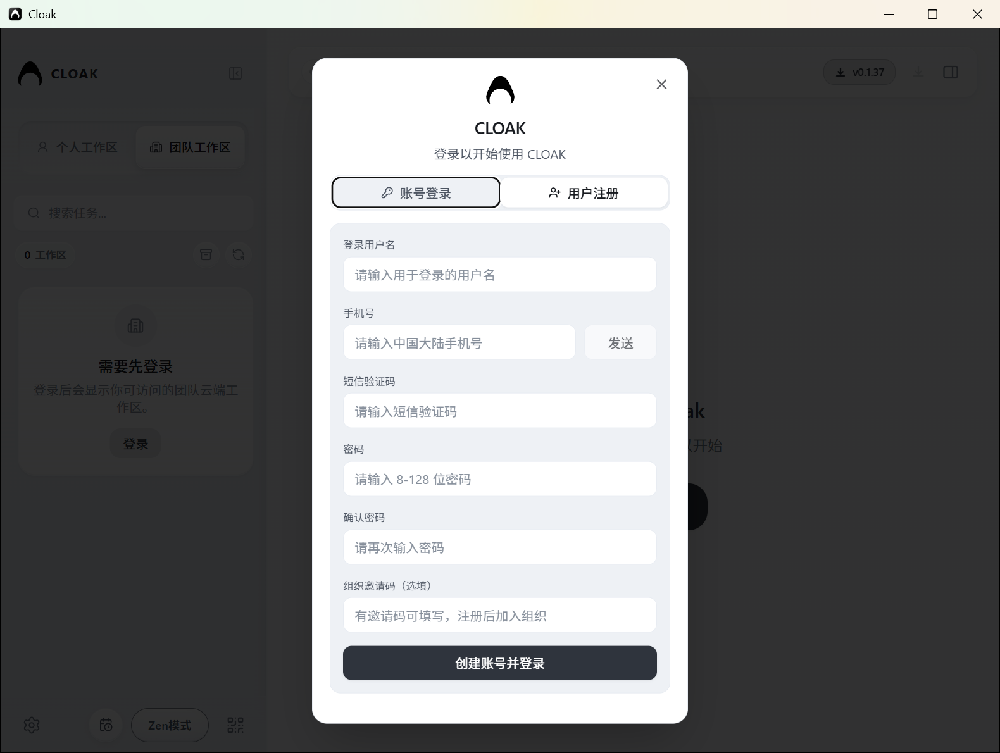
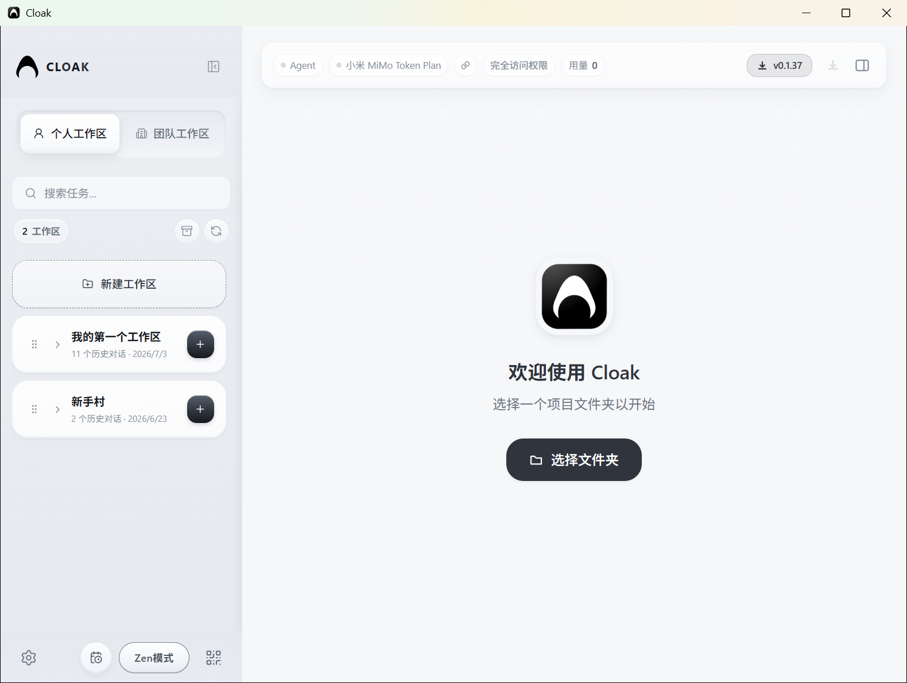

# 首次登录与工作区

Cloak 打开后，可以直接使用个人工作区。需要访问团队工作区时，再登录账号。

## 1. 登录团队工作区

在左侧点击 `团队工作区`。未登录时，页面会显示 `需要先登录`，点击卡片中的 `登录`。

### 账号登录

默认打开的是 `账号登录`。填写用户名和密码，再点击 `账号登录`。

### 短信验证码登录

在账号登录表单下方点击 `短信验证码登录`，填写手机号：

1. 输入中国大陆手机号。
2. 点击 `发送`，获取短信验证码。
3. 输入短信验证码。
4. 点击 `短信登录`。

需要改回密码登录时，点击 `使用密码登录`。

### 注册账号

没有账号时，切换到 `用户注册`，填写：

- 登录用户名
- 手机号
- 短信验证码
- 密码
- 确认密码
- 组织邀请码（选填）

填写完成后，点击 `创建账号并登录`。

当前版本的登录弹窗未显示扫码登录入口，使用账号密码或短信验证码登录。

## 2. 使用个人工作区

个人工作区不需要登录。点击左侧的 `个人工作区`，可以看到已经登记的本地工作区。

工作区卡片上的内容：

- 点击工作区名称左侧的箭头，展开或收起该工作区的历史对话。
- 点击右侧 `+`，在该工作区中新建一条对话。
- 点击历史对话，打开已有对话。

## 3. 新建个人工作区

在个人工作区列表顶部点击 `新建工作区`，选择电脑中的文件夹。

Cloak 会把选中的文件夹登记为个人工作区，并切换到这个工作区。文件夹中的原有文件不会被删除。

## 4. 切换团队工作区

登录成功后，再次点击左侧的 `团队工作区`，页面会显示当前账号可以访问的团队工作区。

选择具体团队工作区后，可以使用该工作区提供的对话、文件和技能。没有被邀请到团队工作区时，列表仍会显示 `0 工作区`。

## 5. 选择当前工作区

- 个人内容：点击 `个人工作区`。
- 团队内容：点击 `团队工作区`，再选择团队工作区。
- 个人工作区中的具体对话：展开工作区卡片后点击对话名称。

下一步可以查看 [模型与环境配置](04-模型与环境配置.md)。
