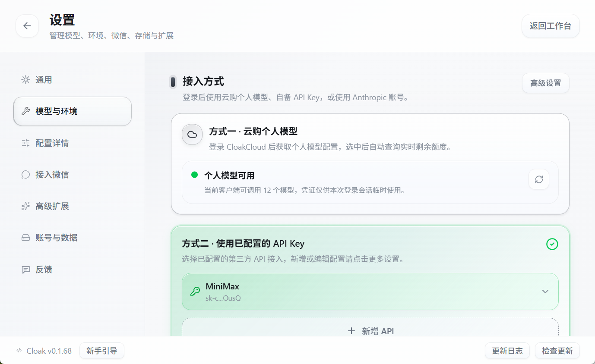
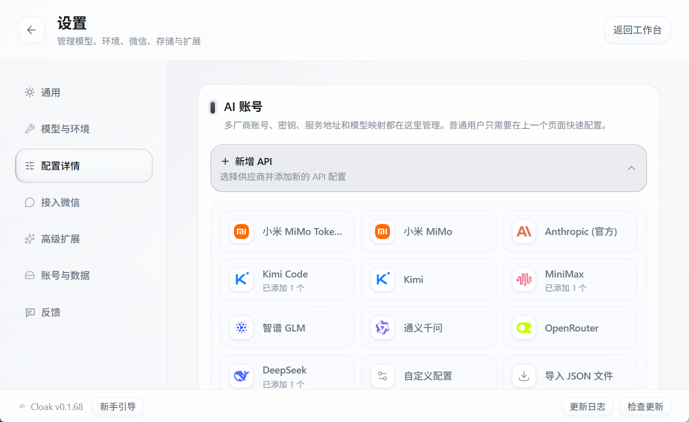
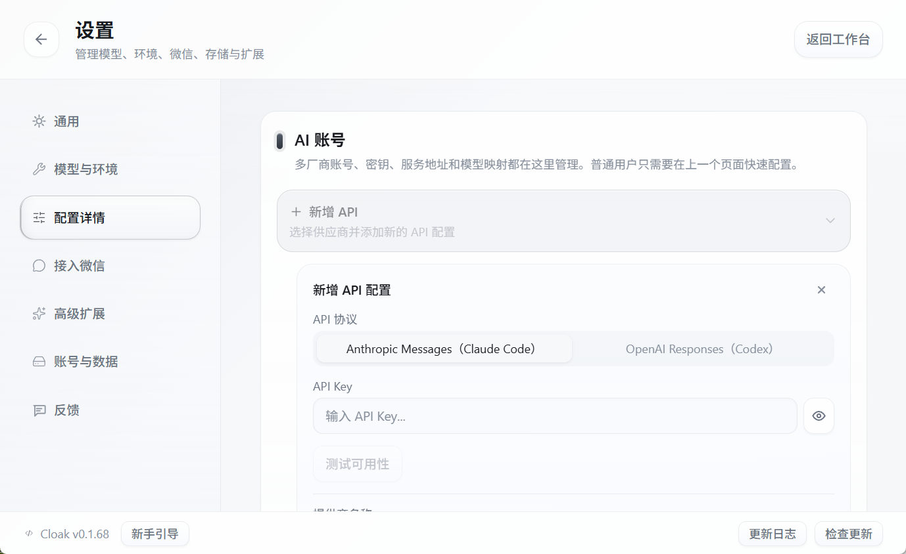
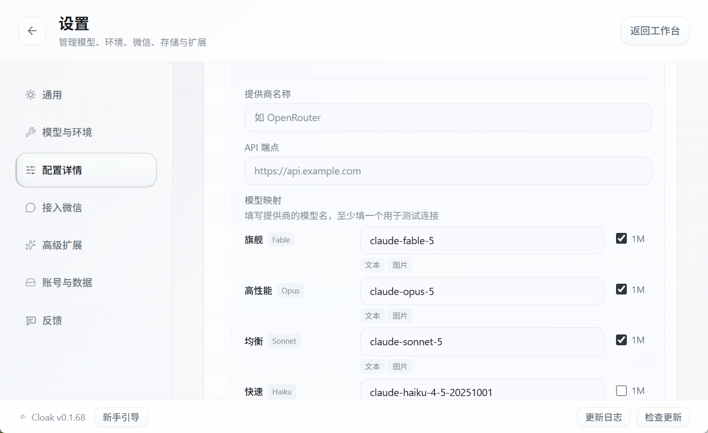
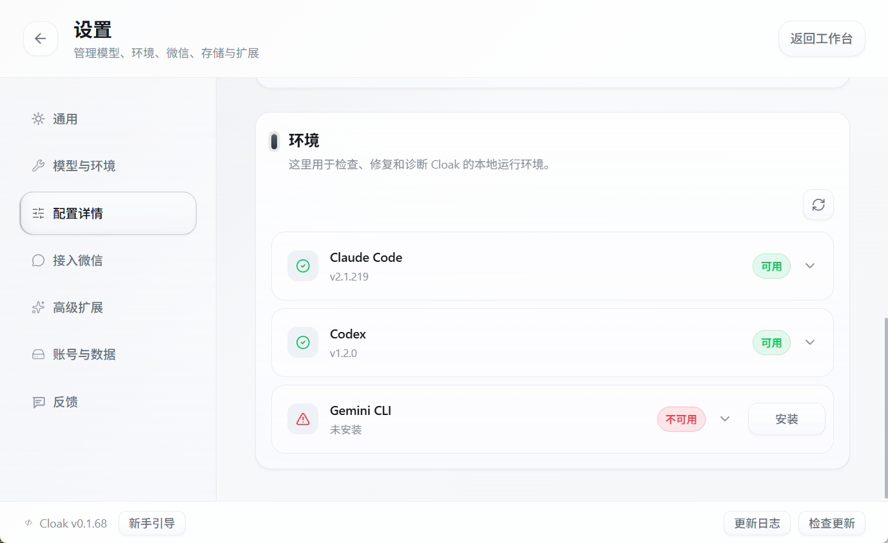

# 模型与环境配置

模型账号和本地 Agent 运行时都在 `设置` 中管理。首次使用或更换模型时，先选择接入方式，再确认准备使用的 Agent 运行时可用。

## 1. 打开设置

在工作台左下角点击齿轮图标，进入 `设置`，再选择 `模型与环境`。

## 2. 选择模型接入方式

在 `接入方式` 区域选择一种方式。

### 方式一：云购个人模型

登录 Cloak 账号后，先查看 `方式一 · 云购个人模型`。已开通的账号会显示可用模型，选中后可查看实时余额。

如果尚未开通，页面可能显示 `申请开通`。按页面提示填写邀请人姓名并提交，然后等待平台管理员审批。审批期间会显示 `申请处理中`；未通过时，可修改邀请人姓名后重新提交。

### 方式二：使用已配置的 API Key

如果已经配置过服务商，在 `方式二 · 使用已配置的 API Key` 中选择对应服务商。

需要增加服务商时，点击 `新增 API`；需要编辑现有配置时，点击页面右上角的 `高级设置`。

### 方式三：Anthropic 账号登录

如果你已经有 Claude 账号或订阅，在 `方式三 · Anthropic 账号登录` 中点击 `登录`。已经登录过时，按钮会显示为 `重新登录`。

完成弹出的授权流程后，回到 Cloak 检查登录状态。

## 3. 选择默认模型

在同一页面的 `默认模型` 区域点击模型名称。

可选模型会随账号、服务商和运行时变化，不同用户看到的名称可能不同。切换接入方式后，重新确认一次默认模型。

选中的模型会用于之后新建的任务。

## 4. 添加或管理服务商

在 `模型与环境` 页面右上角点击 `高级设置`，或在设置左侧选择 `配置详情`。

### 查看已配置的服务商

在 `AI 账号` 区域可以看到已经添加的服务商。展开 `新增 API`，可以选择预设服务商、自定义配置或导入 JSON 文件。

已添加的服务商右侧会显示 `测试可用性`，用于确认当前配置是否能正常连接。

如果正在使用 CC Switch 或系统环境变量中的配置，选择 `继承系统配置`，不要在 Cloak 中重复填写。

### 添加常用服务商

在 `新增 API` 区域选择服务商，按页面提示填写 API Key。列表会随客户端版本更新，以实际页面为准。

### 自定义配置

如果列表中没有需要的服务商：

1. 在 `新增 API` 区域点击 `自定义配置`。
2. 选择 `API 协议`：`Anthropic Messages（Claude Code）` 或 `OpenAI Responses（Codex）`。
3. 填写 `API Key`。
4. 展开 `高级设置`，填写 `提供商名称`、`API 端点` 和至少一个模型映射。
5. 点击 `测试可用性`，确认能正常连接。
6. 点击 `确认并启用`。

未填写 API Key 时，页面会提示先填写密钥，`确认并启用` 不可点击。

### 导入配置

已有配置文件时，在 `新增 API` 区域点击 `导入 JSON 文件`，选择本地文件并按页面提示完成导入。

## 5. 使用组织或平台提供的模型

登录后，当前账号可用的托管模型会统一显示在 `设置 → 模型与环境`。

1. 先登录 Cloak，并确认已经选择正确的组织。
2. 打开 `设置 → 模型与环境`。
3. 查看 `云购个人模型` 或当前账号可用的模型接入方式。
4. 选择模型后，确认剩余额度和默认模型。
5. 页面显示未开通或没有可用模型时，请联系组织管理员。

模型凭据由客户端和组织配置管理，不要在会话、截图或群聊中发送 API Key、Token 等完整凭据。

## 6. 检查 Agent 运行时

进入 `设置 → 配置详情`，向下滚动到 `环境 → Agent 运行时`。

当前页面会分别检查：

- `Claude Code`：使用 Claude Code CLI。
- `Codex`：使用 Cloak 托管的 Codex Adapter。
- `Gemini CLI`：使用 Gemini ACP 运行时。

三个运行时会以可展开卡片显示。先看卡片右侧的总体状态；需要处理时，点击卡片展开版本、授权和诊断信息。截图中的状态仅为示例，以你电脑上的实际检查结果为准。

### Claude Code

确认 `Claude Code` 显示 `可用`。展开卡片后，可以检查 Claude Code CLI 版本、认证状态和诊断信息。

出现异常时，使用卡片中实际显示的 `重新检查`、`检查更新`、`去授权`、`安装` 或 `修复` 操作。

### Gemini CLI

如果显示 `命令不可用`，点击 `安装 Gemini CLI`。安装完成后按页面提示授权，再点击 `检查更新` 或页面右上角的刷新按钮。

### Codex

如果显示尚未安装，点击 `安装 Codex Adapter`。页面也可能根据检查结果提供 `修复 Codex Adapter` 或 `更新 Codex Adapter`。

安装或修复前，先按页面提示准备 Node.js 和 npm。完成后进行 Codex 授权，再刷新状态。

## 7. 完成检查

回到 `模型与环境` 页面，确认：

1. 已选择模型接入方式。
2. 已选中默认模型。
3. 页面显示 `环境已就绪`。
4. 准备使用的 Agent 运行时显示可用。

完成后即可返回工作台开始使用。

下一步可以查看 [微信接入](05-微信接入.md)。
