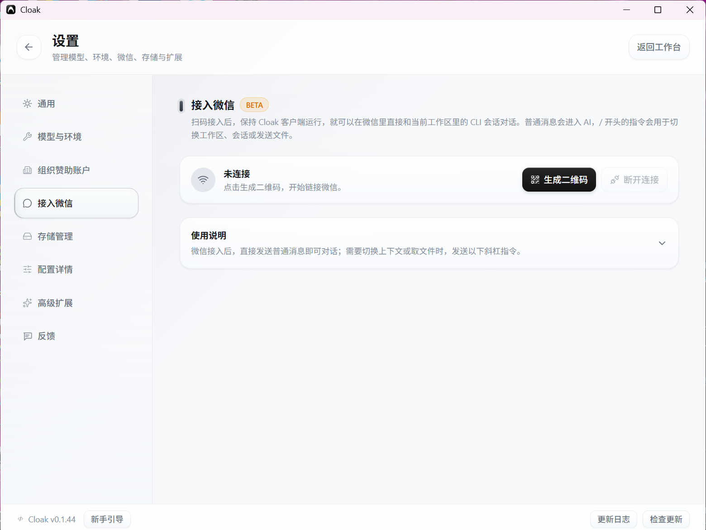
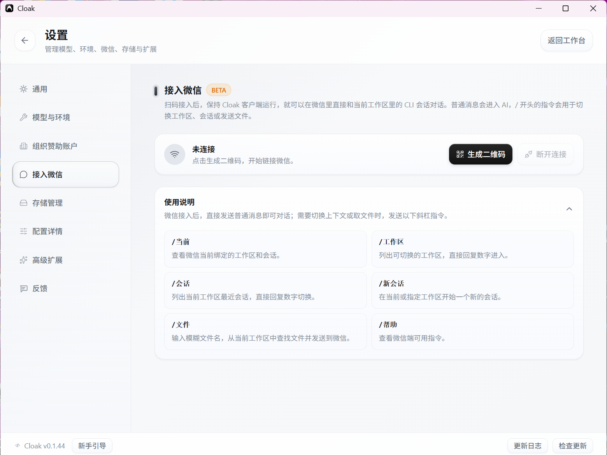

# 微信接入

接入微信后，只要 Cloak 客户端保持运行，就可以在微信里继续当前工作区的对话。

## 1. 接入前准备

先在 Cloak 中完成以下操作：

1. 打开一个个人工作区。
2. 打开已有会话，或新建一条会话。
3. 确认模型和运行环境可以正常使用。

微信消息会按顺序进入当前绑定的会话。客户端关闭后，微信接入也会停止。

## 2. 生成二维码

1. 点击工作台左下角的齿轮图标，进入 `设置`。
2. 在左侧选择 `接入微信`。
3. 点击 `生成二维码`。
4. 等待状态从 `正在启动` 变为 `等待扫码`。

如果页面显示 `连接异常`，先查看页面中的错误信息，再点击 `重新扫码`。

## 3. 扫码确认

打开手机微信扫描页面中的二维码，并在手机上确认连接。

连接成功后，页面状态会变为 `已连接`。此时可以在微信里向 Cloak 发送一条普通消息测试。

## 4. 在微信里对话

直接发送文字即可继续对话。只有以 `/` 开头的内容会被识别为操作指令。

首次使用时，可以先发送：

1. `/工作区`：查看可以进入的工作区。
2. 回复工作区前面的数字。
3. `/新会话`：在选中的工作区开始新对话。
4. 发送一条普通文字消息。

## 5. 切换工作区和会话

微信端支持以下指令：

| 指令 | 用途 |
| --- | --- |
| `/当前` | 查看当前绑定的工作区和会话。 |
| `/工作区` | 列出可用工作区，回复数字即可切换。 |
| `/会话` | 列出当前工作区最近的会话，回复数字即可继续。 |
| `/新会话` | 在当前工作区开始新对话。 |
| `/文件` | 按文件名查找当前工作区中的文件，并发送到微信。 |
| `/帮助` | 查看微信端的指令说明。 |

使用 `/文件` 后，按微信中的提示输入文件名。找到多个结果时，可以回复一个或多个数字选择文件。

## 6. 重新扫码或断开连接

- 需要更换微信账号时，点击 `重新扫码`，再用新的微信账号确认。
- 暂时不再使用时，点击 `断开连接`。
- 页面状态没有及时变化时，可以离开 `接入微信` 页面后重新进入。

## 7. 常见问题

### 微信消息没有进入 Cloak

依次确认：

1. Cloak 客户端仍在运行。
2. `设置 → 接入微信` 显示 `已连接`。
3. 已经在 Cloak 中打开或创建工作区。
4. 已在微信中发送 `/当前`，并看到绑定的工作区和会话。

### 找不到可用工作区

先回到 Cloak 客户端，创建或打开一个个人工作区，再在微信中发送 `/工作区`。

### 二维码失效或扫码后没有连接

点击 `重新扫码` 生成新二维码，并在手机微信中再次确认。如果仍然失败，检查网络后重试。

### 图片、语音或文件消息没有被处理

当前微信对话主要处理文字消息。需要从工作区取文件时，使用 `/文件`；其他文件操作请回到 Cloak 客户端完成。

下一步可以查看 [Zen 模式与语音](06-专注模式与语音.md)。
