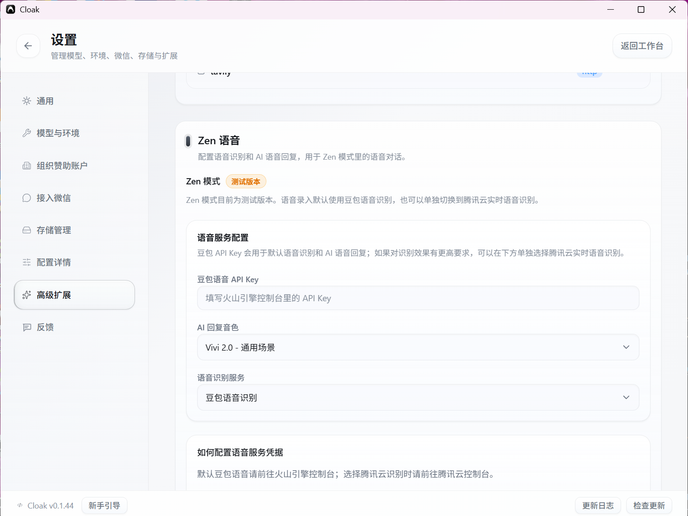
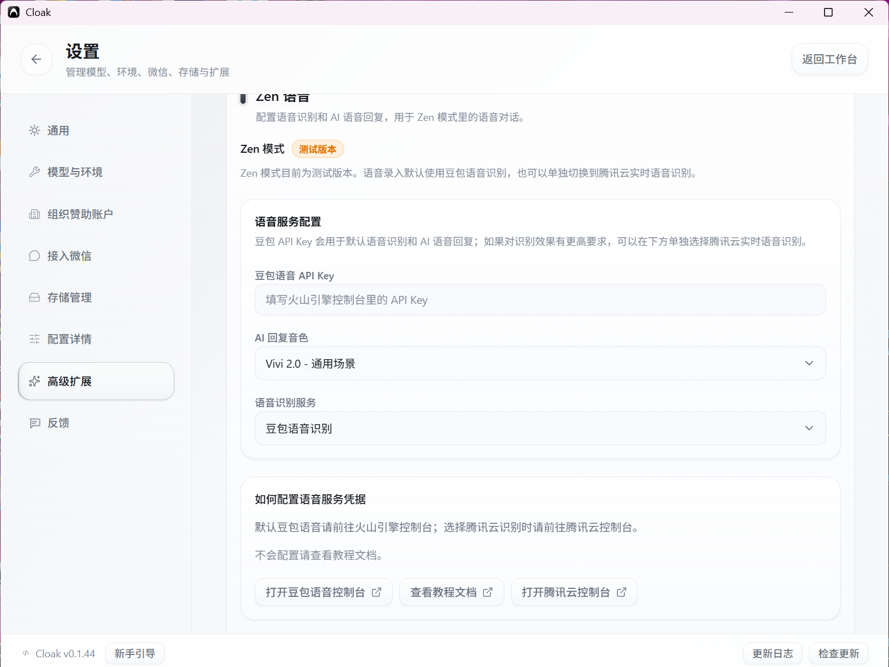

# Zen 模式与语音

Zen 模式会沿用当前工作区和会话，用更简洁的界面继续对话。语音输入和 AI 语音回复需要先配置语音服务。

> Zen 模式目前是测试功能。重要内容仍会保存在原会话中，遇到异常时可以退出 Zen 模式继续操作。

## 1. 配置语音服务

1. 点击工作台左下角的齿轮图标，进入 `设置`。
2. 在左侧选择 `高级扩展`。
3. 向下找到 `Zen 语音`。

页面下方提供 `打开豆包语音控制台`、`查看教程文档` 和 `打开腾讯云控制台`。

首次配置时，可以点击页面中的 `查看教程文档`，或直接打开[语音模型配置教程](https://vcnfaf5fobac.feishu.cn/wiki/GwzxwPPFBiLJVLk476QcXrYmn0e)。按教程取得所需凭据后，再回到本页完成保存。

### 使用豆包语音识别

豆包语音识别可以同时用于语音输入和 AI 语音回复：

1. 填写 `豆包语音 API Key`。
2. 选择 `AI 回复音色`。
3. 在 `语音识别服务` 中选择 `豆包语音识别`。
4. 点击 `保存配置`。

页面显示“配置已保存”后，新设置会立即用于 Zen 模式。

### 使用腾讯云实时语音识别

如果需要改用腾讯云识别语音：

1. 在 `语音识别服务` 中选择 `腾讯云实时语音识别`。
2. 填写腾讯云语音识别控制台中的 `AppID`、`SecretID` 和 `SecretKey`。
3. 点击 `保存配置`。

腾讯云凭据只用于把语音转换成文字。需要播放 AI 语音回复时，仍要填写 `豆包语音 API Key`。

## 2. 进入 Zen 模式

1. 回到工作台。
2. 先选择一个工作区，并打开或新建会话。
3. 点击左侧栏底部的 `Zen模式`。

如果页面提示先选择工作区，按 `Esc` 退出，选择工作区后重新进入。

## 3. 使用文字对话

在底部输入框中填写内容，按 `Enter` 发送。对话、工作过程和交付文件会保留在原会话中。

右侧可以查看当前工作区中的文件。需要讨论文件时，把文件拖到输入框。

## 4. 使用语音输入

1. 点击输入框上方的麦克风按钮，切换到语音输入。
2. 按一下空格键开始录音。
3. 再按一次空格键结束录音。
4. 检查识别出来的文字，按 `Enter` 发送。

识别结束后：

- 按空格键可以继续录入。
- 按 `Shift + 空格键` 可以在文字中输入空格。
- 可以直接编辑识别结果，再发送。

第一次使用时，系统可能会请求麦克风权限。选择允许后再重试。

## 5. 控制 AI 语音回复

- 点击右上角的声音按钮，可以开启或关闭 AI 语音播放。
- 没有填写豆包语音 API Key 时，只能使用文字回复。
- 已选择腾讯云语音识别时，AI 语音回复仍使用豆包语音配置。

## 6. 使用专注音乐和文件

右侧区域会显示当前工作区和专注音乐：

- 点击音乐名称可以选择曲目。
- 使用播放、暂停、上一首和下一首按钮控制音乐。
- 云端曲目第一次播放时，需要先完成下载。
- 点击文件可以打开预览；不支持预览的格式会交给系统默认应用打开。

## 7. 退出 Zen 模式

点击右上角的 `退出 Zen`，或直接按 `Esc`。

退出后会回到原工作台，当前工作区和会话不会改变。

## 8. 常见问题

### 麦克风按钮无法使用

检查以下内容：

1. `设置 → 高级扩展 → Zen 语音` 中已经保存语音识别凭据。
2. 系统已经允许 Cloak 使用麦克风。
3. 当前已经打开工作区和会话。

### 可以识别语音，但 AI 没有声音

确认已经填写豆包语音 API Key，并检查右上角的声音按钮是否处于开启状态。

### 保存时提示补全凭据

- 选择豆包语音识别时，填写豆包语音 API Key。
- 选择腾讯云实时语音识别时，补全 AppID、SecretID 和 SecretKey。

下一步可以查看 [技能库](07-技能库.md)。
