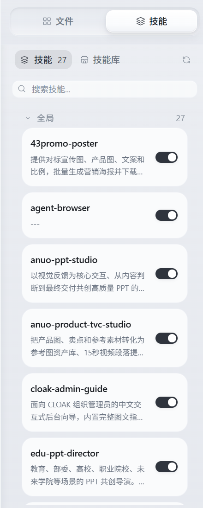
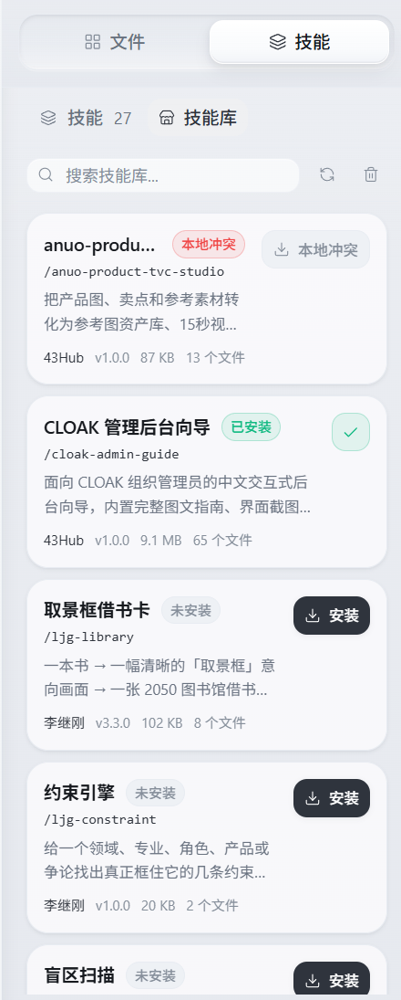

# 技能库

Skill 可以给 Cloak 增加特定任务的操作说明。可以直接使用已经安装的 Skill，也可以从技能库安装和更新。

## 1. 打开技能面板

1. 回到 Cloak 工作台。
2. 在右侧面板顶部选择 `技能`。

如果右侧面板已收起，先点击工作台右侧的面板按钮将它展开。

技能面板会把已安装的内容分成两类：

- `项目`：只在当前个人工作区中使用。
- `全局`：可以在不同个人工作区中使用。

## 2. 使用已经安装的 Skill

可以用以下任一种方式把 Skill 加到对话中：

- 右键 Skill，选择 `在输入框中使用`。
- 把 Skill 卡片拖到聊天输入框。

Skill 名称会进入输入框。继续填写这次要完成的内容，再发送消息。

### 启用或停用

点击 Skill 卡片右侧的开关，可以启用或停用该 Skill。停用后，Skill 文件仍会保留，需要时可以重新启用。

### 查看和编辑

点击 Skill 卡片可以打开内容。右键卡片还可以：

- `编辑`
- `复制`
- 在文件管理器中显示
- `删除`

删除会移除本地 Skill。确认不再需要后再操作。

## 3. 打开技能库

1. 在技能面板顶部点击 `技能库`。
2. 如果 Cloak 提示登录，先完成账号登录。
3. 等待技能列表加载。

当前版本登录后即可浏览技能库，不需要输入兑换码。

## 4. 查找和安装 Skill

1. 在搜索框中输入名称或关键词。
2. 查看 Skill 的说明、作者、版本和状态。
3. 点击 `安装`。
4. 等待页面提示 `Skill 已安装`。
5. 切回顶部的 `技能`，确认新 Skill 已出现在列表中。

如果列表还有更多结果，点击底部的 `加载更多`。

## 5. 更新已安装的 Skill

技能库会显示本地 Skill 与库中版本的关系：

| 状态 | 可以怎么做 |
| --- | --- |
| `未安装` | 点击 `安装`。 |
| `已安装` | 当前已经是本地版本，不需要重复安装。 |
| `可更新` | 点击 `更新`，安装技能库中的新版本。 |
| `本地已修改` | 点击 `覆盖`，确认后用技能库版本替换本地修改。 |
| `本地冲突` | 先检查本地文件，处理冲突后再更新。 |

覆盖本地修改前，先复制需要保留的内容。

## 6. 刷新列表和清理缓存

- 点击刷新按钮，重新读取技能库内容和安装状态。
- 点击清理按钮，可以删除技能安装过程中留下的临时缓存。

清理安装缓存不会删除已经安装的 Skill。正在安装 Skill 时，先等待安装结束。

## 7. 常见问题

### 点击技能库后出现登录窗口

技能库需要登录 Cloak 账号。完成登录后，再次打开 `技能 → 技能库`。

### 技能库一直加载或显示错误

检查网络后点击刷新按钮。如果仍然失败，先退出技能库再重新打开。

### 安装后没有出现在技能列表

1. 切回顶部的 `技能`。
2. 点击刷新按钮。
3. 确认搜索框没有保留筛选内容。
4. 确认 Skill 没有被停用。

### 不确定是否应该覆盖

`本地已修改` 表示本地内容与技能库版本不同。需要保留本地修改时，先复制或备份 Skill，再执行覆盖。

下一步可以查看 [更新与版本](08-更新与版本.md)。
