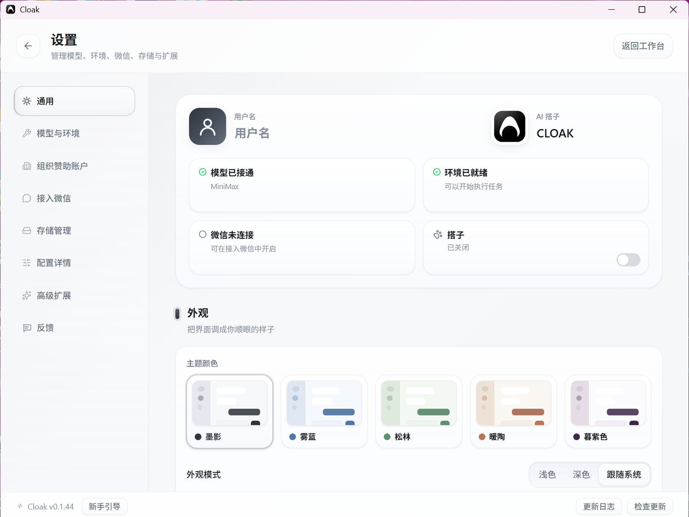

# 更新与版本

可以在设置页查看当前版本、更新日志并安装新版本。

## 1. 查看当前版本

1. 点击工作台左下角的齿轮图标，进入 `设置`。
2. 查看页面左下角的版本信息，例如 `Cloak v0.x.x`。

反馈问题时，请一并提供这里显示的版本号和所用系统。

## 2. 查看更新内容

点击设置页右下角的 `更新日志`，可以查看当前版本和最近版本的用户可见变化。

## 3. 手动检查更新

1. 点击设置页右下角的 `检查更新`。
2. 等待检查完成。

页面会显示以下结果之一：

- `已是最新`：当前不需要更新。
- `下载并安装 v...`：发现新版本，可以开始更新。
- `检查更新失败`：检查网络或系统权限后重试。

## 4. 下载并安装

发现新版本后：

1. 点击 `下载并安装 v...`。
2. 等待下载进度达到 100%。
3. 按提示点击 `重启应用`。

重启前先确认正在运行的任务已经完成，并保存尚未提交的输入。Cloak 重启后会使用新版本。

## 5. 从更新提示安装

Cloak 检测到新版本或组织要求升级时，会显示更新提示。按提示下载并重启即可。

如果暂时不能更新，先确认提示是否允许稍后处理。组织要求必须升级时，需要完成更新后再继续使用。

## 6. 更新失败时重新安装

应用内更新反复失败时：

1. 记下当前版本号。
2. 关闭 Cloak。
3. 打开 [www.43cloak.com](https://www.43cloak.com)。
4. 在下载区获取与你系统匹配的安装包。
5. 按 [安装与启动](01-安装与启动.md) 中的步骤安装。

通常不需要先删除个人工作区文件。不要手动删除工作区文件夹。

## 7. 常见问题

### 一直停在下载中

检查网络连接，关闭代理或防火墙拦截后重试。仍然无法下载时，改用官网安装包。

### 提示没有安装权限

- Windows：关闭 Cloak 后重新运行安装包，按系统提示确认。
- macOS：确认当前账号可以向“应用程序”文件夹安装应用。
- Linux：确认安装文件具有可执行权限。

### 更新后版本号没有变化

完全退出 Cloak 后重新打开，再到设置页左下角检查版本。仍未变化时，重新下载安装包。

### 更新后模型或环境不可用

进入 `设置 → 模型与环境` 检查接入方式和默认模型，再到 `设置 → 配置详情 → 环境` 检查准备使用的 Agent 运行时。具体步骤见 [模型与环境配置](04-模型与环境配置.md)。

至此，安装与配置已经完成。接下来可以进入客户端使用指南，开始创建会话、使用文件和团队工作区。
