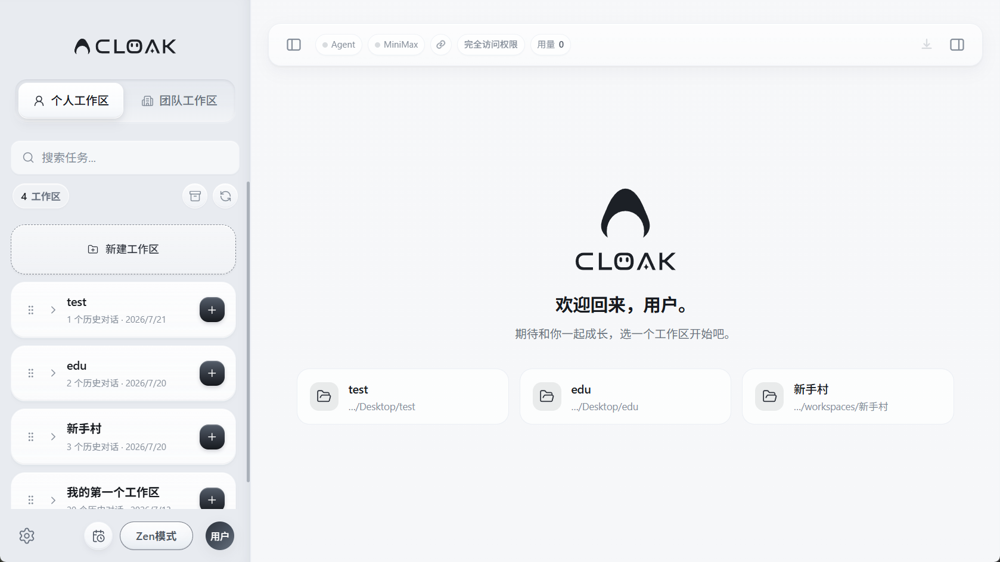
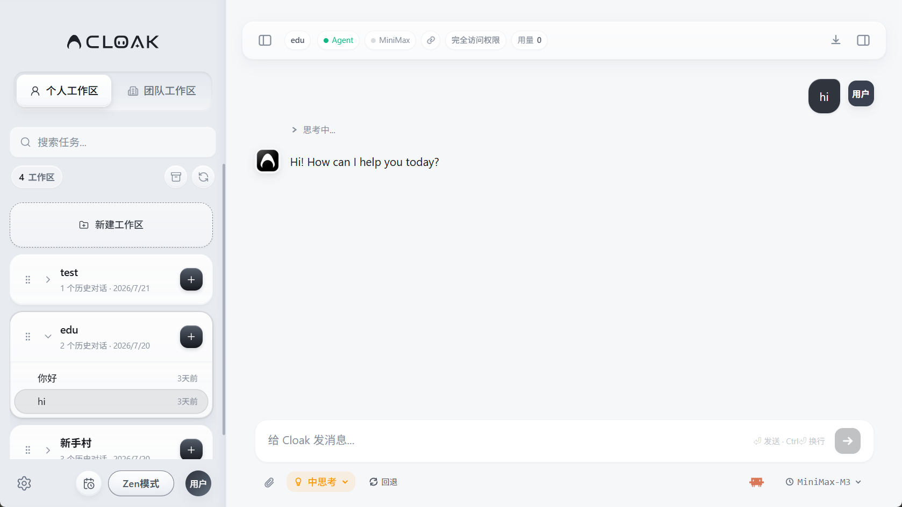
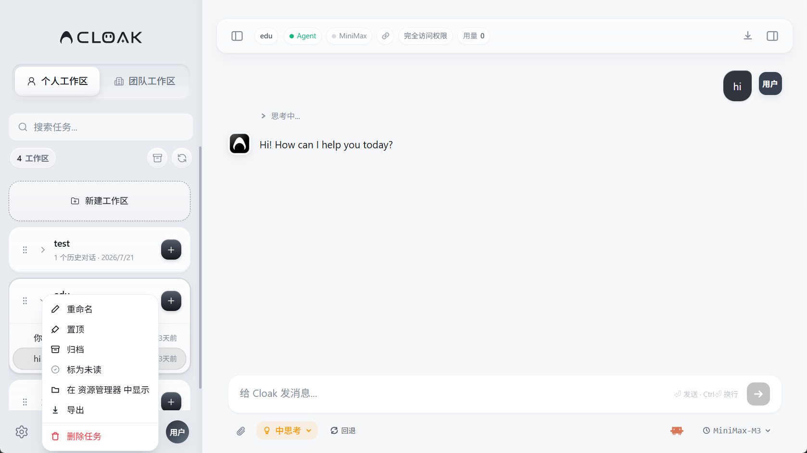

# 主界面与会话

Cloak 把每一段独立对话称为一个“任务”。你可以在不同工作区中新建任务，也可以随时回到历史任务继续处理。

## 1. 认识主界面

打开 Cloak 后，主界面分为三个区域：

- **左侧工作区**：切换个人工作区和团队工作区，搜索、创建和管理任务。
- **中间工作区**：未打开任务时显示欢迎页和最近使用的工作区；打开任务后显示对话。
- **右侧功能面板**：查看文件、云端资料和技能。面板收起时，点击右上角的右侧面板按钮重新展开。

左侧常用入口：

- `个人工作区`：使用电脑中的本地文件夹。
- `团队工作区`：使用组织分配的团队资料、模型和权限。
- `搜索任务`：按任务名称或对话内容查找历史任务。
- `新建工作区`：把电脑中的文件夹添加为个人工作区。
- 工作区右侧的 `+`：直接在这个工作区中新建任务。
- 工作区名称左侧的箭头：展开或收起历史任务。

欢迎页会显示最近使用的 3 个工作区。点击其中一张卡片，也可以直接在该工作区中新建任务。左上角和右上角的面板按钮分别控制工作区列表和右侧功能面板。

## 2. 新建第一个任务

### 在个人工作区中新建

1. 点击左侧的 `个人工作区`。
2. 找到要使用的工作区。
3. 点击工作区卡片右侧的 `+`。
4. 左侧出现 `新建任务` 后，在底部输入框写下要完成的事。
5. 按 `Enter` 发送。

也可以直接点击欢迎页中的最近工作区卡片。还没有个人工作区时，点击左侧的 `新建工作区`，选择电脑中的文件夹。

### 在团队工作区中新建

1. 点击左侧的 `团队工作区`。
2. 选择你有权访问的本地协作工作区。
3. 点击工作区卡片右侧的 `+`，或点击欢迎页中的最近工作区卡片。
4. 输入要求并发送。

云协作工作区会打开创建群聊窗口，而不是普通任务输入框。团队工作区使用组织提供的文件、模型和访问权限。如果看不到目标工作区，请联系组织管理员确认成员和工作区权限。

## 3. 写清楚任务要求

一条容易执行的消息通常包含三部分：

1. **要处理什么**：说明文件、主题或目标。
2. **希望怎么处理**：例如总结、检查、改写、制作表格或生成方案。
3. **结果要什么格式**：例如三点清单、Markdown 文档或 Excel 表格。

例如：

> 请阅读当前工作区的项目说明，列出我今天最先要处理的 3 件事，并说明排序理由。

不需要一次写得很长。Cloak 回复后，可以继续补充条件或要求它修改结果。

## 4. 使用会话界面

会话界面的常用位置：

- **顶部状态栏**：显示运行状态、模型服务、访问权限和用量，并提供左右面板开关。
- **中间消息区**：按时间显示你的消息和 Cloak 的回复。
- **底部输入框**：继续发送要求。按 `Enter` 发送，按 `Ctrl + Enter` 换行。
- **回形针按钮**：添加文件或图片。
- **思考模式**：选择当前任务需要的思考程度。
- **运行方式和模型选择**：在输入区底部选择当前任务使用的 CLI、Agent 和模型。
- **停止按钮**：Cloak 正在处理时，可以停止当前回复。

顶部显示 `完全访问权限` 时，Cloak 可以在当前工作区中执行更多操作。只在你确认工作区和任务内容可信时使用这类权限。

添加文件或图片后，先等待 `处理中…` 消失。附件处理完成前，发送按钮会保持不可用。

## 5. 切换和查找历史任务

- 展开工作区，点击任务名称即可打开。
- 在 `搜索任务` 中输入关键词，可以查找任务名称和对话内容。
- 按 `Ctrl + Tab`，可以在最近使用的两个任务之间快速切换。
- 搜索不到任务时，清空搜索框，再点击工作区列表上方的刷新按钮。
- 已归档的任务可以从工作区列表上方的归档入口查看。

每个任务会保留自己的上下文。开始处理不同主题时，新建一个任务，避免不同内容混在同一段对话里。

切换任务时，尚未发送的文字、图片和文件附件会分别保留在原任务中。即使附件仍在处理，完成后也会回到原任务，不会混入其他任务。

## 6. 管理任务

右键点击历史任务，可以打开任务菜单。

菜单中的常用操作：

- `重命名`：把任务改成容易识别的名称。
- `置顶`：把常用任务放在列表前面。
- `归档`：从当前列表收起，之后仍可在归档入口找到。
- `标为未读`：保留稍后继续处理的提醒。
- `在资源管理器中显示`：打开任务对应的本地文件位置。
- `导出`：把任务内容导出保存。
- `删除任务`：永久删除任务。

删除任务无法撤销。需要保留内容时，先导出或归档。

## 7. 常见问题

### 新建任务后没有输入框

确认已经选择具体工作区。回到左侧工作区卡片，点击右侧的 `+` 重新新建任务。

### 消息无法发送

1. 查看底部是否已经选中模型。
2. 打开 `设置 → 模型与环境`，确认模型连接可用。
3. 团队工作区中仍无法使用时，请管理员检查模型和成员权限。

### 打开了错误的工作区

回到左侧，在正确的工作区卡片上点击 `+`。不同工作区的文件和权限可能不同，不要在错误的工作区继续发送内容。

### 历史任务没有显示

1. 清空 `搜索任务` 中的文字。
2. 点击刷新按钮。
3. 打开归档入口，确认任务是否已经归档。
4. 确认当前位于 `个人工作区` 还是 `团队工作区`。

### 工作区文件夹被移动或改名

重新打开任务后，页面会提示项目文件夹已被移动或删除。

- 仍要继续使用原工作区时，点击 `重新定位文件夹` 或 `重新选择`，选择移动后的文件夹。
- 不再需要这个工作区时，点击 `删除工作区`。该操作只移除 Cloak 中的工作区记录，不要把它当成删除文件的入口。

下一步可以查看 [文件与附件](02-文件与附件.md)。
