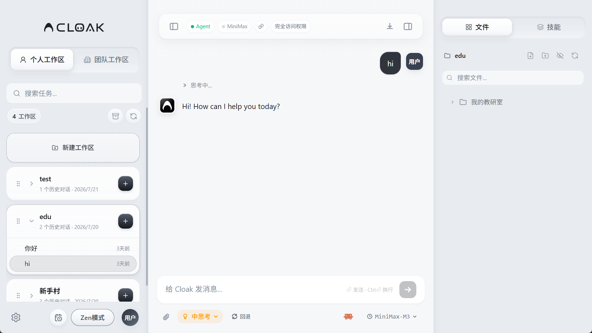
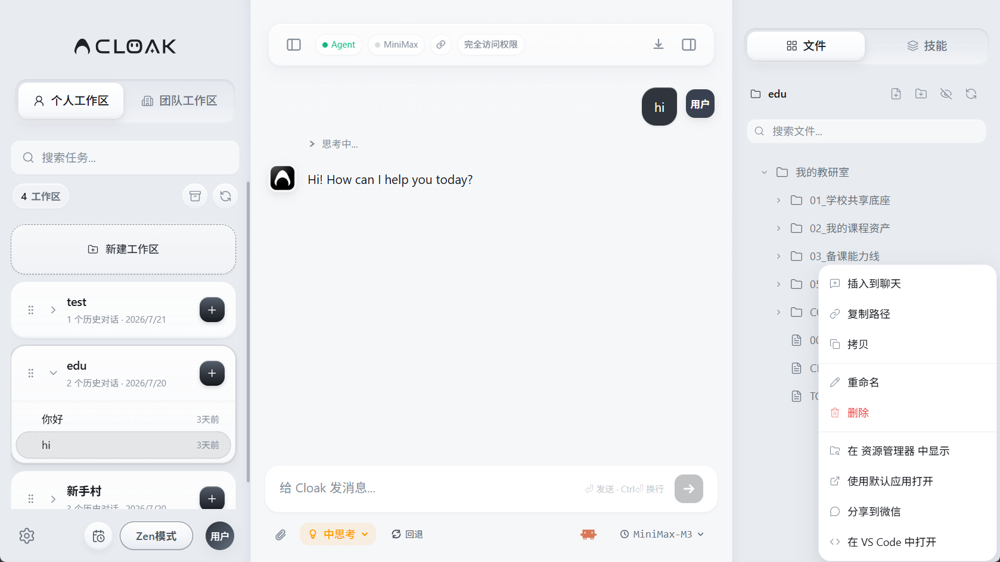

# 文件与附件

Cloak 可以直接查看当前工作区中的文件，也可以把电脑中的文件作为附件交给 AI 处理。

这两种方式用途不同：

- **工作区文件**：文件已经在当前工作区中，可以在右侧文件面板里查找、预览和管理。
- **对话附件**：从电脑中临时选择文件，随当前消息一起交给 AI。

## 1. 打开文件面板

1. 先打开一个工作区中的任务。
2. 点击工作台右上角的右侧面板按钮。
3. 在右侧选择 `文件`。

文件面板顶部会显示当前工作区名称。常用入口包括：

- `搜索文件`：按文件名查找。
- 新建文件按钮：在当前工作区根目录新建文件。
- 新建文件夹按钮：在当前工作区根目录新建文件夹。
- 显示或隐藏隐藏文件。
- 刷新文件列表。

点击文件夹左侧的箭头，可以展开或收起目录。

## 2. 把工作区文件交给 AI

文件已经在当前工作区中时，可以直接引用：

1. 在文件面板中找到文件。
2. 右键点击文件。
3. 选择 `插入到聊天`。
4. 在输入框中补充你希望 AI 完成的事。
5. 按 `Enter` 发送。

例如：

> 请阅读这个文件，整理出目标、当前进展和待确认事项。

`插入到聊天` 会把工作区文件的位置加入输入框。发送前仍可以继续补充要求。

也可以把文件面板中的文件拖到输入框。图片会作为带预览的附件加入，其他文件会作为工作区文件引用加入。

## 3. 添加电脑中的附件

文件不在当前工作区中时，可以使用以下方式：

### 使用回形针按钮

1. 点击输入框下方的回形针按钮。
2. 选择一个或多个文件。
3. 等待 `处理中…` 消失，并确认文件名和大小完整显示在输入框上方。
4. 输入处理要求并发送。

附件仍在处理时，发送按钮不可用。等附件卡片完整出现后再发送，可以避免漏掉最后添加的文件。

### 拖入对话区

从文件资源管理器中把文件拖到对话区。松开后，文件会显示在输入框上方。

注意拖放位置：

- 拖到**对话区**：作为当前消息的附件。
- 拖到右侧的**文件树**：复制到当前工作区。

### 粘贴图片或文件

复制图片、截图或文件后，在输入框中按 `Ctrl + V`。识别成功后，会显示附件卡片。

附件在发送前可以移除。发送消息后，附件会进入这次任务的上下文。

### 图片附件会怎样发送

JPG、JPEG、PNG、GIF 和 WebP 图片可以直接交给 Claude Code 或 Codex 查看。图片会作为实际图像内容发送，不只是把本机路径写进消息。

其他图片格式或运行方式可能按文件路径处理。AI 无法识别图片内容时，先把图片转换为 PNG 或 JPG，再选择 Claude Code 或 Codex 重新添加。

添加图片时，Cloak 会为当前消息保存一份临时副本。之后修改电脑中的原图，不会改变已经添加的附件。需要发送最新版时，先移除旧附件，再重新添加。

### 切换任务后继续编辑

切换到其他任务时，当前尚未发送的文字、图片和文件附件会保留。返回原任务后，可以继续编辑或移除附件。

附件仍在处理时切换任务或工作区，处理完成的附件也会留在原任务中。草稿按任务分别保存，发送前仍要确认当前工作区和附件是否正确。

## 4. 预览和编辑文件

在文件面板中点击文件，可以打开预览。

不同文件会显示不同方式：

- Markdown：可以在 `预览` 和 `编辑` 之间切换。
- HTML、SVG：可以查看预览、源码并编辑。
- 代码和文本：可以查看源码并编辑。
- 图片、PDF、音频和视频：使用对应的预览方式打开。
- 无法预览的文件：可以使用系统默认应用打开。

编辑文件时：

1. 切换到 `编辑`。
2. 修改内容。
3. 点击 `保存`，或按 `Ctrl + S`。

文件有未保存的修改时，切换到其他文件会出现保存提示。保存会直接修改工作区中的原文件。

## 5. 管理工作区文件

右键点击文件，可以打开文件菜单。

常用操作：

- `插入到聊天`：在当前输入框中引用文件。
- `复制路径`：复制文件在电脑中的位置。
- `拷贝`：复制文件，之后可以粘贴到其他文件夹。
- `重命名`：修改文件名。
- `删除`：把文件移到系统回收站或废纸篓。
- `在资源管理器中显示`：打开文件所在的本地文件夹。
- `使用默认应用打开`：使用电脑中的关联程序打开。
- `分享到微信`：调用当前系统支持的微信分享流程。
- `在 VS Code 中打开`：使用 VS Code 打开文件。

右键点击文件夹时，还可以在该文件夹中新建文件或新建子文件夹。

删除文件夹会同时处理其中的内容。确认不再需要后再删除。

## 6. 文件变化标记

工作区中的文件被新增、修改或删除后，文件面板可能显示变化标记：

- `A`：新增文件。
- `M`：文件已修改。
- `D`：文件已删除。

刷新按钮会重新读取文件列表。需要继续关注变化时，不要急于清除标记。

团队工作区还可能显示本地修改、云端版本或冲突状态。遇到冲突时，先确认要保留的版本，再执行上传或覆盖。

## 7. 让 AI 更准确地处理文件

发送文件时，把要求写具体：

- 指定文件：说明要处理哪个文件。
- 指定范围：例如只看第 2 章、某个工作表或最近一周的数据。
- 指定动作：例如总结、比对、改写、提取或检查。
- 指定结果：例如清单、表格、Markdown 或新文件。

例如：

> 对比“旧版方案”和“新版方案”，用表格列出内容变化、影响和需要确认的问题，不要修改原文件。

如果不希望 AI 修改文件，请明确写出“只读取，不修改原文件”。

## 8. 常见问题

### 文件面板没有内容

1. 确认已经打开具体工作区中的任务。
2. 点击文件面板顶部的刷新按钮。
3. 确认搜索框没有保留筛选内容。
4. 文件属于隐藏文件时，打开显示隐藏文件。

### 新复制的文件没有出现

点击刷新按钮重新读取文件列表。仍未显示时，确认文件是否被复制到了当前工作区，而不是其他文件夹。

### 输入框中出现了文件路径

通过 `插入到聊天` 引用工作区文件时，输入框会显示文件位置，这是正常现象。继续补充处理要求后发送即可。

如果想添加工作区外的临时文件，请使用回形针按钮或把文件拖到对话区。

### AI 无法读取附件

1. 确认 `处理中…` 已消失，附件卡片已经完整显示。
2. 确认文件仍然存在，并且没有被其他程序占用。
3. 确认当前账号有权访问该文件。
4. 团队工作区中，请检查文件权限和同步状态。
5. 图片无法识别时，转换为 PNG、JPG、WebP 或 GIF，再使用 Claude Code 或 Codex 重新添加。
6. 其他特殊格式无法读取时，先转换为 PDF、图片、文本或其他常用格式。

### 文件被放到了错误位置

从系统拖入文件时，拖到文件树会复制到工作区，拖到对话区会作为附件。放错位置后，先确认目标文件，再通过文件菜单移动、删除或重新添加。

下一步可以查看 [团队工作区](03-团队工作区.md)。
