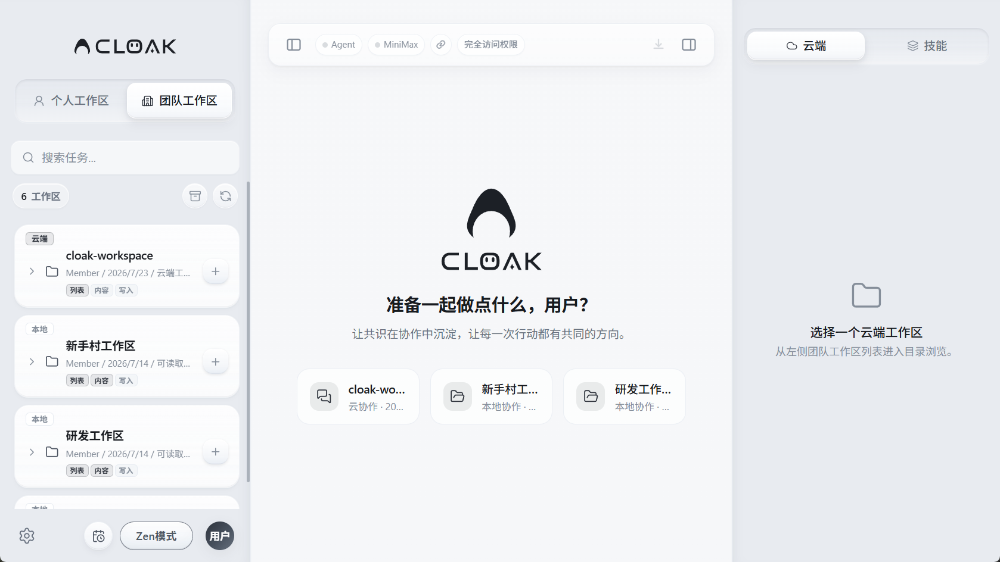
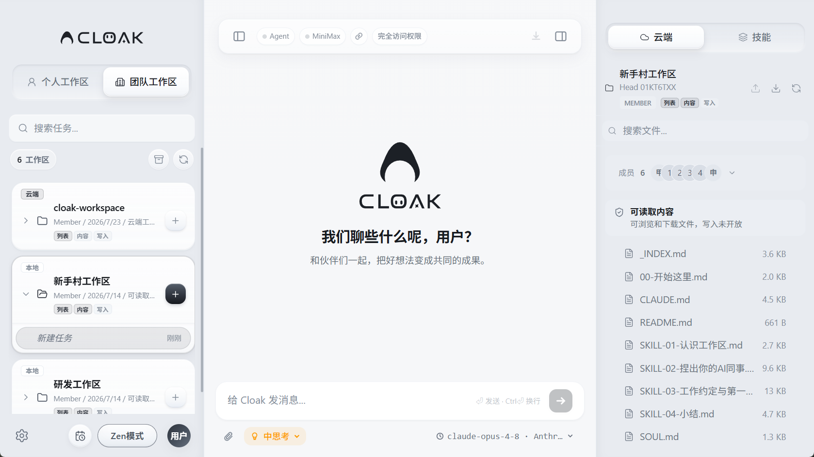
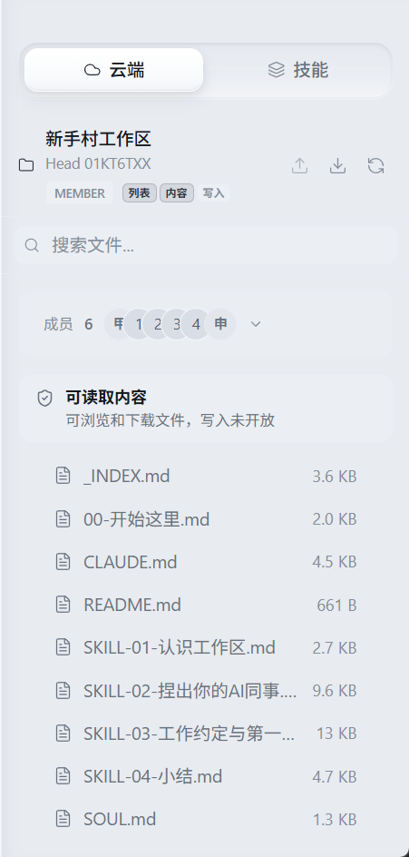

# 团队工作区

团队工作区由组织统一创建和分配。你可以在其中使用团队资料、协作会话和组织提供的模型，不需要自己在电脑上重复准备同一套内容。

团队工作区与个人工作区相互独立。发送消息、上传文件或修改内容前，先确认当前进入的是正确的工作区。

## 1. 进入团队工作区

1. 打开 Cloak。
2. 点击左侧的 `团队工作区`。
3. 在左侧列表或中间的最近工作区中找到目标工作区。
4. 点击最近工作区卡片直接开始，或在左侧点击工作区名称查看历史任务。

左侧栏已经收起时，点击左上角的菜单按钮重新展开。

新版欢迎页会显示最近使用的 3 个团队工作区。卡片下方会标明：

- `本地协作`：点击后直接新建普通任务。
- `云协作`：点击后打开创建群聊窗口。

如果尚未登录，团队工作区会显示登录入口。完成登录后，客户端会自动读取你可访问的组织和工作区。

如果账号还没有加入组织，可以在团队工作区中输入管理员提供的邀请码。加入后，点击列表上方的刷新按钮重新加载。

## 2. 看懂工作区卡片

每张工作区卡片会显示：

- **工作区名称**：确认资料和任务属于哪个团队空间。
- **Member / Manager**：你在该工作区中的角色。
- **更新时间**：工作区最近一次更新的日期。
- **访问状态**：例如 `可写入`、`可读取内容`、`只可浏览` 或 `已禁用`。
- **权限标签**：包括 `列表`、`内容` 和 `写入`。
- **历史任务**：展开卡片后，可以继续之前的任务。

`Manager` 表示工作区角色，不等同于拥有全部文件权限。是否能读取或修改文件，以卡片和右侧云端面板显示的权限为准。

## 3. 在团队工作区中新建任务

1. 找到标有 `本地` 的工作区。
2. 点击工作区卡片右侧的 `+`，或点击欢迎页中的 `本地协作` 卡片。
3. 等待中间区域出现输入框。
4. 在底部确认当前模型和思考模式。
5. 输入要完成的工作。
6. 按 `Enter` 发送。

例如：

> 请阅读当前工作区的项目说明，整理本周需要推进的事项，并按负责人、截止时间和风险输出表格。

团队工作区中的任务会保留在对应工作区下。开始处理另一个项目时，先切换工作区再新建任务，避免引用到错误的文件。

标有 `云端` 的工作区用于团队群聊。点击卡片或右侧的 `+` 后，会先打开创建群聊窗口；这类工作区不提供文件列表、下载和本地同步。群聊的成员邀请和协作方式会在下一篇《团队群聊》中说明。

## 4. 查看角色和文件权限

进入支持文件同步的团队工作区后，如果右侧面板没有显示，先点击右上角的面板按钮，再选择 `云端`。顶部会显示当前工作区名称、版本标记、角色和权限标签。

三个权限标签分别表示：

- `列表`：可以查看工作区、目录和版本信息。
- `内容`：可以下载和读取文件内容。
- `写入`：可以上传、同步并提交文件变更。

常见组合：

- **只有列表**：能看到目录和版本，但不能打开文件内容。
- **列表 + 内容**：能浏览和下载文件，但不能提交修改。
- **列表 + 内容 + 写入**：能读取文件，也能上传和同步修改。
- **已禁用**：不能再写入；是否还能读取，以面板中的状态说明为准。

权限不足时，相关按钮会变灰，点击后也会显示不能操作的原因。不要反复重试，记录工作区名称和缺少的权限，联系组织管理员处理。

## 5. 使用团队云端文件

右侧 `云端` 面板中的常用操作包括：

- **搜索文件**：按文件名查找已经加载的目录。
- **点击文件**：下载到本地缓存并打开预览。
- **上传按钮**：从电脑选择文件并上传到当前工作区，需要 `写入` 权限。
- **同步全部到本地**：把可读取的云端文件更新到本地缓存，需要 `内容` 权限。
- **刷新按钮**：重新读取云端目录和版本。
- **右键文件**：复制路径、在资源管理器中显示、使用默认应用打开，或上传本地修改。

文件状态可能显示：

- `新`：本地新增，尚未上传。
- `已修改`：本地内容与云端版本不同。
- 对勾：本地缓存已经同步。
- 警告图标：本地和云端都发生了变化，存在冲突。

看到冲突时，先分别确认本地和云端要保留的内容，再上传修改。直接覆盖可能丢失其他成员刚提交的内容。

## 6. 团队模型与运行权限

部分团队工作区使用组织统一配置的模型。进入工作区后，客户端会自动加载可用模型；可选择的模型可能与个人工作区不同。

发送任务前检查底部模型名称。如果模型区域显示不可用、正在加载，或消息无法发送：

1. 点击工作区列表上方的刷新按钮。
2. 确认当前账号仍在组织中。
3. 检查网络连接后重新进入工作区。
4. 仍无法使用时，请管理员检查该工作区的模型和成员配置。

顶部的运行权限决定 Cloak 在当前任务中能执行哪些本地操作。团队文件的读取和写入仍受工作区权限控制；显示 `完全访问权限` 不代表可以绕过团队的文件权限。

## 7. 常见问题

### 看不到团队工作区

1. 确认已经登录正确账号。
2. 确认账号已加入目标组织。
3. 点击团队工作区列表上方的刷新按钮。
4. 请管理员确认你已经被加入目标工作区。

### 工作区显示“已禁用”

已禁用的工作区不能继续写入。需要恢复使用时，请管理员重新启用工作区。仍可查看的内容以右侧权限状态为准。

### 能看到目录，但打不开文件

这通常表示只有 `列表` 权限，没有 `内容` 权限。请管理员补充内容读取权限。

### 文件能打开，但不能上传

确认权限标签中是否有 `写入`。没有写入权限时，可以阅读和下载，但不能提交本地修改。

### 云端文件不是最新版本

先点击右侧面板的刷新按钮，再使用 `同步全部到本地`。如果出现冲突提示，不要直接覆盖，先确认团队要保留的版本。

### 新建任务后无法发送消息

检查底部是否已经加载可用模型。团队工作区的模型由组织配置时，需要管理员确认模型可用且已分配给当前工作区。
