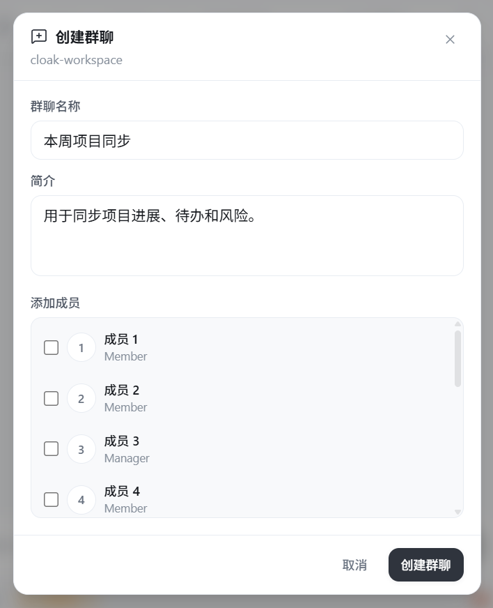
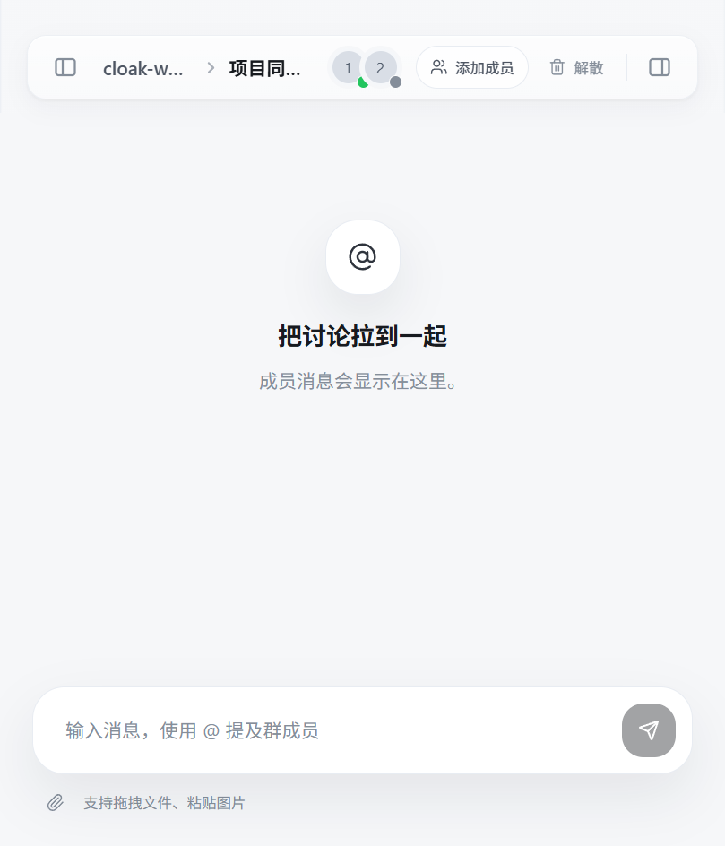
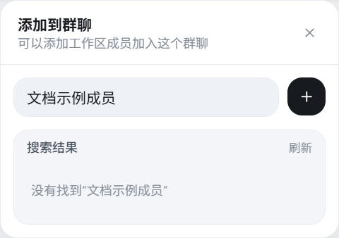
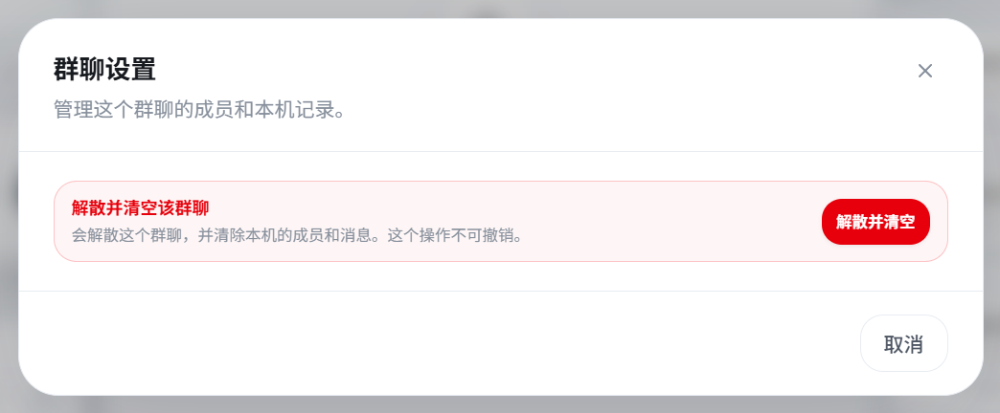

# 团队群聊

团队群聊用于多人持续讨论同一件事。消息会在成员之间同步，适合项目协调、问题跟进和临时讨论。

团队群聊属于标有 `云端` 的团队工作区。它与普通任务相互独立，不会显示团队工作区的文件目录和同步按钮。

## 1. 创建群聊

1. 打开 Cloak。
2. 点击左侧的 `团队工作区`。
3. 找到标有 `云端` 的工作区。
4. 点击工作区右侧的 `+`，或点击欢迎页中的 `云协作` 卡片。
5. 填写群聊名称和简介。
6. 勾选需要一起讨论的成员。
7. 点击 `创建群聊`。

群聊名称要能说明讨论主题。例如：

- 本周项目同步
- 客户反馈跟进
- 新版本上线检查

简介可以写清讨论范围、预期结果或截止时间。后续看到群聊时，成员能更快判断是否需要参与。

创建成功后，群聊会显示在对应团队工作区下。创建者成为群主；部分成员添加失败时，客户端会显示失败人数和原因，可以进入群聊后重新添加。

## 2. 打开已有群聊

1. 进入 `团队工作区`。
2. 展开群聊所属的云端工作区。
3. 点击工作区下方的群聊名称。
4. 等待消息记录同步完成。

已加入的云端群聊会在登录后自动恢复到列表中。切换电脑或重新安装客户端后，使用同一账号登录，仍可以重新读取服务端保留的群聊。

## 3. 看懂群聊界面

群聊中间区域用于阅读和发送消息。顶部显示工作区、群聊名称、成员入口和管理按钮；底部是消息输入框和附件入口。

常用位置：

- **顶部工作区和群聊名称**：确认当前讨论属于哪个团队空间。
- **成员头像**：查看成员、角色和在线状态。
- **添加成员**：邀请同一工作区中的其他成员。
- **解散或退出**：群主看到 `解散`，普通成员看到 `退出`。
- **消息区域**：按时间显示成员发送的内容和附件。
- **输入框**：发送文字，或使用 `@` 提及群成员。
- **回形针**：从电脑选择附件。

## 4. 发送消息和提及成员

1. 点击底部输入框。
2. 输入消息。
3. 按 `Enter` 发送。

需要换行时，按 `Shift + Enter`。

需要提醒指定成员时：

1. 输入 `@`。
2. 从候选列表中选择成员。
3. 继续填写要对方处理的事项。
4. 按 `Enter` 发送。

例如：

> @项目负责人 请在今天下班前确认测试范围，并回复仍未解决的风险。

`@` 后尽量写清动作、交付结果和时间。只发送“请看一下”容易让成员不知道下一步该做什么。

## 5. 发送图片和文件

群聊支持以下附件方式：

- 点击输入框下方的回形针选择文件。
- 把文件拖到消息输入区域。
- 复制图片后，在输入框中粘贴。

附件准备完成后，可以同时补充文字，再发送消息。建议说明附件用途，例如：

> 请查看附件中的需求清单，重点确认第 3 项和第 5 项。

一次发送多个附件时，先检查文件名和内容，避免把其他项目的资料发进群聊。附件需要上传到群聊服务，网络中断时可能发送失败。

## 6. 添加和管理成员

进入群聊后，点击顶部的 `添加成员`：

1. 输入姓名搜索工作区成员。
2. 在搜索结果中找到目标成员。
3. 点击成员完成添加。
4. 等待客户端提示成员已经加入。

点击顶部的成员头像，可以查看：

- 成员姓名和角色。
- 当前在线或离线状态。
- 最近离线时间。

只有群主可以移除其他成员。点击成员列表中的移除按钮并确认后，该成员将不能继续接收这个群聊的新消息。

搜索不到成员时，先确认对方已经加入当前组织和工作区，再点击 `刷新` 重新加载成员。

## 7. 处理群聊邀请

别人把你加入群聊后，客户端会显示“收到一个群聊邀请”。

- 点击 `加入`：接受邀请，群聊会出现在团队工作区的会话列表中。
- 点击 `忽略`：暂时关闭这条邀请，不进入群聊。

如果点击加入后提示邀请失效，通常是群聊已经解散、你已被移出，或邀请状态已经发生变化。请联系群主重新确认。

## 8. 撤回自己的消息

已经同步成功的本人消息旁会显示撤回按钮。

1. 找到要撤回的消息。
2. 点击消息旁的删除图标。
3. 等待消息变为 `消息已撤回`。

只能撤回自己发送且已经同步到服务端的消息。发送失败或仍在同步的消息，暂时不能撤回。

## 9. 退出或解散群聊

群主和普通成员看到的操作不同：

- **群主**：可以解散群聊。解散后，所有成员都不能继续使用这个群聊。
- **普通成员**：可以退出群聊。退出后，该群聊会从自己的列表中移除。

这两个操作都会清除本机保存的群聊记录，并且不能撤销。操作前先确认重要信息已经整理到团队文档或其他正式记录中。

如果只是暂时不需要查看，不要点击解散或退出。可以先切换到其他任务，保留群聊供后续继续讨论。

## 10. 常见问题

### 创建群聊时没有可添加成员

确认当前云端工作区中已经有其他成员。成员刚加入工作区时，关闭创建窗口后重新打开，或点击工作区列表上方的刷新按钮。

### 群聊消息一直没有出现

1. 确认客户端已经登录。
2. 检查网络连接。
3. 退出当前群聊后重新进入。
4. 点击团队工作区列表上方的刷新按钮。

### 消息显示“发送失败”

失败的消息会保留在消息区域中，但输入框会被清空。检查网络后重新输入或复制原消息；带附件的消息还要重新添加附件，并确认文件仍然存在。

### 看不到刚加入的群聊

点击团队工作区列表上方的刷新按钮。如果仍然没有出现，请群主确认你是否已经成功加入，而不是只发出了尚未接受的邀请。

### 无法添加或移除成员

添加成员前，确认对方属于当前工作区。移除成员只对群主开放；普通成员需要联系群主处理。

### 无法退出或解散

等待当前消息同步完成后再试。如果网络恢复后仍失败，重新进入群聊并操作一次，不要连续重复点击。
