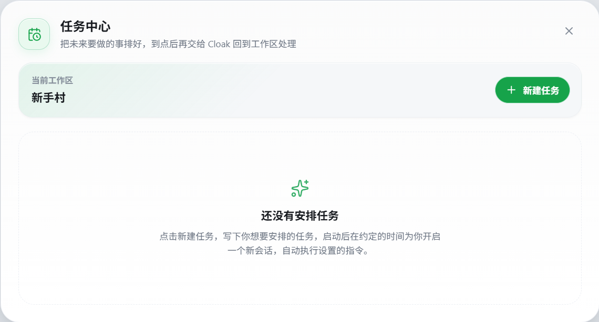
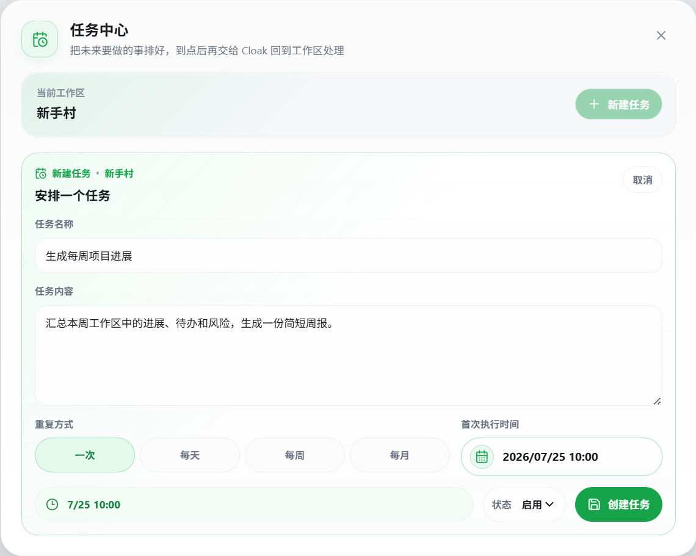
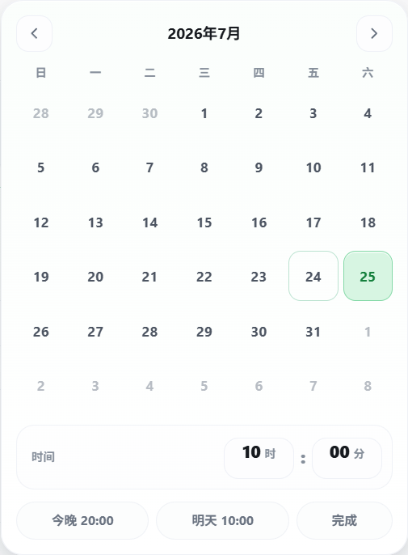
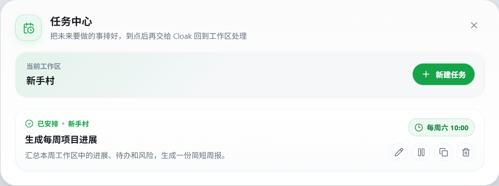

# 任务中心

任务中心用于安排以后自动执行的工作。你可以提前写好任务内容和执行时间，Cloak 到点后会回到对应工作区，新建会话并执行这段指令。

任务计划保存在当前电脑上。它不会自动分配给团队成员，也不会同步到其他电脑。

## 1. 打开任务中心

1. 先进入要处理的个人工作区或团队工作区。
2. 点击左下角的日历时钟图标。
3. 确认任务中心顶部显示的 `当前工作区`。

也可以从以下位置打开：

- 展开已有定时任务的工作区，点击“有任务等待执行”的提示条。
- 在系统托盘菜单中点击任务中心入口。

如果顶部显示 `尚未打开工作区`，`新建任务` 按钮会暂时不可用。关闭任务中心，先进入一个工作区，再重新打开。

## 2. 新建定时任务

1. 点击 `新建任务`。
2. 填写任务名称。
3. 在 `任务内容` 中写清到点后要完成的工作。
4. 选择重复方式。
5. 设置首次执行时间。
6. 将状态设为 `启用`。
7. 点击 `创建任务`。

任务名称用于在列表中识别计划。可以直接写预期结果，例如：

- 生成每周项目进展
- 整理本月客户反馈
- 检查上线前的待办事项

任务内容会作为新会话的第一条指令。建议同时写清范围、结果和格式。例如：

> 汇总本周工作区中的进展、待办和风险，生成一份简短周报，按“已完成、进行中、待确认”三个部分整理。

任务执行时会读取对应工作区。需要使用的文件应提前放进该工作区，并使用容易识别的文件名。

## 3. 设置执行周期

任务中心支持四种重复方式：

- `一次`：只在指定时间执行一次。
- `每天`：每天在所选时间执行。
- `每周`：每周在所选星期和时间执行。
- `每月`：每月在所选日期和时间执行。

点击 `首次执行时间`，可以选择日期、小时和分钟。

时间选择器还提供两个快捷选项：

- `今晚 20:00`
- `明天 10:00`

设置每周或每月任务时，首次执行日期同时决定后续的星期或日期。保存前查看表单底部的时间摘要，确认周期与时间正确。

## 4. 查看任务状态

创建成功后，任务会显示在任务中心列表中。

每张任务卡会显示：

- `已安排` 或 `已暂停`。
- 任务所属的工作区。
- 任务名称和任务内容。
- 下一次执行时间或重复周期。

启用的任务排在暂停任务之前。同一状态下，越早执行的任务越靠前。

工作区展开后，也会显示等待执行的任务数量和最近一次计划。左下角任务中心入口出现提示点时，表示当前有启用中的计划。

## 5. 编辑、暂停、复制和删除

任务卡右侧有四个操作按钮：

- **编辑**：修改名称、任务内容、周期、时间或状态。
- **暂停 / 恢复**：临时停止或重新启用任务。
- **复制**：建立一个内容相同的副本，再调整名称和时间。
- **删除**：从本机移除这项计划。

修改任务后，点击 `保存修改` 才会生效。

暂时不需要执行时，使用暂停。删除操作会立即移除任务；如果以后还要恢复，不要直接删除。

复制任务后会自动进入编辑状态。先修改名称和时间，避免两个相同任务在同一时间重复执行。

## 6. 到点后会发生什么

任务到达执行时间后，Cloak 会：

1. 打开任务绑定的工作区。
2. 新建一个会话。
3. 把任务内容发送给当前可用的模型。
4. 在会话中继续执行任务。

任务开始时，客户端会显示提示。你可以像查看普通任务一样打开这个新会话，检查进度和结果。

一次性任务完成后会从任务中心移除。每天、每周和每月任务完成后，会自动计算下一次执行时间。

## 7. 执行前需要满足的条件

定时任务依赖当前电脑上的 Cloak。执行时间到达时，需要满足以下条件：

- Cloak 客户端保持运行。
- 对应工作区仍然存在，并且当前账号有访问权限。
- 模型和运行环境可以正常使用。
- 需要联网的任务能够连接网络。
- 团队工作区已经在本机准备好可读取的文件目录。

如果客户端在计划时间没有运行，错过的任务不会在下次启动时补跑：

- 一次性任务会被视为已经错过。
- 重复任务会顺延到下一次计划时间。

需要保证准时执行时，不要在计划开始前退出 Cloak，也不要让电脑进入会中断应用运行的状态。

## 8. 个人工作区和团队工作区

任务会绑定到创建时显示的 `当前工作区`。

- **个人工作区**：任务使用本机工作区中的文件。
- **团队工作区**：只有已经在本机开放文件读取的工作区才能创建任务。
- **云端群聊工作区**：如果只提供群聊、不提供文件目录，不能创建工作区定时任务。

任务计划本身只保存在当前电脑。即使绑定的是团队工作区，其他成员也不会在自己的任务中心看到这项计划。

从客户端移除个人工作区时，与该工作区绑定的定时任务也会一并移除。移除前先检查任务中心。

## 9. 常见问题

### 新建任务按钮不可用

关闭任务中心，先进入一个个人工作区或可读取文件的团队工作区，再重新打开任务中心。

### 到时间后没有执行

依次检查：

1. 计划是否处于 `已安排` 状态。
2. 客户端在计划时间是否保持运行。
3. 工作区文件夹是否仍然存在。
4. 模型和运行环境是否可用。
5. 网络连接是否正常。

如果客户端在计划时间处于关闭状态，这次计划不会补跑。可以编辑任务，重新设置下一次执行时间。

### 任务打开了错误的工作区

任务会继续使用创建时绑定的工作区。删除当前任务，进入正确的工作区后重新创建。

### 重复任务执行了两次

打开任务中心，检查是否复制出了内容相同的任务。暂停或删除多余计划，并确认剩余任务的时间。

### 换电脑后看不到任务

任务计划不会在设备之间同步。请在新电脑上进入对应工作区，重新创建需要的计划。

### 任务开始后执行失败

打开自动创建的会话查看提示。确认所需文件存在、模型可用且网络正常后，可以在会话中重新发送任务内容，或修改计划的下一次执行时间。
