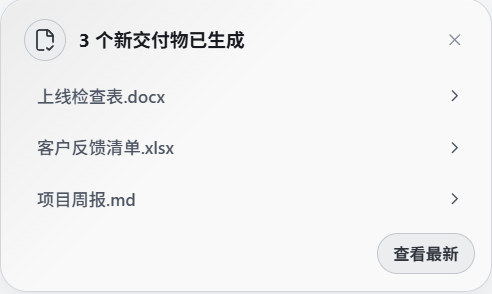
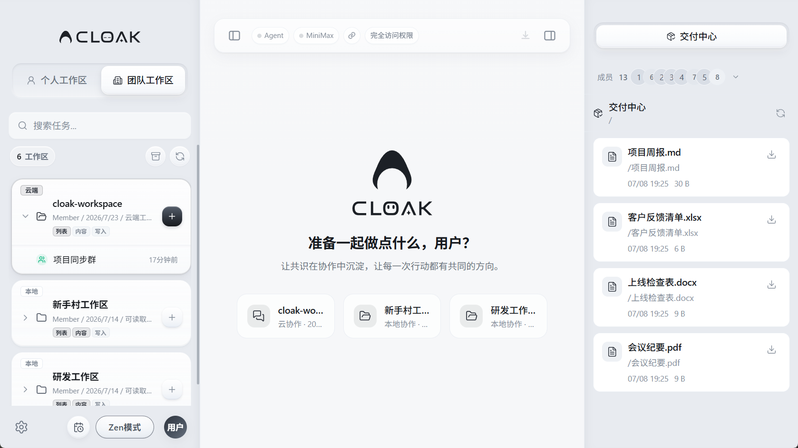
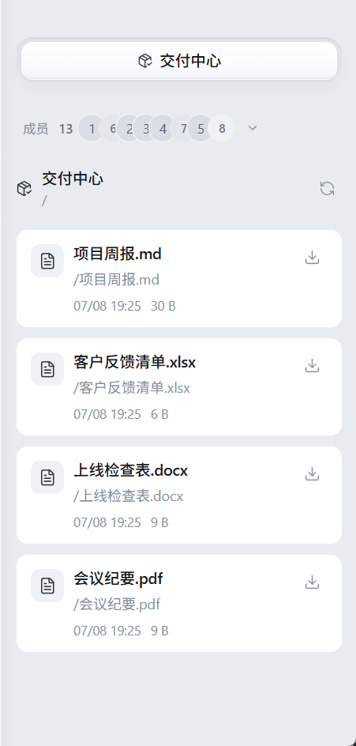

# 交付与产物

Cloak 完成任务后，结果可能直接显示在会话中，也可能生成文档、表格、图片或其他文件。

生成的文件称为交付物。交付物的查看方式取决于当前使用的是本地工作区还是云端工作区。

| 工作区类型 | 交付物在哪里 | 是否需要下载 |
|---|---|---|
| 个人工作区 | 当前工作区的文件目录 | 不需要，文件已经保存在电脑上 |
| 标有 `本地` 的团队工作区 | 该工作区在本机的文件目录 | 不需要；需要共享时再提交到团队空间 |
| 标有 `云端` 的团队工作区 | 右侧的 `交付中心` | 需要选择文件并下载到电脑 |

## 1. 看懂“任务结果”和“交付物”

任务完成后，先查看会话中的最后一条回复。

- 如果结果是说明、总结或建议，内容会直接显示在会话中。
- 如果 Cloak 创建了文件，回复中通常会说明文件名或保存位置。
- 新创建的本地文件还会触发交付物提醒。
- 云端工作区生成的文件会进入交付中心。

有些任务只需要回答问题，不一定会生成文件。需要文件时，在任务指令中明确写出文件类型和名称，例如：

> 根据工作区中的会议记录，生成一份 `项目周报.md`，包含本周进展、风险和下周计划。

## 2. 查看本地交付物提醒

个人工作区或本地团队工作区生成文件后，客户端右下角会显示交付物提醒。

提醒中会列出最近生成的文件。你可以：

- 点击文件名，直接在文件面板中定位该文件。
- 点击 `查看`，打开这一个交付物。
- 有多个文件时，点击 `查看最新` 定位最近生成的文件。
- 点击右上角的 `×` 关闭提醒。

提醒只会停留一段时间。提醒消失不代表文件被删除，文件仍然保存在工作区中。

一次生成较多文件时，提醒只展示最近几项。打开右侧文件面板，可以查看完整目录。

## 3. 在文件面板中找到产物

交付物提醒消失后，可以按以下步骤查找：

1. 确认当前打开的是生成文件时使用的工作区。
2. 点击右上角的文件面板按钮。
3. 点击文件面板中的刷新按钮。
4. 在搜索框中输入文件名的一部分。
5. 点击文件进行预览，或双击使用外部应用打开。

如果只记得文件类型，可以搜索扩展名，例如：

- `.md`：Markdown 文档
- `.docx`：Word 文档
- `.xlsx`：Excel 表格
- `.pptx`：PowerPoint 演示文稿
- `.pdf`：PDF 文件

文件的预览、重命名、复制和外部打开方式，参见[文件与附件](02-文件与附件.md)。

## 4. 使用云端交付中心

标有 `云端` 的团队工作区不显示普通文件目录。进入这类工作区后，右侧面板会切换为 `交付中心`。

打开方法：

1. 点击左侧的 `团队工作区`。
2. 选择标有 `云端` 的工作区。
3. 查看右侧的 `交付中心`。
4. 如果列表没有更新，点击交付中心右上角的刷新按钮。

交付中心只显示当前云端工作区的产物。切换工作区后，列表也会随之切换。

## 5. 看懂云端交付记录

每条交付记录会显示文件名、保存路径、更新时间和文件大小。

交付中心支持文件和文件夹：

- **文件**：点击右侧的下载按钮，保存到电脑。
- **文件夹**：点击文件夹名称或右侧箭头，进入下一级目录。
- **返回上级**：进入文件夹后，点击顶部的 `..`。
- **刷新列表**：点击右上角的刷新按钮。

页面顶部的 `/` 表示当前正在查看交付中心的根目录。进入子文件夹后，这里会显示对应路径。

## 6. 下载云端交付物

1. 在交付中心找到目标文件。
2. 点击文件右侧的下载按钮。
3. 在“保存交付物”窗口中选择电脑上的保存位置。
4. 确认文件名。
5. 点击保存。
6. 等待客户端提示 `文件已保存`。

交付中心按文件下载。需要下载文件夹中的内容时，先进入文件夹，再逐个下载需要的文件。

下载后得到的是电脑上的独立副本。云端文件后续更新时，本地副本不会自动同步，需要重新下载。

## 7. 检查交付物再分享

交付物生成后，先完成以下检查：

1. 确认文件可以正常打开。
2. 检查文件名是否能说明内容和版本。
3. 核对关键数字、日期、人员和结论。
4. 删除不应对外发送的批注、草稿和敏感信息。
5. 确认使用的是最新版本。

多人协作时，可以在文件名中加入日期或版本，例如：

- `项目周报-2026-07-24.md`
- `客户反馈汇总-v2.xlsx`
- `上线检查表-已确认.docx`

本地团队工作区中的产物，需要提交或同步到团队空间后，其他成员才能看到。云端交付中心中的文件可以下载后通过群聊或其他方式发送。

## 8. 微信和 Zen 模式中的交付提示

从微信发起任务时，Cloak 会尝试把任务中新生成的文件返回到微信。文件过多、文件过大或发送失败时，微信中会显示未发送成功的说明；可以回到桌面客户端，从工作区文件面板中查找。

在 Zen 模式中生成文件时，界面会显示简短的“新增交付物”提示。退出 Zen 模式后，仍可以在文件面板中查看文件。

微信的连接和使用方式参见[微信接入](../1-安装与配置/05-微信接入.md)。

## 9. 常见问题

### 任务完成了，但没有看到交付物提醒

先阅读会话中的最后一条回复。有些任务只返回文字，不会创建文件。

如果回复中提到了文件：

1. 打开右侧文件面板。
2. 点击刷新。
3. 搜索回复中提到的文件名。
4. 确认当前工作区是否正确。

### 文件面板中找不到生成的文件

确认任务没有切换到其他工作区。可以回到对应会话，查看回复中写明的文件路径。

如果工作区文件夹被移动或删除，需要重新定位工作区后再查找。

### 云端交付中心是空的

1. 确认选择的是标有 `云端` 的工作区。
2. 点击交付中心右上角的刷新按钮。
3. 确认任务确实已经生成文件。
4. 检查当前账号是否仍有该工作区的访问权限。

### 下载按钮不可用

当前账号可能没有下载权限，或工作区已经被禁用。联系组织管理员检查工作区和成员权限。

### 下载后文件无法打开

检查文件扩展名是否与内容一致，并尝试使用对应的桌面应用打开。文件大小为 `0 B` 或下载中断时，重新下载一次。

### 同名文件不知道哪个是最新版本

比较交付记录中的更新时间。下载前可以先根据时间确认，保存到电脑时再补充日期或版本号。

### 点击刷新后仍然没有新文件

等待任务完全结束后再刷新。网络恢复后重新进入工作区；如果会话中显示生成失败，可以在原会话中让 Cloak 重新生成。
