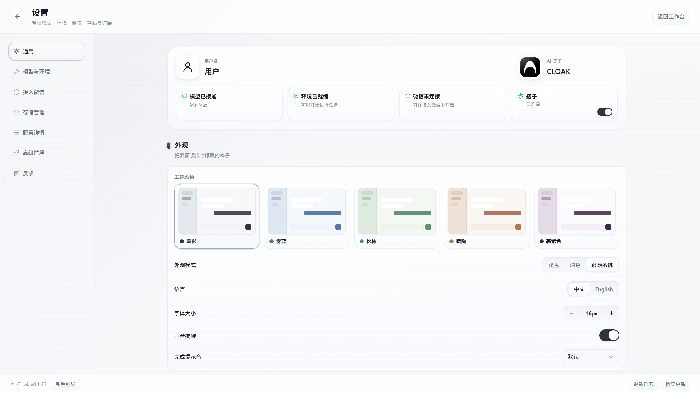
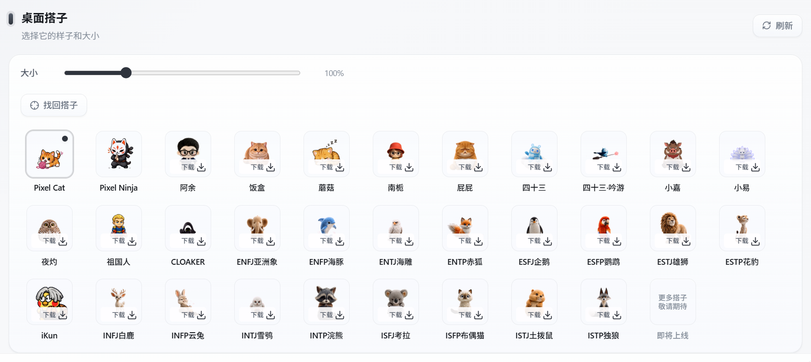

# 桌面工作搭子

桌面工作搭子是一个悬浮在桌面上的小型动画角色。它会一直显示在其他窗口上方，并根据当前状态切换动作。

你可以用它快速判断 Cloak 是正在等待输入、正在工作，还是已经回到空闲状态。搭子本身不会新建任务，也不会显示会话内容。

## 1. 打开桌面搭子

1. 点击客户端左下角的设置按钮。
2. 进入 `通用` 页面。
3. 找到顶部状态卡中的 `搭子`。
4. 打开右下角的开关。

开关打开后，搭子会以独立小窗口出现在桌面上。如果以前移动过它，客户端会恢复上次的位置；首次打开时，搭子会显示在屏幕中间附近。

## 2. 认识搭子窗口

搭子窗口只保留角色本身，不显示标题栏和任务栏图标。切换到其他应用后，它仍会停留在窗口上方。

当前搭子会根据 Cloak 的状态播放不同动画：

- **空闲时**：播放休息或睡眠动画。
- **输入内容时**：切换到活动状态。
- **Cloak 思考或生成内容时**：切换到工作状态。
- **点击搭子时**：播放一次互动动画。

不同形象使用的动画可能不同。状态变化只用于提示当前工作情况，不代表任务已经完成。

## 3. 选择形象

在设置页向下滚动，找到 `桌面搭子`。

形象列表分为两类：

- **内置形象**：已经保存在客户端中，可以直接点击切换。
- **云端形象**：卡片上显示 `下载`，点击后会先下载资源，再自动切换。

当前使用的形象右上角会显示圆点，卡片外框也会高亮。

如果云端形象列表没有更新，点击右上角的 `刷新`。已经下载的形象会保存在当前电脑上，之后可以直接切换。

右键点击云端形象，可以选择：

- `更新资源`：重新下载最新版本。
- `删除本地资源`：删除当前电脑上的资源文件。

删除正在使用的云端形象后，客户端会自动切回内置的 Pixel Cat。此操作不会删除云端提供的形象，以后仍可重新下载。

## 4. 调整大小

拖动 `大小` 滑块可以调整搭子尺寸。

- 最小为 `50%`。
- 最大为 `250%`。
- 每次调整 `5%`。

滑块右侧会显示当前比例。调整后，桌面上的搭子会立即更新。

如果搭子挡住内容，可以先缩小尺寸，再把它拖到屏幕边缘。使用高分辨率屏幕时，可以适当放大，避免角色看不清。

## 5. 移动和找回搭子

按住搭子并拖动，可以把它移动到屏幕上的其他位置。松开后，客户端会保存新位置。

更换显示器、修改缩放比例或断开外接屏幕后，搭子可能停留在看不到的位置。此时：

1. 打开 `设置` > `通用`。
2. 滚动到 `桌面搭子`。
3. 点击 `找回搭子`。

搭子会重新显示在当前屏幕中间附近。这个操作不会改变已经选择的形象和大小。

## 6. 暂时隐藏搭子

不需要搭子时，回到 `设置` > `通用`，关闭顶部状态卡中的 `搭子` 开关。

关闭后：

- 桌面搭子窗口会消失。
- 已下载的形象不会被删除。
- 已选择的形象和大小会被保留。

下次重新打开开关，可以继续使用原来的设置。

## 7. 常见问题

### 打开开关后没有看到搭子

1. 点击 `找回搭子`。
2. 检查搭子大小是否设置得过小。
3. 暂时断开不再使用的外接屏，再点击一次 `找回搭子`。
4. 关闭搭子开关后重新打开。

### 搭子挡住了其他窗口

拖动搭子到屏幕边缘，或在设置中调小尺寸。不需要持续显示时，可以直接关闭搭子开关。

### 点击云端形象后没有切换

云端形象需要先完成下载。等待卡片上的下载进度结束，再检查高亮边框是否已经切换。

如果下载失败：

1. 检查网络连接。
2. 点击右上角的 `刷新`。
3. 再次点击显示 `重试` 的形象卡片。

### 搭子动作没有变化

搭子会根据当前会话的输入和生成状态切换动画。没有打开工作区、没有输入内容或任务已经停止时，保持休息状态属于正常情况。

### 搭子显示太小或有锯齿

打开 `桌面搭子` 设置，逐步调大尺寸。部分形象使用像素风格，放大后仍会保留清晰的像素边缘，这不是图片损坏。

### 删除本地资源后还能看到该形象

删除的是当前电脑上的已下载文件，云端形象仍会保留在列表中。需要再次使用时，点击 `下载` 重新获取。
