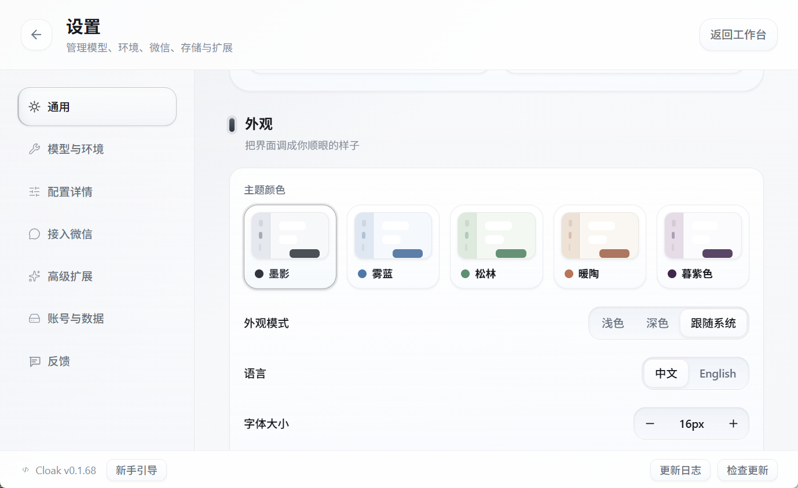
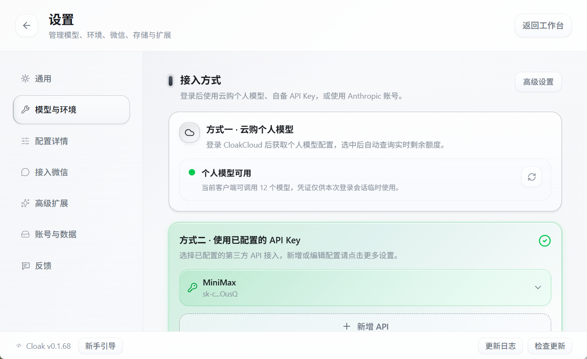
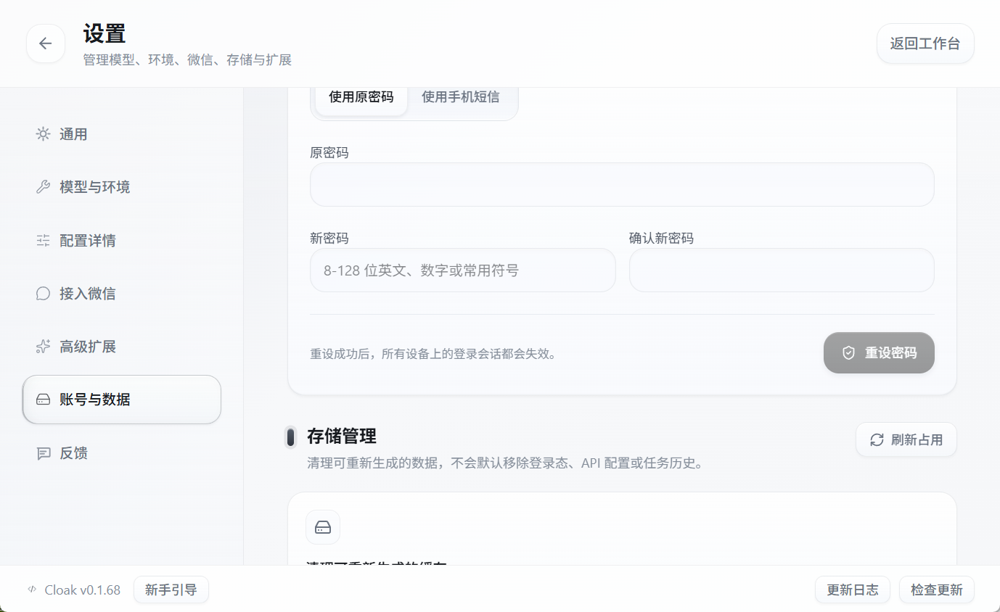
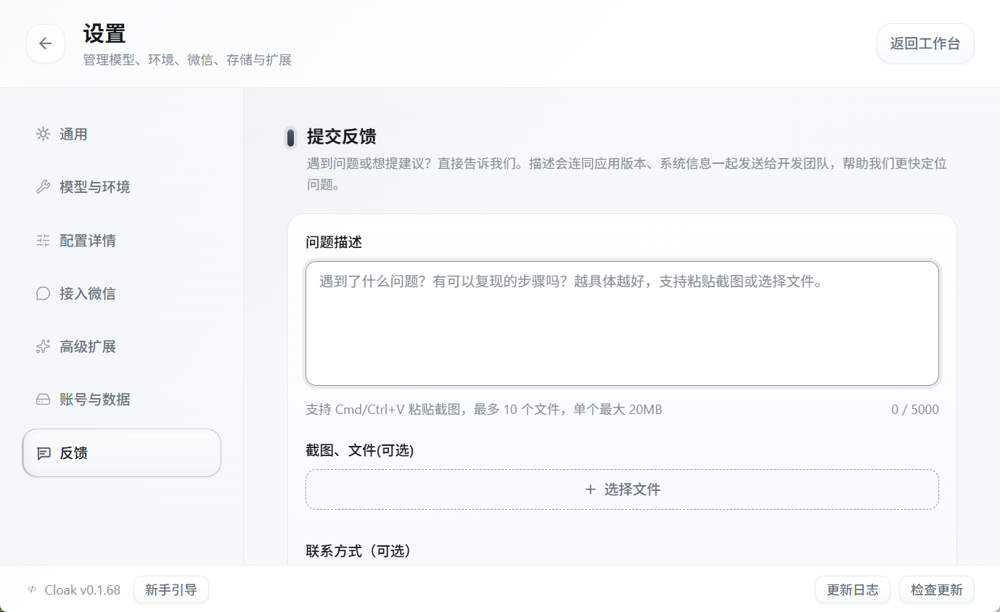

# 设置中心

设置中心集中管理客户端外观、模型、运行环境、微信、账号与数据、扩展和反馈。

大多数日常设置修改后会立即生效。涉及密钥、语音服务或重置数据的操作，需要按页面提示确认或保存。

## 1. 打开和退出设置

点击客户端左下角的设置按钮，即可打开设置中心。

设置中心左侧包含 7 个页面：

| 页面 | 主要用途 |
|---|---|
| `通用` | 查看连接状态，调整外观、语言、字体、声音和桌面搭子 |
| `模型与环境` | 选择模型接入方式、默认模型，检查运行环境 |
| `配置详情` | 管理 API 提供商、模型映射和本机运行环境 |
| `接入微信` | 连接微信，查看切换工作区和会话的指令 |
| `高级扩展` | 管理 MCP 服务器和 Zen 语音服务 |
| `账号与数据` | 重设登录密码，清理缓存和下载资源，或重置应用数据 |
| `反馈` | 提交问题、建议、截图和文件 |

退出设置的方法：

- 点击左上角的返回箭头。
- 点击右上角的 `返回工作台`。
- 按 `Esc` 键。

如果页面上已经打开确认窗口，需要先关闭确认窗口，再退出设置。

## 2. 使用通用设置

`通用` 页面顶部显示当前客户端的主要状态：

- 模型是否已经接通。
- 本机运行环境是否就绪。
- 微信是否连接。
- 桌面搭子是否开启。

状态卡可以帮助你判断下一步需要处理什么。例如，显示“模型未连接”时，进入 `模型与环境`；显示“环境需要处理”时，进入 `配置详情`。

页面下方可以修改：

- **用户名和头像**：点击头像可以更换图片，点击名称可以直接编辑。
- **AI 搭子名称和头像**：用于客户端中的 AI 形象显示。
- **主题颜色**：在墨影、雾蓝、松林、暖陶和暮紫色之间切换。
- **外观模式**：选择浅色、深色或跟随系统。
- **语言**：选择中文或 English。
- **字体大小**：使用 `-` 和 `+` 调整界面文字。
- **声音提醒**：控制任务完成后的提示音。
- **完成提示音**：选择声音时会播放一次预览。
- **桌面搭子**：选择形象、调整大小和找回位置。

桌面搭子的完整说明参见[桌面工作搭子](07-桌面工作搭子.md)。

## 3. 管理模型与运行环境

`模型与环境` 用于完成最常见的模型选择和环境检查。

页面提供三种接入方式：

1. **云购个人模型**：登录后使用当前账号已开通的个人模型；未开通时可按页面提示申请。
2. **已配置的 API Key**：从已经添加的第三方 API 配置中选择。
3. **Anthropic 账号登录**：使用已经授权的 Claude 账号。

选定接入方式后，在页面底部选择默认模型。新建会话时会优先使用这个模型；已经运行中的会话不会因为这里的修改自动重新开始。

`环境已就绪` 表示本机已经具备执行任务的基础条件。出现新版本提示时，可以点击旁边的 `更多设置`，进入环境管理区域处理。

需要新增 API、修改密钥或检查模型映射时，点击接入方式右上角的 `高级设置`，或直接打开左侧的 `配置详情`。

模型和环境的完整配置步骤参见[模型与环境配置](../1-安装与配置/04-模型与环境配置.md)。

## 4. 接入微信

`接入微信` 页面用于连接或断开微信，并查看微信端可用指令。

首次使用时，按照页面提示完成连接。连接后先检查：

- 当前显示的微信连接状态。
- Cloak 客户端仍在运行。
- 客户端中已打开准备继续的工作区或会话。
- 普通消息会进入 AI；只有以 `/` 开头的内容才会被识别为切换工作区、会话或发送文件的指令。

微信消息会按顺序进入当前会话。在共用电脑上暂时不使用时，请点击 `断开连接`。

详细步骤参见[微信接入](../1-安装与配置/05-微信接入.md)。

## 5. 使用账号与数据

`账号与数据` 同时包含 `账号安全` 和 `存储管理`。需要重设密码时使用账号安全；需要清理可以重新生成的文件时，向下滚动到存储管理。

页面包含三类操作：

### 清理可重新生成的缓存

会清理 WebView 网络缓存、工具 npm 缓存和临时附件。

此操作不会默认删除：

- 登录状态。
- API 提供商配置。
- Cloak 管理的任务历史。

清理后，部分页面或工具第一次重新打开时可能需要重新加载。

### 管理下载资源

可以清理已经下载的桌面搭子和云端指南资源。删除后不会影响云端内容，下次使用时会重新下载。

点击卡片可以展开资源分类。选择要清理的范围后，还需要在确认窗口中再次确认。

### 重置应用数据

`重置应用数据` 会退出登录，并删除用户设置、下载资源和其他应用数据。API 配置和 Cloak 管理的任务历史会保留。

这是不可撤销的操作。普通缓存问题优先使用“清理可重新生成的缓存”，不要直接重置应用数据。

## 6. 使用配置详情

`配置详情` 面向需要管理多个模型账号或处理运行环境问题的用户。

页面分为两个区域：

- **AI 账号与 API 提供商**：新增、编辑、启用或删除提供商，设置服务地址、API Key 和模型映射。
- **环境与运行时**：查看 Claude、Codex、Gemini 等运行方式的状态，检查版本并处理安装或更新问题。

如果只需要切换已经配置好的模型，使用 `模型与环境` 即可。只有新增密钥、修改服务地址或排查环境时，才需要进入配置详情。

API Key 属于敏感信息。不要把设置页面截图发送到公开群聊，也不要把密钥粘贴到普通会话中。

## 7. 使用高级扩展

`高级扩展` 包含两个区域：

- **MCP 服务器**：让模型连接外部工具或数据服务。
- **Zen 语音**：配置语音识别和 AI 语音回复。

MCP 服务器通常由技术人员或组织管理员提供配置。不了解用途时，可以保持现有状态，不要随意删除或修改命令。

Zen 语音配置需要根据所选服务填写对应凭据，并点击页面底部的 `保存配置`。语音服务配置教程可从页面中的 `查看教程文档` 打开，也可以参见[专注模式与语音](../1-安装与配置/06-专注模式与语音.md)。

## 8. 提交反馈

遇到问题时，打开 `反馈` 页面。

1. 在 `问题描述` 中写清发生了什么。
2. 写出可以重复问题的操作步骤。
3. 粘贴截图，或点击 `选择文件` 添加附件。
4. 需要后续联系时，填写邮箱、微信或飞书手机号。
5. 点击 `提交反馈`。

问题描述最多 `5000` 个字符。最多可以添加 `10` 个文件，单个文件不能超过 `20 MB`。

提交内容会附带应用版本等诊断信息，帮助定位问题。发送前检查附件，删除与问题无关的账号、密钥、客户信息和其他敏感内容。

## 9. 查看版本和更新

设置中心底部会一直显示当前 Cloak 版本。

底部按钮包括：

- `新手引导`：重新打开首次使用引导。
- `更新日志`：查看近期版本变化。
- `检查更新`：手动检查客户端新版本。

左侧 `模型与环境` 或 `配置详情` 出现红点时，通常表示检测到了需要关注的环境或工具更新，不一定代表当前功能已经不可用。

客户端更新方法参见[更新与版本](../1-安装与配置/08-更新与版本.md)。

## 10. 常见问题

### 修改后没有看到保存按钮

主题、语言、字体、声音、模型选择和桌面搭子等设置会立即保存。Zen 语音凭据等页面会显示单独的保存按钮，需要点击后才生效。

### 界面文字太大，部分内容显示不全

进入 `通用`，在 `字体大小` 中逐步调小。也可以适当拉大客户端窗口，避免设置卡片被压缩。

### 模型与环境页面显示红点

打开 `模型与环境` 查看环境状态和版本提示。需要安装、修复或更新时，点击 `更多设置` 进入配置详情。

### 清理缓存后需要重新下载资源

这是正常情况。可重新生成的缓存和下载资源被清理后，会在下次使用对应功能时重新创建或下载。

### 误点了重置应用数据

点击按钮后还会出现确认窗口。不要确认，直接关闭窗口即可。已经确认并完成重置的数据无法从客户端中恢复。

### 反馈按钮不可用

先填写问题描述。仍不可用时，检查网络连接；如果页面提示反馈服务未配置，请联系组织管理员或 Cloak 团队。
