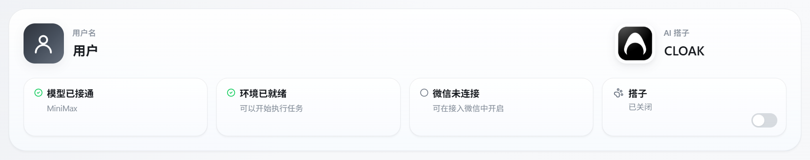
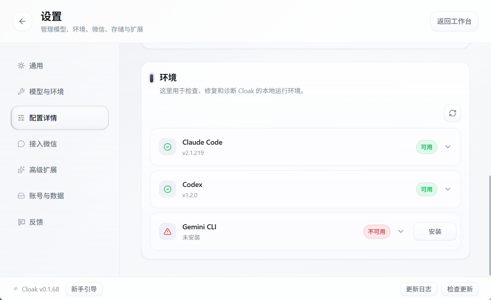

# 常见问题排查

遇到问题时，先不要反复点击或立即重置应用数据。先确认问题属于登录、模型、环境、网络、文件还是团队权限，再处理对应位置。

多数临时问题可以通过刷新状态、重新进入页面或稍后重试解决。持续出现同一错误时，保留错误原文并提交反馈。

## 1. 先做一次快速检查

按下面的顺序检查：

1. 记录页面上的完整错误提示。
2. 确认电脑网络可以正常使用。
3. 打开 `设置` > `通用`，查看顶部状态卡。
4. 确认当前工作区和会话是否正确。
5. 只重试一次刚才的操作。
6. 仍然失败时，按照本文对应分类继续检查。

状态卡的含义：

| 状态 | 正常显示 | 需要处理时去哪里 |
|---|---|---|
| 模型 | `模型已接通` | `模型与环境` |
| 本机环境 | `环境已就绪` | `配置详情` > `环境` |
| 微信 | `微信已连接` | `接入微信` |
| 桌面搭子 | `已开启` 或 `已关闭` | `通用` 页面底部 |

微信和桌面搭子不是执行普通任务的必要条件。模型或本机环境异常时，新会话通常无法正常运行。

## 2. 看懂常见错误提示

客户端会先显示简短说明。需要提交反馈时，可以点击消息中的 `查看详情`，复制原始错误。

| 错误提示 | 常见原因 | 处理方法 |
|---|---|---|
| API 密钥无效或已过期 | Key 填写错误、失效或被停用 | 到 `配置详情` 检查对应 API 提供商 |
| 请求太频繁 | 短时间发送了过多请求 | 等待几十秒后再试，不要连续点击发送 |
| API 余额不足 | 当前账号或 Key 的额度不足 | 充值、切换其他配置，或联系管理员 |
| 模型不存在或不可用 | 模型名不正确、已下线或当前账号无权限 | 在 `模型与环境` 切换模型 |
| 网络连接失败 | 断网、代理、VPN、防火墙或服务地址异常 | 检查网络和服务地址后重试 |
| 权限不足 | 文件、工作区、组织或系统权限不足 | 检查对应权限，不要反复重试 |
| 服务暂时繁忙 | 模型服务返回临时错误 | 稍后重试或切换备用模型 |
| CLI 未正确安装 | 本机运行环境缺失或损坏 | 到 `配置详情` > `环境` 检查或重新安装 |
| 对话太长 | 当前会话已超过模型可处理的长度 | 新建任务，并简要补充必要上下文 |

错误详情中可能包含本机路径、模型名称或其他诊断信息。发送到群聊或工单前，删除 API Key、Token、客户数据和个人文件路径。

## 3. 客户端无法安装或启动

### 安装程序没有反应

1. 确认下载的是当前系统对应的安装包。
2. 检查安装包是否已经完整下载。
3. 关闭正在运行的旧版 Cloak。
4. 检查安全软件是否拦截安装程序。
5. 重新运行安装程序。

如果 Windows 提示没有写入权限，只在确认安装包来源可信时使用管理员权限运行。

### 启动后只有空白页面

1. 退出 Cloak 后重新打开。
2. 等待页面加载完成，不要连续启动多个客户端。
3. 检查系统时间和网络连接。
4. 进入 `设置` > `账号与数据` > `存储管理`，清理可重新生成的缓存。
5. 仍然空白时，更新到最新客户端。

不要先使用 `重置应用数据`。重置会退出登录并删除用户设置，应当作为最后手段。

### 更新后无法启动

重新下载最新安装包覆盖安装。覆盖前不要手动删除工作区文件夹。

安装和启动步骤参见[安装与启动](../1-安装与配置/01-安装与启动.md)，更新排查参见[更新与版本](../1-安装与配置/08-更新与版本.md)。

## 4. 无法登录或看不到组织

### 二维码已经失效

点击刷新，使用新二维码重新扫码。扫码后等待客户端返回结果，不要重复扫描多张二维码。

### 账号或短信登录失败

依次检查：

1. 手机号、区号或账号是否正确。
2. 验证码是否来自本次登录。
3. 验证码是否已经过期。
4. 密码是否满足页面要求。
5. 网络是否能够访问 CloakCloud。

不要把验证码或密码发送给其他人。

### 登录成功但没有组织

个人账号可以继续使用个人工作区。需要进入团队空间时，联系组织管理员确认：

- 当前账号是否已经加入组织。
- 是否使用了正确的手机号或账号。
- 成员是否被停用。
- 是否已经分配团队工作区。

### 组织或工作区列表加载失败

先点击页面上的重试或刷新。仍然失败时，退出账号后重新登录，并确认网络和系统时间正常。

登录方式参见[首次登录与工作区](../1-安装与配置/03-首次登录与工作区.md)。

## 5. 模型无法连接或消息无法发送

### 状态显示“模型未连接”

打开 `设置` > `模型与环境`，选择一种接入方式：

- Anthropic 账号。
- 已配置的 API Key。
- 已开通的云购个人模型。

选择后确认页面底部已经设置默认模型。

### API Key 配置后仍然失败

1. 打开 `配置详情`。
2. 找到正在使用的 API 提供商。
3. 检查服务地址、API Key 和模型映射。
4. 点击 `测试对话`。
5. 回到工作区，新建一个任务再发送简短消息。

部分渠道可能限制设置页中的测试请求。`测试对话` 失败但配置看起来正确时，以新会话中的实际发送结果为准。

### 显示“模型不存在”

模型名称可能已经变更，或当前 Key 没有调用权限。切换到配置中列出的其他模型，不要自行猜测模型名称。

团队工作区显示“没有可用模型”时，需要组织管理员为该工作区启用模型。

### 模型暂时不可用

模型服务返回临时错误时，客户端可能提供：

- `重试当前模型`
- `切换到备用模型并重发`

先等待一段时间再重试。已经连续失败时，切换备用模型，不要重复快速发送同一条消息。

完整配置步骤参见[模型与环境配置](../1-安装与配置/04-模型与环境配置.md)。

## 6. 本机环境或 CLI 异常

打开 `设置` > `配置详情`，滚动到 `环境`。

运行时列表会分别显示 Claude Code、Gemini 和 Codex 的状态。只需要处理当前准备使用的运行方式。

常见状态：

- **可用**：可以启动并完成会话初始化。
- **检查中**：等待检查结束后再操作。
- **命令不可用**：本机没有找到对应程序，使用页面提供的安装按钮。
- **需要认证**：程序已安装，但还需要登录或填写凭据。
- **初始化失败**：程序可以找到，但无法建立会话，先刷新，再检查版本和配置。

### Claude Code 不可用

1. 点击 `检查 CLI 状态`。
2. 检查 Claude 认证是否仍为已登录。
3. 有更新时点击 `更新 CLI`。
4. 文件缺失或损坏时点击 `重新安装`。
5. Windows 检测到损坏的旧程序时，使用 `修复` 后重新扫描。

### Gemini 不可用

使用 `安装 Gemini CLI` 安装，或按照页面提示完成认证。安装或登录过程可能打开终端窗口，不要在执行完成前关闭。

### Codex 不可用

根据页面状态安装、修复或更新 Cloak 托管的 Codex Adapter。使用 API Key 登录时，只在专用凭据窗口中填写，不要发送到会话里。

安装或修复完成后，点击运行时区域右上角的刷新按钮，再新建任务测试。

## 7. 任务一直运行或没有回复

### 发送后长时间没有变化

复杂任务可能需要较长时间。先观察状态栏和会话中是否还有新内容。

如果客户端提示“任务仍在运行中”：

1. 再等待一段时间。
2. 确认网络没有中断。
3. 持续没有变化时停止当前任务。
4. 新建任务，用更短、更明确的指令重试。

停止任务前不要退出客户端，否则不容易判断任务是仍在执行还是已经中断。

### 新建任务后没有输入框

通常是还没有进入可用工作区。先选择个人工作区或有权限的团队工作区，再新建任务。

### 同一条消息执行了两次

网络较慢时不要连续点击发送。发现重复任务后，保留一个，停止多余的任务。

### 历史任务加载失败

1. 确认选择了正确工作区。
2. 收起后重新展开该工作区。
3. 重新进入对应任务。
4. 仍然失败时重启客户端。

主界面和会话说明参见[主界面与会话](01-主界面与会话.md)。

## 8. 文件、附件或交付物异常

### AI 无法读取附件

1. 确认附件已经出现在输入框上方。
2. 等待 `处理中…` 消失，再发送消息。
3. 检查文件是否仍存在，并确认当前工作区可以读取该路径。
4. 图片无法识别时，转换为 PNG、JPG、WebP 或 GIF，再使用 Claude Code 或 Codex 重新添加。
5. 添加图片后又修改了原图时，先移除旧附件，再重新添加最新版。
6. 文件过大时，拆分后重新添加。
7. 对话过长时，新建任务后重新添加附件。

### 文件面板是空的

确认当前打开的是本地工作区。云端工作区使用交付中心，不显示普通文件目录。

本地文件面板没有更新时，点击刷新，并确认工作区文件夹没有被移动、改名或删除。

### 无法预览文件

二进制文件、过大的外部文件或暂不支持的格式可能无法在客户端内预览。双击文件，使用系统中的对应应用打开。

### 找不到生成的文件

1. 阅读会话最后一条回复中的文件名和路径。
2. 确认当前工作区正确。
3. 刷新文件面板或交付中心。
4. 搜索文件名或扩展名。

更多说明参见[文件与附件](02-文件与附件.md)和[交付与产物](06-交付与产物.md)。

## 9. 团队工作区或群聊权限异常

团队工作区会分别显示列表、内容和写入权限。

- **没有列表权限**：看不到目录或工作区入口。
- **没有内容权限**：可以看到名称，但不能读取文件。
- **没有写入权限**：可以读取，但不能上传或修改。
- **工作区已禁用**：成员暂时不能继续使用。

这些权限需要组织管理员调整。把工作区名称、需要完成的操作和页面提示发给管理员，不要只说“用不了”。

群聊中无法邀请、移除成员或解散群聊，通常与群主、管理员或组织角色有关。成员不能自行绕过这些限制。

参见[团队工作区](03-团队工作区.md)和[团队群聊](04-团队群聊.md)。

## 10. 网络和更新问题

### 页面一直加载

1. 检查其他网络服务是否正常。
2. 检查代理或 VPN 是否连接。
3. 确认防火墙或安全软件没有阻止 Cloak。
4. 关闭并重新打开当前页面。
5. 稍后再试。

公司网络可能限制模型服务、npm 或更新地址。持续失败时，请网络管理员检查对应访问策略。

### 客户端可以打开，但模型无法使用

客户端、CloakCloud 和模型提供商是不同的网络服务。能够登录不代表模型接口一定可达。

检查当前 API 提供商的服务地址，并尝试切换其他可用模型。

### 更新后环境出现红点

客户端更新和 CLI、Gemini、Codex Adapter 更新是不同的项目。进入 `模型与环境` 或 `配置详情`，按照页面提示分别更新。

### 检查更新失败

确认网络和系统时间正常，稍后重新检查。也可以从正式发布渠道下载最新安装包覆盖安装。

## 11. 提交有效反馈

完成以上检查仍未解决时，打开 `设置` > `反馈`。

反馈中至少写明：

1. 问题发生的时间。
2. 使用的是个人工作区还是团队工作区。
3. 可以重复问题的操作步骤。
4. 页面显示的完整错误提示。
5. 当前客户端版本。
6. 使用的模型接入方式和模型名称。
7. 已经尝试过哪些处理方法。

可以粘贴截图或添加文件。最多添加 `10` 个文件，单个文件不能超过 `20 MB`。

提交前删除：

- API Key、Token、密码和验证码。
- 客户资料和内部文件内容。
- 不需要公开的本机路径。
- 与问题无关的聊天记录。

如果客户端无法进入反馈页面，把上述信息发送给组织管理员或 Cloak 团队。不要只发送一张没有上下文的错误截图。
