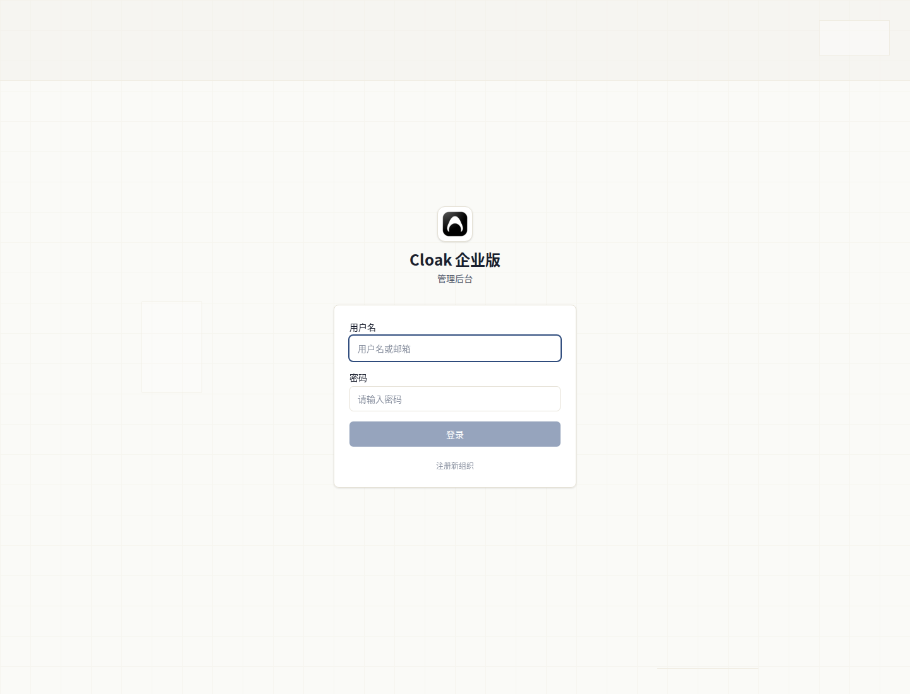

# 登录与授权

登录地址：<https://admin.cloud.43cloak.com/login>

## 登录方式

当前页面只提供用户名和密码登录。

输入账号和密码后点击“登录”。

当前不支持飞书登录。

## 组织选择

如果同一个账号可以进入多个组织，登录时会先出现组织下拉框。

在下拉框里选择要进入的组织，再继续登录。

## 登录后

登录成功后会进入数据看板。

左侧菜单显示当前账号可以使用的管理页面。没有权限的页面不会显示。

## 常见提示

- 用户名或密码错误：请重新输入账号信息。
- 账号已被禁用：该账号不能继续登录。
- 该账号无管理后台权限，请使用客户端访问：当前账号不能进入管理后台。
