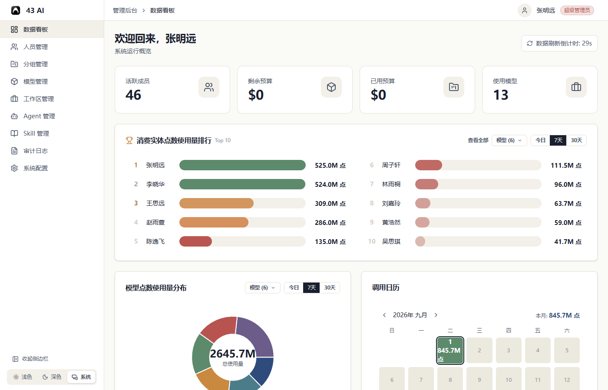

# 数据看板

进入管理后台后，首页就是数据看板。

## 顶部总览

页面最上方有四个卡片：

- 活跃成员
- 剩余预算
- 已用预算
- 使用模型

实际显示的卡片会根据组织权限和数据接入情况变化。

## 成员排行

中间区域显示成员模型点数使用量排行。

可查看内容：

- 成员排名
- 时间范围：今日、7天、30天
- 模型筛选

右上角“查看全部”可打开完整名单。

## 分析区

下方四个区域分别是：

- 模型点数使用量分布
- 调用日历
- 模型点数使用趋势
- 时段分布

每个图表右上角可切换模型；部分图表可切换时间范围。

## 状态说明

- 右上角显示自动刷新倒计时。
- 没有数据时，图表会显示“正在准备中”或类似提示。
- 没有权限时，相关卡片可能不会显示。
