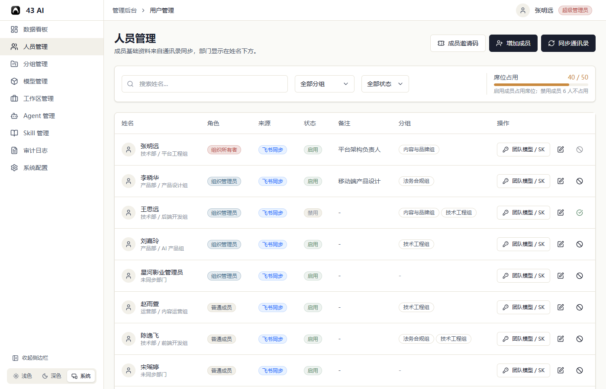
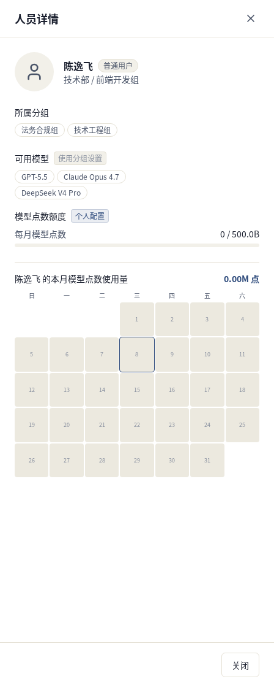
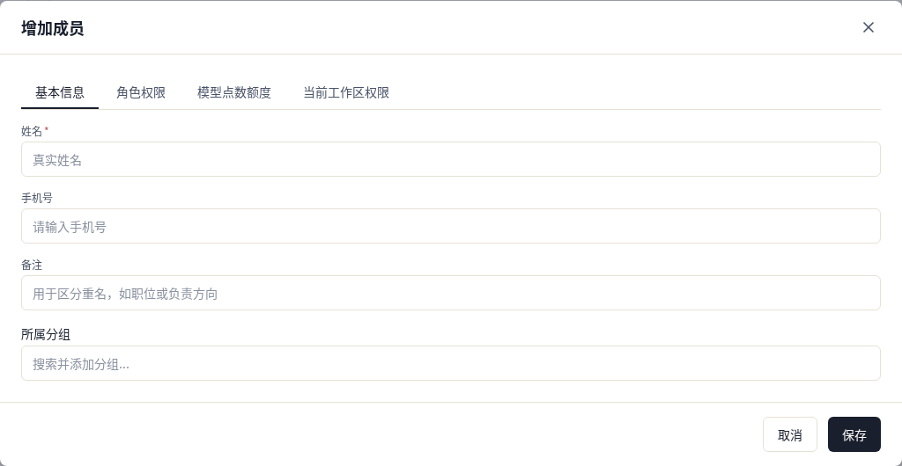
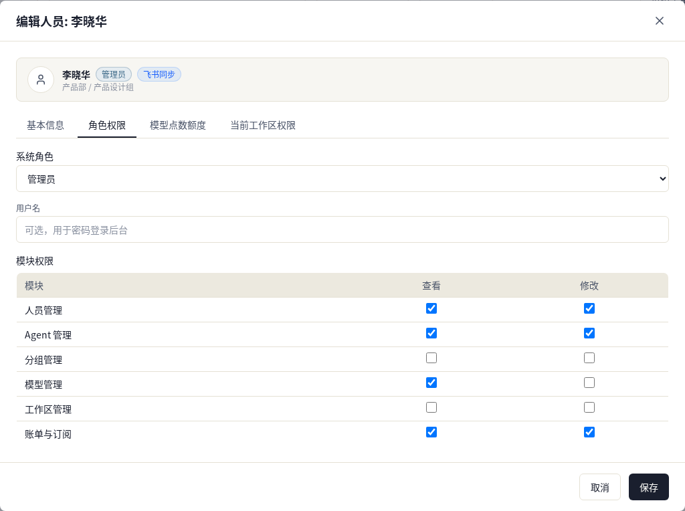
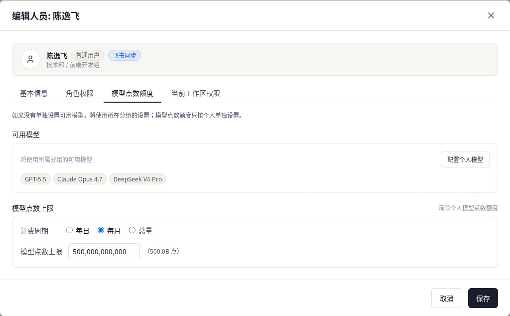
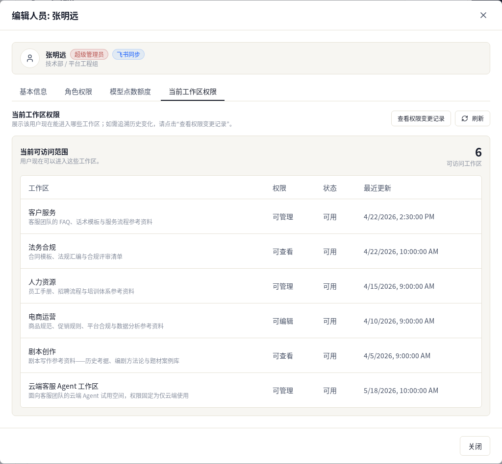
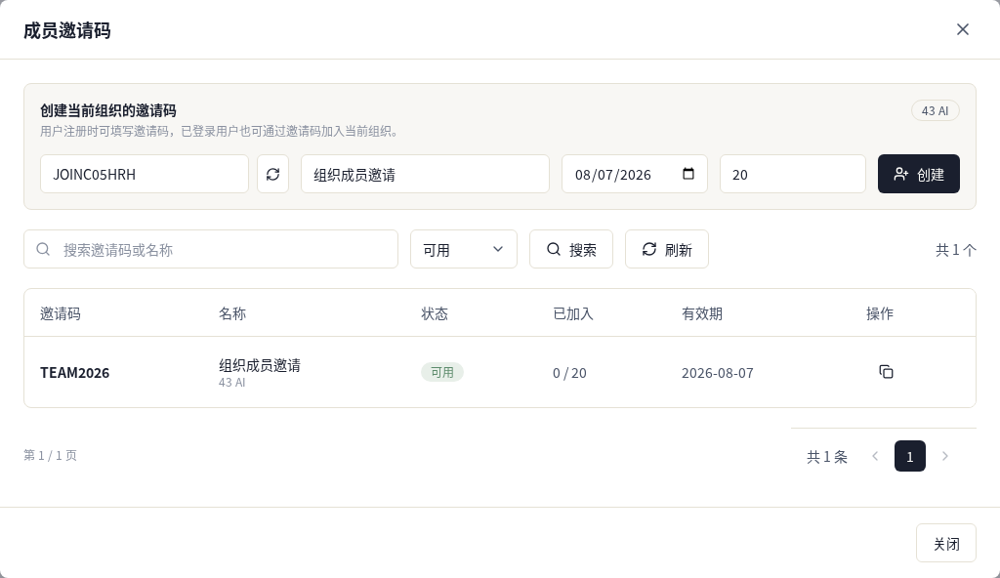

# 人员管理

人员基础资料来自通讯录同步，部门显示在姓名下方。

## 列表页

页面顶部有三个入口：

- `成员邀请码`
- `增加成员`
- `同步通讯录`

列表上方可以按姓名、分组、状态筛选。底部可以切换每页数量并翻页。

列表中可看到这些信息：

- 姓名和部门
- 角色
- 来源
- 状态
- 备注
- 分组

操作列可以打开团队模型 / Skill 配置、编辑成员，或者对成员执行禁用 / 启用。

## 人员详情

点击成员行，会打开人员详情。

这里可以查看：

- 所属分组
- 可用模型
- 模型点数额度
- 本月模型点数使用量

如果某项是按分组生效，页面会直接显示分组来源。

## 新增成员

新增成员时先填基本信息：

- 姓名
- 手机号
- 备注
- 所属分组

填完后，可以继续切换到其他页签，补充角色、额度和工作区权限。

## 角色权限

这里可以设置系统角色，并勾选模块权限。

每个模块分别控制：

- 查看
- 修改

## 模型点数额度

这里可以给成员单独设置模型点数额度。

可以配置：

- 计费周期：每日、每月、总量
- 模型点数上限
- 是否清除个人额度

## 当前工作区权限

这里显示这个成员现在能进入哪些工作区。

每一行会列出：

- 工作区名称
- 权限
- 状态
- 最近更新

右上角可以查看权限变更记录，也可以刷新当前结果。

## 成员邀请码

这里可以创建当前组织的邀请码，并查看已有邀请码列表。

创建时需要填写：

- 邀请码
- 名称
- 有效期
- 最大加入次数

下方列表可以按邀请码、名称和状态查询，也可以复制邀请码。

## 禁用 / 启用

操作列里的状态按钮会打开确认框。

确认后，成员会被禁用或启用。不同状态下，按钮文案会跟着变化。
