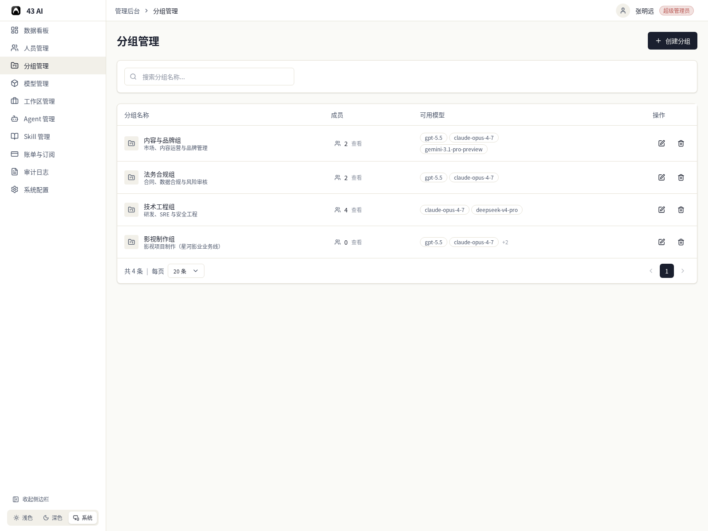
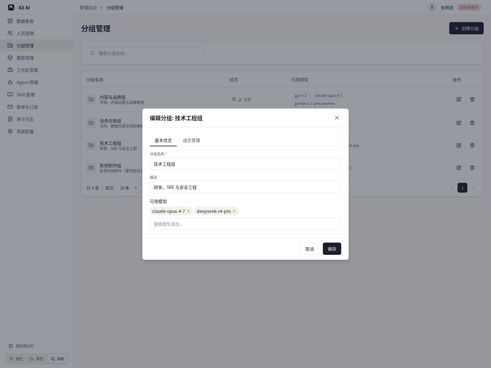
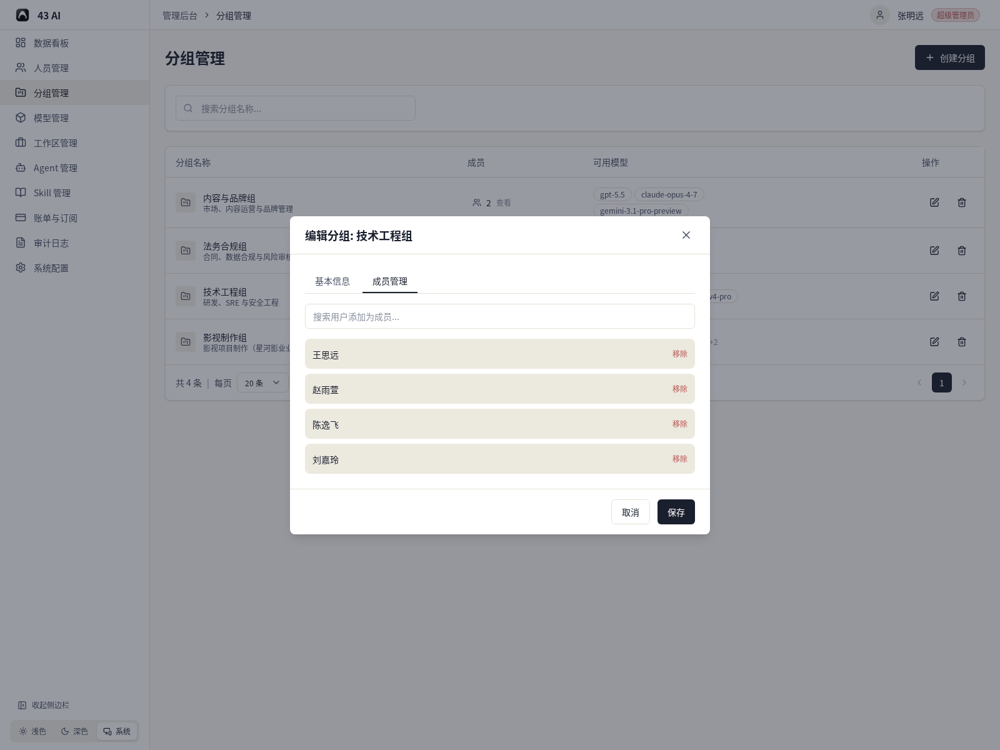
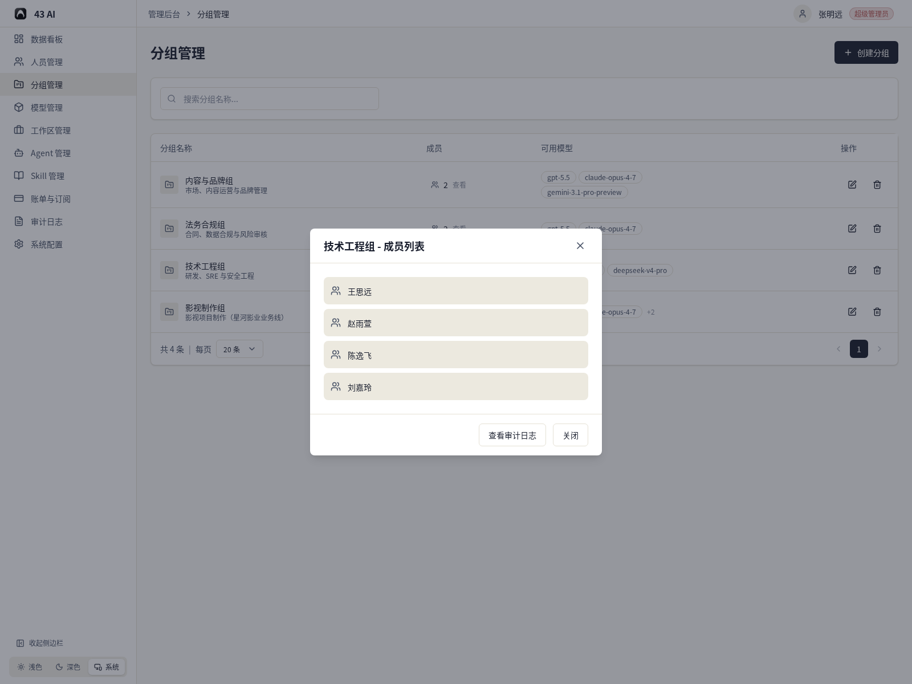
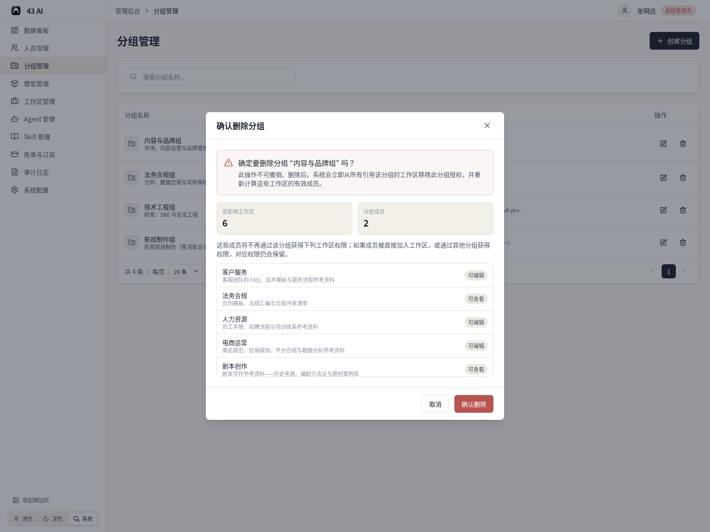

# 分组管理

分组页列出当前组织里的所有分组，页面上直接能看到成员数和可用模型。

## 列表页

页面顶部可以搜索分组名称，也可以新建分组。

列表里显示这些信息：

- 分组名称和描述
- 成员数
- 可用模型
- 编辑和删除入口

底部可以切换每页数量并翻页。

## 创建 / 编辑分组

创建和编辑使用同一个弹窗。

在“基本信息”里可以填写：

- 分组名称
- 描述
- 可用模型

模型会以标签形式显示，标签右侧的 `x` 可以移除。

## 成员管理

切到“成员管理”后，可以搜索用户并加入分组。

这里可以看到：

- 当前成员列表
- 每个成员右侧的 `移除`
- 保存按钮

## 成员列表

在列表页点击成员数，会打开成员列表。

这里可以直接查看这个分组当前包含哪些成员，也可以进入审计日志。

## 删除分组

点击删除后，系统会先显示影响范围。

这里会提示：

- 受影响工作区数量
- 分组成员数量
- 受影响工作区列表

确认删除后，系统会同步清理这些工作区上的分组授权。
