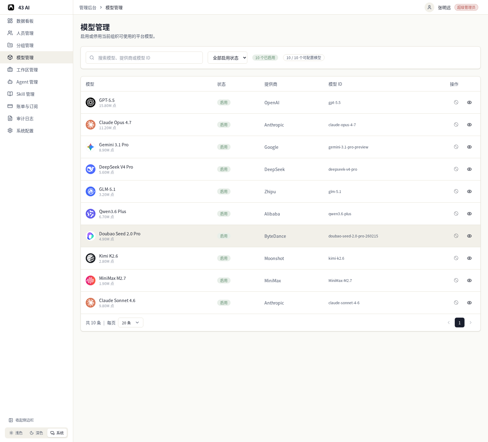
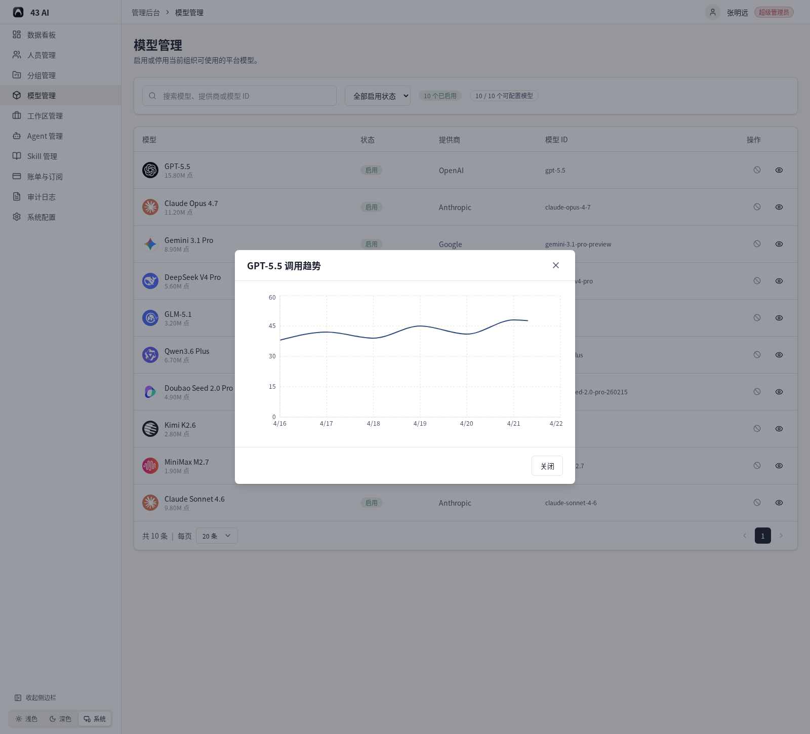

# 模型管理

这里可以查看当前组织可使用的平台模型，并控制它们的启用状态。

## 列表页

页面顶部可以按模型名称、提供商或模型 ID 搜索，也可以按启用状态筛选。

列表里可以看到：

- 模型名称
- 累计调用量
- 状态
- 提供商
- 模型 ID

右侧操作区可以切换启用状态，也可以查看这个模型的调用趋势。

## 状态

模型状态会直接显示在列表里。

当前页面里主要会看到：

- `启用`
- `停用`

每个状态都能一眼看出这个模型现在是否可用。

## 调用趋势

点击右侧的趋势图标后，会打开这个模型的调用趋势窗口。

这里可以看到一段时间内的调用变化，方便直接判断这个模型最近是否常用。

## 翻页

列表底部可以切换每页显示数量，并翻页查看其他模型。
