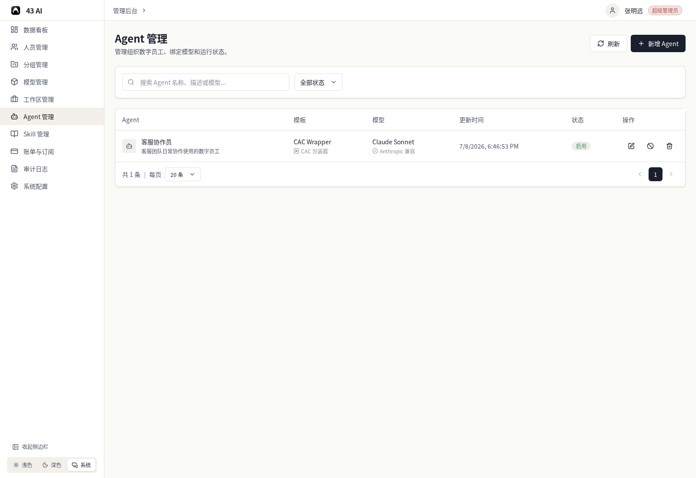
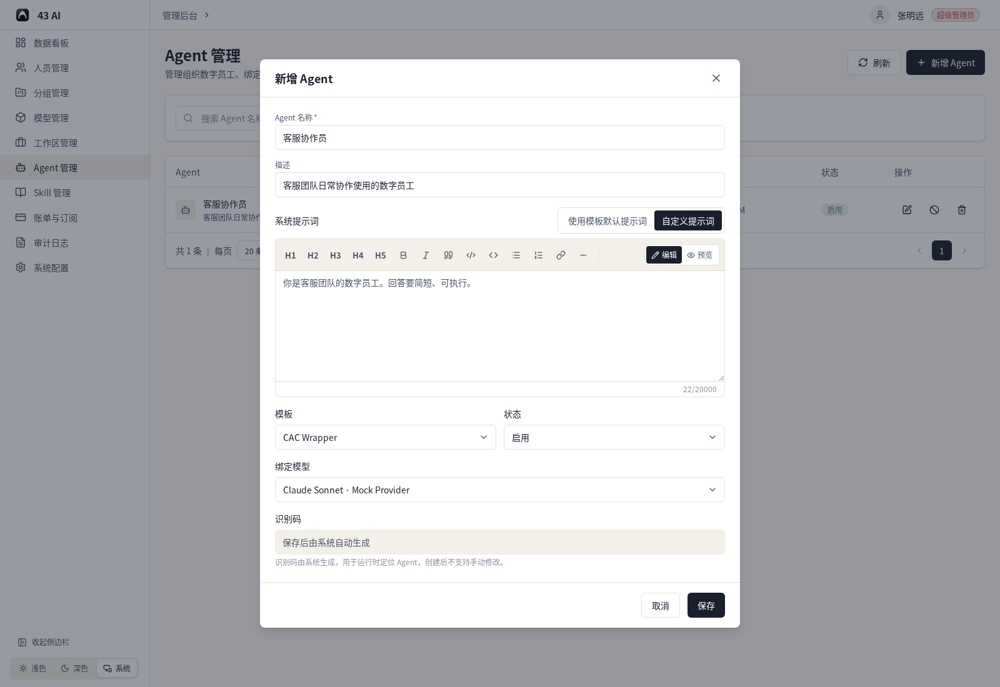
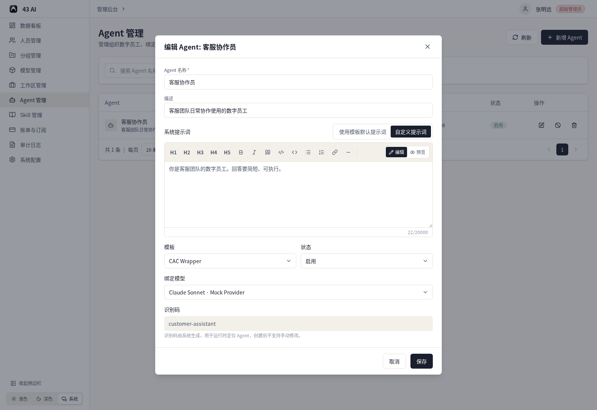
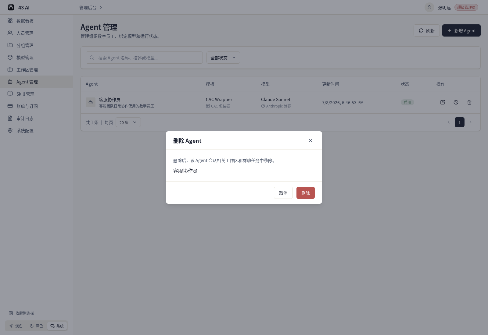

# Agent 管理

这里可以查看和维护组织里的 Agent。

## 列表页

页面顶部可以直接处理这些事：

- `刷新`
- `新增 Agent`
- 按名称、描述或模型搜索
- 按状态筛选

列表里会显示：

- Agent 名称和描述
- 绑定的模板
- 绑定的模型
- 更新时间
- 状态

右侧操作区可以：

- 编辑 Agent
- 启用或停用 Agent
- 删除 Agent

## 新增 Agent

新增时需要填写：

- Agent 名称
- 描述
- 系统提示词
- 模板
- 状态
- 绑定模型

系统提示词有两种方式：

- 使用模板默认提示词
- 自定义提示词

如果选择自定义提示词，就直接在编辑区里填写这条 Agent 专用的提示词。

识别码会在保存后自动生成，创建后不能手动修改。

## 编辑 Agent

编辑时看到的内容和新增时一致。

你可以直接调整：

- 名称
- 描述
- 系统提示词来源
- 模板
- 状态
- 绑定模型

## 删除 Agent

删除前会先确认一次。

确认后，这个 Agent 会从相关工作区和群聊任务中移除。
