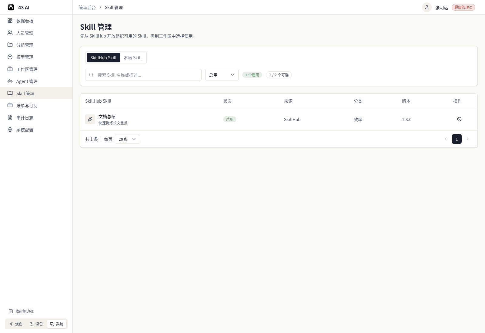
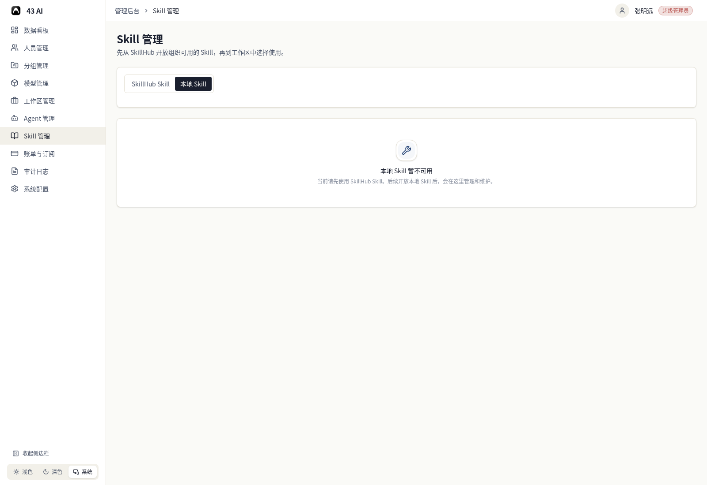

# Skill 管理

这里先管理 SkillHub 里对本组织开放的 Skill。

当前 `Skill 管理` 只对组织所有者显示。普通组织管理员即使有其他模块权限，也不会看到这个菜单。

## SkillHub Skill

页面顶部可以切换到 `SkillHub Skill`。

这里可以直接看：

- 当前启用的 Skill 数量
- 当前可选的 Skill 总数
- 每个 Skill 的状态、来源、分类和版本

上方还可以：

- 搜索 Skill 名称或描述
- 按状态筛选

列表右侧的按钮可以把 Skill 开放给本组织，或者从本组织停用。

底部可以切换每页数量，也可以翻页查看其他 Skill。

## 本地 Skill

当前页面里的本地 Skill 还没有开放。

后续如果开放本地 Skill，这里会作为管理和维护的位置。
