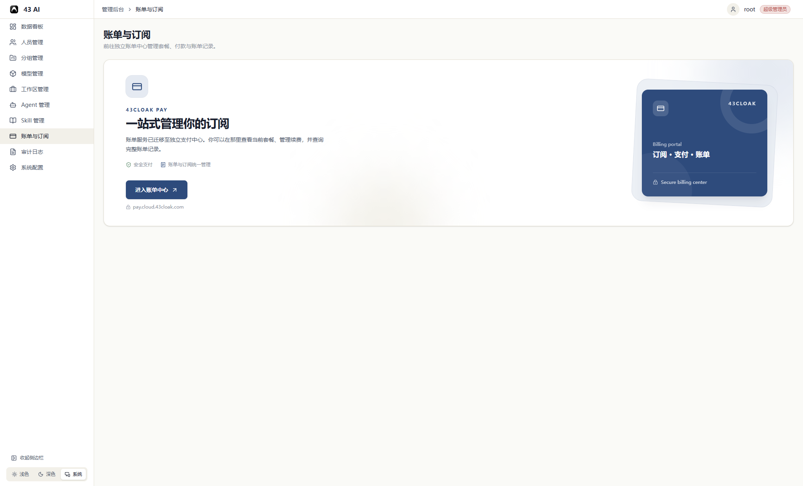

# 账单与订阅

管理后台中的“账单与订阅”是独立账单中心的入口。

套餐、续费、付款和账单记录都在账单中心统一管理。

## 进入账单中心

1. 在管理后台左侧点击 `账单与订阅`。
2. 点击 `进入账单中心`。
3. 浏览器会在新窗口打开 `https://pay.cloud.43cloak.com`。

进入后，你可以查看当前套餐、管理续费，并查询完整的账单记录。

## 权限说明

超级管理员可以直接访问该页面。

其他管理员需要获得“账单与订阅”模块权限。如果左侧没有这个菜单，请联系超级管理员检查你的角色和模块权限。

## 常见问题

### 点击后没有打开新页面

检查浏览器是否拦截了新窗口。也可以直接访问 `https://pay.cloud.43cloak.com`。

### 账单中心无法访问

先确认当前网络可以访问 `pay.cloud.43cloak.com`。如果网络正常但页面仍无法打开，请记录页面提示和发生时间后联系 CLOAK 团队。
