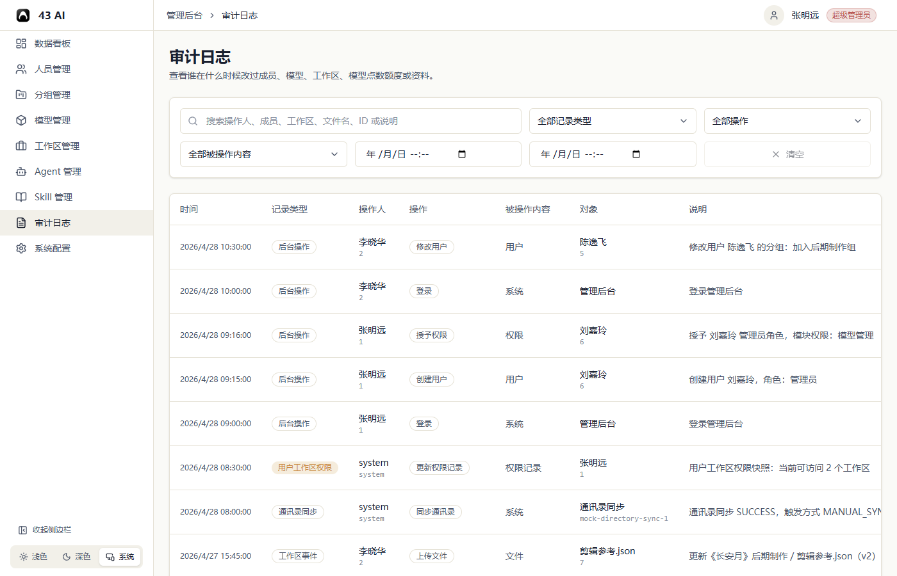

# 审计日志

这里可以查看后台里的关键操作记录。

## 搜索和筛选

顶部可以按这些条件筛选：

- 操作人、成员、工作区、文件名、ID 或说明
- 记录类型
- 操作
- 被操作内容
- 起止时间

`清空` 可以一次移除所有条件。

## 列表内容

列表会显示：

- 时间
- 记录类型
- 操作人
- 操作
- 被操作内容
- 对象
- 说明
- 相关记录

底部可以切换每页数量并翻页。
