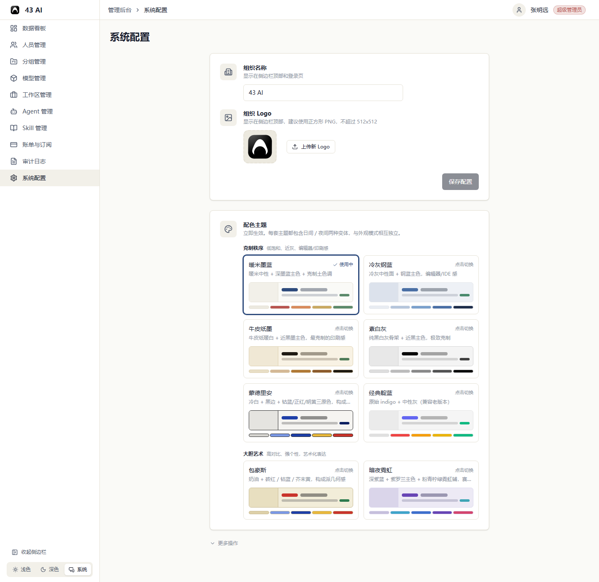
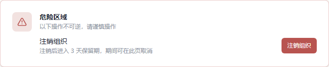

# 系统配置

组织所有者可以调整组织信息、主题和危险操作。
普通组织管理员这里只会显示主题和外观设置。

## 组织信息

这里可以修改：

- 组织名称
- 组织 Logo

修改后点 `保存配置` 生效。

Logo 旁边还可以点 `上传新 Logo` 重新选择图片。

## 配色主题

中间显示的是可选主题卡片。

- 标记 `使用中` 的主题是当前主题
- 其他主题可以点 `点击切换` 立即应用

## 更多操作

展开 `更多操作` 后，可以看到 `危险区域`。

- `注销组织` 会让组织进入 3 天保留期
- 保留期内可以在这里取消注销

## 外观模式

左下角可以切换：

- `浅色`
- `深色`
- `系统`

同一位置还可以收起侧边栏。
